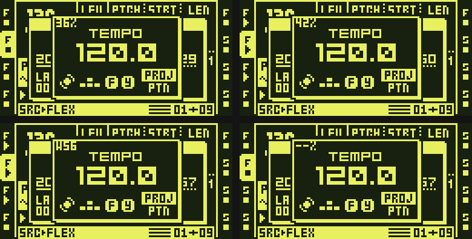

# PROCESSOR LOAD

How busy the Octatrack's ColdFire processor is making audio, as a number in
the stock TEMPO popup. One octabam module (key `PROCESSOR LOAD`), ColdFire
only, standalone: it needs no other module and nothing on a computer.

## What you see

Press TEMPO. The popup's top left corner shows the load:

| shows | means |
|---|---|
| `47%` | the mean load over the last quarter second |
| `73%!` | the same, 70 % or more |
| `--%` | no fresh reading (the first half second after the meter starts, or no audio blocks completed) |
| `W112` (FUNC held) | the longest single audio block of the last quarter second, in % of one block's time |

The number updates about four times a second while the popup is open. The
TEMPO / EXT SYNC / PICKUP SYNC header sits two pixels lower than in stock
to leave the number its band; the rest of the popup draws as in stock,
and the module hooks no key: the BPM, the tap tempo and the TEMPO keys are
the stock ones.



On octabam's ColdFire emulator (8 Oct 2026; emulator readings, not what a
unit reads): top left `36%` with the author's project loaded and stopped;
top right `42%` while it plays; bottom left `W56`, FUNC held while it
plays; bottom right `--%`, no blocks counted (a fault forced on the
emulator for the test, below).

## How it works

### What is measured

The Octatrack makes audio in blocks of 16 samples: 362.8 microseconds
each at 44.1 kHz, about 2,756 blocks a second. Every block starts the
ColdFire's **frame interrupt**, the routine that runs the sequencer step,
the LFOs, the parameter records for the DSPs, the sample streaming set-up
and any ColdFire machine (FM SYNTH, for example), and hands the block to
the two DSPs.

PROCESSOR LOAD times that interrupt from its first instruction to its
return, every block. The clock is **DMA timer 3 (DTIM3)**, a counter the
stock OS already runs freely at the 132 MHz bus clock (Sam Banks measured
the frame period on it: 362.8 us, so DTIM3 runs at 132 MHz; on an MKII). The module
only reads it; it never programs a timer.

- At the interrupt's entry (main's install of the frame vector names the
  module's entry instead of the stock handler) it stores DTIM3, then runs
  the stock handler unchanged.
- At the interrupt's one exit (the epilogue every path of the handler
  reaches) it reads DTIM3 again, adds the difference to a running sum,
  counts the block and keeps the longest block, then does the stock
  restore and return.

Nothing else runs in the interrupt: no division, no drawing, no waiting.

### The window

About sixty times a second the UI task (the stock loop that runs the
screen and the keys) calls the meter. At most once every 33,000,000
DTIM3 ticks (a quarter second) it takes a snapshot of the sum, the block
count and the longest block, and computes

```
load = (busy ticks in the window) / (ticks the window lasted) x 100, rounded
```

The snapshot is read without stopping interrupts: a sequence counter that
the interrupt makes odd while it updates tells the UI whether a block ended
while it read; if one did, that window gives no reading (`--%`) rather than
a torn one, and nothing waits. A window longer than four seconds (the UI
was starved), a window in which no block completed, and the first window
after the meter starts give `--%` too. One block may straddle a window's
edge, so a window may hold up to one block more busy time than it lasted;
more than that is treated as a broken window.

Timing starts at the first block after the stock OS has set its "startup
complete" flag. The boot logo resets DTIM3 while it plays; starting after
it keeps the reset out of every window. A single body longer than about
127 ms is discarded for the same reason.

### What the number means

The share of real time the ColdFire spends inside the frame interrupt:
the sequencer, LFOs, parameter records, sample set-up, ColdFire machines,
plus everything that happens while the interrupt runs -- higher-priority
interrupts that land inside it (the eDMA chain, below) and the waits for
the DSPs. If it reached 100 %, the processor would have no time left for
anything else between blocks, and audio would break up before that.

What the stock OS alone reads: on hardware, Sam Banks's CF METER probe
measured the frame interrupt at 123.1 us stopped and 213.5 us playing (his
MKII, 3 Oct 2026, a fresh project with samples on tracks 1-4), that is
about 34 % and 59 % of a block -- a third of the processor is already
spoken for by the stock OS with the transport stopped. The Octatrick
diagnostic build's meter read about 34 % stopped on the author's MKI (with
the author's modules loaded).

On the emulator the numbers are the emulator's, not the hardware's: its
ColdFire does not run at the unit's speed, so an emulator percentage is
not a prediction of a unit's. They show the meter working: with
PROCESSOR LOAD as the only module (and the stock effects), one of the
author's projects reads `35%` stopped and `40%` playing; in the
`octatrick` remix with the four other modules of this repository and
USB, the same project reads `36%` and `42%`.

### What it cannot see

- **The DSPs.** The effects and the DSP side of every voice run on the two
  DSP56300s; this is the ColdFire only. A project can be fine here and full
  on a DSP, or the other way round.
- **The UI, the card and USB.** Screen drawing, file loading and saving,
  USB work outside the interrupt: none of it is in the number. A slow
  screen or a slow card load does not show here.
- **Single blocks in the mean.** A mean of 40 % can hide one block that
  took more than its 362.8 us -- an audible drop. Hold FUNC to see the
  longest block of the window.
- **The future.** It shows what the processor is doing now; whether a new
  machine, track or effect will fit is something you find out by trying.

### Limits

- **The eDMA jump.** The stock eDMA chain runs at a higher interrupt level
  and calls a delay routine about 127 us into each block (inferred from
  where the jump starts in the author's logs). While the interrupt body is shorter than that, the routine runs
  outside it; once the body is longer it lands inside it and is counted.
  So between about 36 % and 48 % the number climbs faster than the work
  does (about 1.7 points per point of work), then flattens about 10 to 12
  points higher. A jump from the high 30s to the high 40s can be this, not
  a sudden heavy load.
- **The clock.** 132 MHz is the bus clock measured on MKII hardware by Sam
  Banks (the frame period read 362.8 us on DTIM3) and on the author's MKI by the
  Octatrick diagnostic build. A unit with another bus clock would scale every
  reading.
- **The `!` at 70 %.** One unit's experience: the author's MKI stopped
  responding with readings above about 75 % in a heavy project. It is a
  warning to back off, not a guarantee either side of it.
- **The meter's own cost.** Per audio block, 12 instructions at the entry and 17 at
  the exit (19 when the block is the longest of the window so far), against
  an interrupt body of about 22,000 to 38,000 instructions in the same
  emulator runs (22,225 to 24,861 with the module alone; 24,392 to
  37,933 in the full remix, stopped and playing). In the UI task, counted from the
  module's tick routine to its return, 23 instructions on each of the about 60
  ticks a second that only check the clock, and 607 (the stock drawing
  calls for the overlay included) on the about four a second that take a
  reading with the popup open. The same counts with and without the
  other modules in the image. It is measured
  in emulator instructions, not in microseconds or percent: the emulator
  does not run at the hardware's speed.
- **MKII.** The DTIM3 method ran on an MKII in Sam's CF METER; this module
  itself has not been tried on an MKII yet.
- **Not yet flashed.** Built from octabam `main` (063a426) and run on
  octabam's ColdFire emulator, alone and in the `octatrick` remix (8 Oct
  2026); not yet run on a unit.

### The FUNC reading

While FUNC is held, the popup shows `W` and the longest single block of
the last quarter second as a percentage of a block's 362.8 us (`W112` =
406 us). Over 100 means that block took longer than the time between two
blocks; the DSPs had to wait for it. Single blocks above 100 happen at
ordinary trigs and are not always audible; a run of them, or a mean near
the `!`, is the thing to watch. The interrupt keeps the longest block
since the meter's last snapshot (the first block after a snapshot starts
the next window's), so the reading belongs to the same quarter second as the
mean. Releasing FUNC returns to the mean at once.

## The hooks

| site | bytes | what |
|---|---|---|
| `0x4001fbf8` | 6 (kind lea) | main's install of the frame vector: names `pl_isr` |
| `0x4000d9a6` | 10 | the frame interrupt's epilogue: `pl_tail`, then the displaced restore / RTE |
| `0x40056c8a` | 6 | the UI task's type-1 message path: `pl_tick`, then the displaced countdown call |
| `0x4004b528` | 8 | the TEMPO draw: the stock body (its prologue replayed), then the overlay |
| `0x4004b5b4` | 4 (poke) | the TEMPO header's y: two pixels down |

RAM: one DRAM unit of about 0.9 KB (code, 32 bytes of interrupt state and
52 bytes of UI state). Nothing is saved with a project; nothing is written
to the card, a hardware register or a DSP.

Combining: PROCESSOR LOAD conflicts with **CF METER** (the same two
interrupt sites) and **TEMPO BUS** (it replaces the TEMPO popup). It runs
beside the synth, quantizer, direct jump and tuner modules of this
repository, USB AUDIO OUT (whose frame hook rejoins the epilogue this module
hooks) and the rest of the `octatrick` remix: both built and run together on the emulator (below).

## Tests and measurements

All on octabam's ColdFire emulator (its pinned build, 8 Oct 2026), with
two images built from octabam `main` 063a426: PROCESSOR LOAD alone on
the stock effects, and the `octatrick` remix plus PROCESSOR LOAD (SYNTH
MACHINE, SCALE QUANTIZER, DIRECT JUMP, TUNER, USB MIDI, USB AUDIO OUT /
CROSSBAR / IN). Emulator readings and instruction counts, never
hardware times.

- **Build and ledger.** Both images build. `modules/processor-load/` as a
  plain copy and as octabam's wrapper + `upstream/` layout give the same
  image byte for byte. The ledger refuses PROCESSOR LOAD with CF METER and
  with TEMPO BUS, by name, with the declared reasons. octabam's remix
  self-test passes every module check.
- **Cold boot, no idle hook.** Booted with the logo and no card, every
  write to the stock startup flag and to the meter's "armed" word logged:
  the stock OS sets the flag at 2,995.2 ms emulated, and the meter arms in
  the very next audio block (1.7 samples later, from the frame interrupt's
  entry). At 3.00 s it has counted 15 blocks and shows `--%` (its first
  window); from 3.30 s it reads `35%`, steady from then on. With a card and
  a project loading, it reads from the first moment the panel can be
  driven.
- **The TEMPO popup.** Stopped and playing, in both images (the numbers
  above and the screenshots): the reading follows the transport (`36%`
  stopped, `42%` playing, `38%` just after stop in the remix) and holds
  steady at idle.
- **FUNC.** Held while playing: `W56` (the remix) and `W47` (alone) in
  the place of the mean; released: the mean again at once.
- **`--%`.** With the exit's "a timer reset" limit forced to 0 in emulator
  memory (so no block is counted), the popup reads `--%` / `W--` within
  three quarters of a second; with the limit restored, one window reads low (it
  straddles the restore) and the next reads `35%` again. Both images.
- **The UI tick.** With a card and project loaded, the popup open and the
  transport running, the UI loop reaches the meter's site 120 times in
  every 2-second window (60 a second; 216 passes of the loop head), the
  same as stopped and as on the stock OS.
- **The cost.** Counted instruction by instruction while playing and
  stopped (above). The same counts in both images.
- **Stock bytes.** `tools/stock_scan.py`: no run of 16 or more stock bytes
  in `processor-load/` (the hook sites' displaced instructions, at most 10
  bytes each, are the manifest's `expect`s, as in the other modules).

## Credits

- [Sam Banks](https://github.com/sambanks) -- octabam's CF METER probe
  (`modules/cfmeter`): the two interrupt sites (the vector install and
  the universal epilogue) and the method of timing the frame interrupt on
  DTIM3, and the hardware readings above.
- The meter itself is the TEMPO meter of the Octatrick diagnostic build
  (`cfdiag`, `loadmeter.s`, first shipped in the author's diagnostic test images),
  stripped of everything USB and diagnostic and made standalone: its own
  UI tick, arming on the stock startup flag, the longest-block reading.
