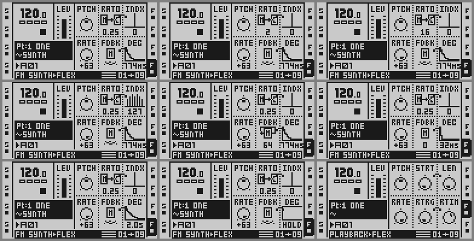

# Synth machine (phase 5: paraphonic chords, the engine in DRAM; phase 4: glide; phase 3: the page; phase 2: the FM voice; phase 1: the hollow voice)

**Octatrick 2.10 (not tagged yet; 5 - 8 Oct 2026).** **FM SYNTH is in the
machine list** (8 Oct): the sixth row of SRC SETUP (FUNC + SRC) and of SELECT
MACHINE TYPE on every track, playing with no sample and no marker file -- see
"Selecting FM SYNTH from the machine list (2.10)" below (adapted from
Modwerk's FM Synth module, MIT, Modwerk contributors). Four changes on the
synth: DEC puts HOLD at 127 (5 Oct); the note-start click is gone (attacks of
at least one carrier period, S-shaped); the LFO destination list speaks FM;
a held CHROMATIC key is the gate (HOLD is for sequencer trigs). And three
fixes after the author's test of the first 2.10 build on his MKI (7 Oct): a
note restarted while it still sounds no longer clicks at a short DEC; a fast
run at VOIC 2..4 no longer loses notes; a live-recorded legato phrase no
longer goes silent on playback. Each below.

**2.10: DEC puts HOLD at 127 (5 Oct 2026).** The
PLAYBACK page's DEC knob read `HOLD` at raw 0, then the shortest decay at 1
up to `2.0s` at 127; HOLD (the index envelope holds: the maximum sustain of
the decay) is now the LAST position on the right. **127 = `HOLD`** (the
index holds for the whole note; the paraphonic k `T_DK` is 0), **0 = the
shortest** (k = `K_MAX`, the instant decay; the page prints `0`), and **1..126
are unchanged** -- the same k (`K_NUM / raw²`, capped at `K_MAX`) and the same
milliseconds as before, so a saved DEC other than 0 or 127 sounds the same; a
saved 0 (was HOLD) now decays at once and a saved 127 (was `2.0s`) now holds.
The icon follows: a flat top at 127, the shortest fall (L = 2 columns) at 0.
Sites: `poly.s` `sy_env_k` (the mono voice) and the paraphonic frame's RTIM
-> `T_DK` (`po_fr_hold`); `page.s` `pg_fmt_decay` and `pg_ic_decay`. The page
cave stays **1,812 B** (two short branches pay for the compare; `PINNED_PAGE`
re-ratified); the DRAM unit grows 18,452 -> 18,472 B. FUNC + detent from 0
now steps 0 16 32 .. 112 127 = HOLD at the end. The measured records below
predate this and keep the old law (DEC 0 = HOLD).

**2.10 also (6 Oct 2026): the note-start click is gone.** Tim heard a click
at the start of FM notes ("noticeable if you turn ratio all the way down, and
play lower octaves"). The cause (measured on the emulator): the 16-frame linear attack
(5.8 ms) is a fraction of one carrier period below about C3 and ends at an
arbitrary phase, so the onset and the corner at its end put 17..35 dB more
energy at 100 Hz..1 kHz than a dark low note (RATO 0.25) carries. Every attack
now lasts at least one carrier period and is S-shaped; a warm START's index
ramp lasts at least a period; a START at another pitch on a sounding mono note
crossfades; a stolen voice fades over a period, and a chord-memory or stolen
voice that must jump UP in pitch fades out first and starts its new note cold.
**What you hear differently:** attacks below C3 are slower -- C1 reaches -3 dB
in 20 ms and full level in 31 ms, C2 in 10 / 16 ms, C3 (F2..F3) in 26 frames
= 9.4 ms, from F3 up as before (ATK 0: 6.2 ms, was 5.8) -- and every attack is
S-shaped (the same total time, within 6 %, for every ATK); at VOIC 2..4 a
chord whose voices must move UP while all of them sound starts each such note
one period of the note it replaces late (from a C1: up to 31 ms; from a C3:
7.6 ms). Details and numbers: "The note-start click (2.10)" below.

**2.10 also (6 Oct 2026): the LFO destination list speaks FM.** On a synth
track LFO SETUP's PMTR lists the FM SYNTH page's own names -- `PTCH RATO INDX
FINE FDBK DEC`, then AMP, then `SPD1 SPD2 DEP1 DEP2`, then FX1 and FX2 -- where
it printed the Flex names (`STRT LEN RATE RTRG RTIM`) and offered `SPD3` /
`DEP3`, which are VOIC and CHRD on a synth track: the knob steps over those
two. Every other track's list is unchanged. Details: "The LFO destination list
(2.10)" below.

**2.10 also (6 Oct 2026): a held key is the gate.** A CHROMATIC key held on a
synth track sustains for as long as it is held and starts the release (REL)
when it goes up; HOLD now gates sequencer trigs only (and MIDI notes, as
before). Until now a live key's note ended at HOLD even with the key still
down (HOLD 32 at 120 BPM: 282 ms). LEG MONO / POLY behave as before, STOP
still ends everything, and the live recorder still records the played length.
Details: "A held key is the gate (2.10)" below.

**2.10 also (7 Oct 2026): three fixes from the author's test of the first
2.10 build.** Four things were heard on the MKI; the emulator showed three
causes, and all three are fixed:
- **A click at the start of a note restarted while it still sounds**
  (a quick re-press of a CHROMATIC key, the same note again in a fast run, a
  sequencer trig on its own tail, a recorded legato phrase played back) at
  DEC 0, louder the higher INDX, gone with DEC turned up a little. Such a
  START ramped the index back to full and DEC 0 then dropped it to its floor
  within one 16-sample frame. Now the index envelope restarts as a fresh
  note's and the index itself ramps over at least one carrier period: at DEC
  0 a restarted note sounds like a fresh one.
- **Notes that did not sound** in a fast run at VOIC 2..4 over a long REL: a
  second key pressed while a voice faded for the first key took that same
  voice and dropped the first key's note. A voice holding a waiting note is
  now taken last.
- **A live-recorded legato phrase went silent on playback** at its first
  legato step (LEG MONO at VOIC 1, LEG POLY at VOIC 2..4): the recorded
  trigless step made the stock renderer walk the synth's marker sample to its
  end, which ended the voice. The step now keeps the voice.
Not reproduced on the emulator: notes not sounding at REL 0 with the
sequencer running, and notes jumping up an octave. Details: "The author's
test of the first 2.10 build (2.10)" below.

**OCTATRICK2.9 (28 Sep 2026, later): FINE defaults to 0c when a track
becomes a synth track.** A track that is made a synth track -- a FLEX track
given an `FMSYNTH*` / `SYNTH*` slot in the machine window or the sample-list
window, or switched to FLEX with such a slot already in its FLEX column --
comes up with FINE `0c` (RATE raw 64) at that moment, once: the Part byte,
its battery-RAM shadow and the live lane are written, so the page reads `0c`
before the first note and SAVE keeps it. A track that already was a synth
track keeps whatever FINE it has (a re-assignment of the same or another
marker slot, a project load, a Part reload, a pattern change, a warm boot
change nothing); a sample track is never written (stock's RATE stays, 127
in a fresh Part); RATE p-locks are untouched. Until now every fresh synth
track read FINE +63c, the stock RATE default -- **"FINE defaults to 0c"**
below has the sites and the measurements. **BUILD 22 (27 Sep 2026): the
new-project case** -- the FIRST marker of a fresh project goes into the
track's own empty slot, so no machine or slot byte changes and none of the
three sites ran (Tim's MKI: +63c on the first FM machine, 0c on later
ones); the file browser's select is the fourth site (`po_loadsel`) --
**"The new-project case"** below.
**OCTATRICK2.9 (28 Sep 2026): the chord snap follows ROOT.** Nothing in
this module changed. `po_snap` snaps every chord note (and a MIDI-IN key of
a chord, a fingered chord's voicing) by pitch class against the mask the
quantizer's pinned accessor `SCALE_AT` returns, and since 2.9 that mask is
the scale's pitch classes rotated by the project's ROOT (`modules/
quantizer/core.s qz_scale_mask`; `SCALE_AT` and `KEYS_AT`, the two
contracts this engine reads as fixed addresses, are unchanged), so a MAJ
chord on a key with SCALE MAJOR / ROOT E lands in E major: measured on the
BUILD 19 bus, key 13 (E4 with ROOT E) + MAJ = E4 G#4 B4 (329.6 / 415.3 /
493.9 Hz) and key 16 (G4 chromatic, snapped to F#4) + MAJ = F#4 A4 C#5
(370.0 / 440.0 / 554.4 Hz, the A# of the shape snapped down to A). ROOT
C is 2.8. The quantizer's README has the ROOT design and its measurements.
The engine's own MIDI IN (STANDARD) follows the scale as the panel keys do:
with a scale ON `po_snap` snaps a synth track's MIDI note onto the (now
root-rotated) mask -- 2.8 did the same (measured on the 2.8 bus: note 85,
C#4, with SCALE MINOR sounded C4) -- and only SCALE OFF is unquantized (85
sounded C#4 there); the quantizer's README says so under "MIDI IN and the
scale".

**OCTATRICK2.8 (5 Oct 2026): pitch slides on sample tracks, and the chord
table in Syntakt order.** A FLEX or STATIC track with **LEG MONO and GLIDE**
slides every pitch change over the GLIDE time instead of jumping -- a live
key over a held key, a sequenced trigless trig's PTCH lock, a knob turn, an
LFO -- while a sample trig (a new note) still starts at its own pitch; LEG
OFF is stock (instant), THRU / NEIGHBOR / PICKUP untouched. The CHRD table
is reordered (`MIN MAJ SU2 SU4`, the sevenths, the rest, the two-note
intervals last: a CHRD byte from 2.7 names another shape) and the
recogniser prefers the shape with the fewest distinct notes among equal
voicings -- **"Pitch slides on sample tracks"** and **"VOIC, CHRD"** below.
**Transposing a step (4 Oct 2026)**: on a synth track in GRID RECORDING,
hold a placed trig and press **FUNC + DOWN** or **FUNC + UP**: the step's
PTCH lock moves an octave down or up (12 semitones, clamped -64..+63; a
step without a lock starts from the Part's PTCH and gets one; every held
trig moves), the PLAYBACK page shows the new value while the trig is held.
With no trig held FUNC + UP / DOWN is still the trig-mode selector, byte for
byte, and so is everything on a sample track -- **"Transposing a step"**
below.
**LEG (2 Oct 2026; every audio track since 3 Oct 2026)**: the AMP SETUP
page (FUNC + AMP) of every audio track gains a sixth box, **LEG** -- the
legato switch, a Part byte saved with the project (a stock Part reads OFF,
so an existing track needs LEG = MONO for the legato it had from GLIDE):
**OFF / MONO on a sample track** (FLEX, STATIC, THRU, NEIGHBOR, PICKUP:
MONO is the trigless key legato of 2.6 -- instant pitch, no retrigger),
**OFF / MONO / POLY on a synth track**; GLIDE is the slide time only,
everywhere (it no longer switches legato on for a sample track), and **LEG
OFF = no glide at all on a synth track** (sequenced trigless trigs step
too). POLY at VOIC 2..4 slides the sounding chord to a new key -- **"LEG"**
below.
**The marker (30 Sep 2026)**: the marker file is `FMSYNTH.wav` -- a FLEX
slot whose file name (after the last `/`) starts with `FMSYNTH` or `SYNTH`
makes its track a synth (`sy_scanned` / `po_lp_scanned` in `poly.s`, the
quantizer's `qz_is_synth`: a leading `FM` is skipped, then the five-byte
`SYNTH` compare as before). The marker's length no longer bounds the note:
`sy_render` keeps the voice struct's sample positions (`+64..+83`, saved to
the track record's `T_POS` before the stock call and written back after it,
mono and paraphonic alike), so the stock renderer never reaches the
marker's end and a note ends only through the AMP envelope (HOLD / REL) or
a key release; a plain FLEX sample track is untouched (the wrapper only
saves and restores on a synth voice).
**The tuning system (27 Sep 2026)**: on a synth track PTCH is semitones
(-64..+63, one unit a semitone, a signed whole number on the page), RATE is
FINE (-64..+63 cents), the CHROMATIC keyboard runs over octaves -4..+4 and
records exact PTCH locks, and the chord shapes list their notes in priority
order -- **"The tuning system"** below, first.
**29 Sep 2026: chord shapes are four-note VOICINGS and the level is equal
power** -- every shape but `----` plays 2 / 3 / 4 notes at VOIC 2 / 3 / 4
(its own notes first, then octave doublings), a start with a shape is chord
memory (the previous chord goes), a voice is `1 / sqrt(VOIC)` of the mono
voice (-3 / -4.8 / -6 dB) and a soft limiter takes the in-phase excess --
**"VOIC, CHRD, and the mono voice"** below.
Phase 5 (24 Sep 2026) moves the FM voice engine into a DRAM unit (`poly.s`,
the ROM cave `synth.s` kept for the record) and makes the synth paraphonic:
the LFO page's VOIC slot (1..4) gives a synth track that many voices playing
chord shapes chosen by its CHRD slot, snapped onto SCALE, with per-voice
release and glide and polyphonic CHROMATIC keys; LFO 3 is muted on a synth
track -- **"Phase 5"** below.
Phase 4 (24 Sep 2026) adds **GLIDE** -- the pitch slews toward a new PTCH
instead of jumping, with the time set by the new PROJECT > CONTROL >
SEQUENCER > GLIDE row (`modules/quantizer`, which also gives the CHROMATIC
keys 303-style legato) -- **"Phase 4: glide"** below.
Phase 3 (22 Sep 2026) makes the PLAYBACK page present the synth -- **"Phase 3:
the page"** below. Phase 2 (22 Sep 2026) replaces phase 1's sine with a two-operator FM voice
whose parameters are the FLEX PLAYBACK page's other slots -- **"Phase 2: the
FM voice"** below has the design, the parameter map and the numbers. Phase
1's text follows it as written (its record-layout guess is corrected in the
phase-2 section and marked in place).

The measurement sections below name the scripts, logs, renders and shots
they came from; those files are in the author's workspace, not in this
repository. Each section states its method (the build, the emulator mode,
the card and the settings) and its numbers.

---

## Selecting FM SYNTH from the machine list (2.10, 8 Oct 2026)

FM SYNTH is a machine of its own now: the sixth row of the track's machine
lists, under STATIC FLEX THRU NEIGHBOR PICKUP. **No marker file and no sample
are needed.** The `FMSYNTH*.wav` / `SYNTH*.wav` marker files still work exactly
as before; the machine list is simply the easier way in.

**To select it** (any track, T1..T8):

- **SRC SETUP:** hold FUNC and press SRC (the PLAYBACK page key). The machine
  list is on the left; go DOWN to `FM SYNTH` (the last row) and press YES. The
  right-hand side then shows the FLEX setup values the track keeps (LOOP, SLIC,
  LEN, RATE, TSTR, TSNS -- all OFF on a fresh FM SYNTH track).
- **SELECT MACHINE TYPE:** press the track key twice quickly (the QUICK ASSIGN
  slot list), press LEFT on `<< MACHINE`, go DOWN to `FM SYNTH`, press YES.

The PLAYBACK page then reads `PTCH RATO INDX FINE FDBK DEC`, the footer
`FM SYNTH>FM SYNTH`, and both lists open on the `FM SYNTH` row for that
track. A track that was not playing the FM voice before starts from PTCH 0,
RATO 1, INDX 32, FINE 0c, FDBK 0, DEC 40 (199 ms). Choosing FM SYNTH again
keeps your patch, and so does choosing it over a track that already plays FM
through a marker file (its patch and its setup values are kept; only the
machine-list mark is added).

**To go back** choose FLEX or STATIC (or any other machine) in either list.
The mark is removed and the track is the plain machine again. The FLEX page
keeps the FM values (STRT 12, LEN 32, RATE 64 ...), as a marker track's FLEX
page does when its marker is replaced by a sample: set them for the sample.
If the FLEX slot holds a marker file, the track still plays FM through it.

**What is stored.** The machine byte is FLEX (1), so every stock FLEX path --
the PLAYBACK lanes, locks, LFOs, scenes, the DSP voice -- stays valid; the
mark is the three bytes `F`, `M`, 1 at the start of the track's NEIGHBOR
PLAYBACK column (the Part + 0x3c + 30 * track; the bank blob + part * 6322 +
0x8edbc + 30 * track), written into the Part and its battery-RAM shadow. A
FLEX track never uses those bytes and the stock Part validator's NEIGHBOR
range is 0..127, so the mark survives SAVE, RELOAD, Part COPY / PASTE and a
project load like any other Part byte. Part CLEAR clears it with the rest.
The quantizer (`quantizer/`, the same tag) knows the mark too: CHROMATIC keys,
the tuning system, LEG and the live recorder treat a chosen track as a synth
track. Build both modules from this tag together; an older quantizer treats a
chosen track as a sample track.

**On a stock OS, or a build without this change,** such a track is a plain
FLEX track: with an empty slot it is silent; with a sample in its slot it
plays that sample with the FM values as STRT / LEN / RATE / RTRG / RTIM (RATE
64 is half speed); the mark is ignored. **Before downgrading, choose FLEX (or
STATIC) on every FM SYNTH track and SAVE**, or keep a marker file in the slot
if you want those tracks to stay FM on an older Octatrick build.

### How it works

The chooser is adapted from Modwerk's FM Synth module ([repeat98/modwerk](https://github.com/repeat98/modwerk),
`sdk/octabam/modules/synth`, commit 1c1d938; MIT, Modwerk contributors), whose
chooser is derived from Modwerk's Analog BD chooser hooks. That module's
LICENSE states its own terms, separate from the repository root's licence; its
attribution lines, carried in this repository's [LICENSE](../LICENSE):

> Dedicated chooser, Part validation, sample-free transport and original presentation:
>
> MIT License
>
> Copyright (c) 2026 Modwerk contributors
>
> Portions of the firmware analysis tooling originate from the octamax project
> (https://github.com/mxldyn/octamax), Copyright (c) 2025-2026 Maxolydian,
> also under the MIT License.

and, for the Analog BD chooser it derives from, `Copyright (c) 2026 Sam Banks`
(MIT, the same octamax sentence).

`synth/machine.s` (a DRAM unit, 956 B) holds the chooser: Modwerk's
`machine.s` and its `registration.c` helpers written out in assembly. The
lists grow from five rows to six (six pokes: `pea 5 -> 6` at `0x40079248` and
`0x400585fa`, `moveq #4 -> #5` at `0x4003c950`, `0x40078678`, `0x400786ce`,
`0x40079904`); row 5 prints `FM SYNTH` (`0x400334d8`; SRC SETUP's name table,
`0x4003c928`, copied from the stock one at run time); a chosen track's row is
highlighted and the lists open on it (`0x4003c980`, `0x400786c8`,
`0x400585dc`, `0x40078886`); SRC SETUP's editor and drawer address row 5 as
FLEX (`0x4003a52e`, `0x4003cd98`); a track's machine name reads FM SYNTH
(`0x4003d718`); the UI tick (`0x4005221e`) puts the FM SYNTH page into the
PLAYBACK descriptor table's spare slot 5 for SRC SETUP. The commits: the
machine window's machine-byte write shares the FINE-0c detour at
`0x40079816` (`fm_main_commit`, then `po_machwin`); SRC SETUP's two writes
`0x4005a616` / `0x4005a850` (the second follows `po_machlist`'s detour, which
returns to it). Row 5 is stored as FLEX plus the mark; any other row clears
the mark. The first choice's seed is written where stock's reload of a track
from its Part (`0x40001f18`) writes: the Part and its shadow, the live lane's
six PLAYBACK bytes and its SETUP bytes (lane + 32), the six PLAYBACK value
words the frame builder hands the DSP and the engine (`0x80000a50 + 64 *
track`, byte << 8), and the slew counters of those bytes cleared
(`0x80000db4 + 32 * track`). The frame builder refreshes the words from the
Part only at a trig from another bank or Part (`0x4000c0b4`), so without them
a track that had already played in this Part kept its sample's words: FM
SYNTH chosen after a sample at RATE 127, STRT 0 played C4 as 67.8 Hz (FINE
+63c, RATO 0.25) under a page reading FINE 0c, RATO 1 (fixed 8 Oct 2026, see
Measured). The Part validator (`0x40002318`) clamps FLEX's PTCH into 4..124,
where FM SYNTH's PTCH is 0..127 (-64..+63 semitones): for a chosen track the
twelve FLEX bytes sit the validation out (the stock defaults in their place,
read from the descriptor, the FM bytes back afterwards). A marker track keeps
the stock clamp, as before.

Playing without a sample (in `poly.s`): the kind table's FLEX START callback
(`0x400d6458`, a SymbolRef) is `po_fmstart`, which starts a chosen track's
voice without consulting a sample (the CF voice marked active, so the stock
STOP and kill end it; 0x100, a cold start, for the DSP) and calls the stock
callback for every other FLEX track; the frame builder's second supplier call
(`0x4000d514`, `po_fmsource`) gives a chosen track `sy_render` where an empty
FLEX voice would get stock's silent supplier; and `sy_call` writes the source
header stock would have written (count, ring position, rate 1.0, read
position) with silent pairs for the engine to fill, instead of calling the
stock renderer. `po_fmstart` answers as the stock callback does: 0x100 (a cold
start) for a voice that was not running, 0 for one that runs on. Modwerk's
transport answered 0x100 to every START; on this engine that restarted the
DSP's stream under every warm note (a retrigger or a new key on a sounding
note: +40..57 dB of onset splatter in the note-start click table, where a
marker track measures -2..+28 dB), so the port answers 0 there, as stock does
for a START that continues its voice. `po_is_synth`, the page's `pg_resolve`, the VOIC/CHRD page
(`po_lfopage`) and the voice start test the mark ahead of the marker scan.
The page cave gained `fm_descriptor` (16 B, first; `pg_resolve` moved to +16)
and the mark test: 1,868 B (was 1,812), `PINNED_PAGE` re-ratified, inside the
same zero run (`0x400d24d0..0x400d2ce0`).

Changed from Modwerk's module: one detour at `0x40079816` does both the FINE
rule and the commit (Modwerk dropped the FINE-0c detour); `pg_resolve` is the
only PLAYBACK route (their second resolver detour at `0x40031e74` is not
needed); their name hook at `0x4004c36a` is left out (`a0` is not a machine
byte there, so it never changed a name); no refusal path; the voice start
tests the mark only and keeps this engine's own scan of the starting voice's
sample (a sample lock to a real file on a marker track stays a sample); a
marker track keeps its patch when FM SYNTH is chosen over it; the START
callback answers 0 for a voice that runs on (above); the six-row name table is
copied from the stock one at run time instead of carrying its five addresses.

### Measured (8 Oct 2026, ot_emu, the quantizer + synth image built from this change through the panel; T1 on the 2.10 click and gate cards)

- **Selection.** SRC SETUP and SELECT MACHINE TYPE list FM SYNTH as the sixth
  row on T1..T8. Chosen on T1 with an empty FLEX slot: the Part's machine byte
  01, the mark `46 4d 01` in the Part, the FLEX PLAYBACK bytes `40 0c 20 40 00
  28`, the SETUP bytes 0; the page reads PTCH RATO INDX FINE FDBK DEC and the
  footer FM SYNTH>FM SYNTH; the pattern's trigs sound at C4 (spectral peak
  262.5 Hz, 2.5 Hz bins) with no sample anywhere in the slot. Both lists then
  open on FM SYNTH; FLEX chosen again clears the mark and the page reads FLEX.
- **A sample track** (fixed 8 Oct 2026). T1 = FLEX with a sine in its slot,
  PB 64 0 127 127 0 79 and the stock SETUP (LOOP ON, TSTR AUTO): the sample
  plays, then FM SYNTH is chosen in SRC SETUP: every note is C4, 261.7 Hz
  (autocorrelation; 261.9 Hz spectral peak), sample for sample the render of
  FM SYNTH chosen on a track that never played. The click table's note-start
  measure on its C4 notes (cold and warm) equals a marker track with the same
  patch to 0.0 dB. Before the fix every note was 67.8 Hz: the seed reached
  the Part and the page but not the value words the voice reads, so the
  sample's STRT 0 (RATO 0.25) and RATE 127 (FINE +63c) played on (the first
  build's own render of this route peaked at 271.2 Hz, not C4; its sample had
  LEN 0, INDX 0). FLEX chosen again: the sample plays with what the Part and
  the page then hold (STRT 12, LEN 32, RATE 64, SETUP 0), sample for sample
  (to 1 LSB) a project loaded with that Part -- before the fix it played the
  stale values until the next reload. The FLEX + STATIC render before FM
  SYNTH is sample for sample the build without this change.
- **A marker assigned after a sample** (the FINE rule below): T1 as above,
  the sample plays, then QUICK ASSIGN slot 1 (`SYNTH.WAV`): C4 at RATO 0.25,
  FINE 0c = 65.4 Hz (before the fix 67.8 Hz: FINE +63c under a page reading
  0c).
- **A marker track** (FLEX slot 1 = `SYNTH.WAV`, PB 64 20 50 64 30 80): FM
  SYNTH chosen over it keeps the PB and SETUP bytes and adds the mark; the
  render before and after is the same to 0.00 dB (10 ms RMS envelopes).
- **SAVE and reload.** FM SYNTH chosen, INDX 32 -> 42, PROJ > SAVE > YES >
  YES; a cold boot of that card: machine FLEX, the mark, INDX 42, the page
  FM SYNTH, both lists on FM SYNTH, the voice at C4.
- **Part COPY / PASTE / CLEAR.** Part ONE with FM SYNTH on T1, copied
  (FUNC + REC in the PART chooser) and pasted into THREE (FUNC + STOP): THREE's
  T1 is FM SYNTH (mark, patch, sound); CLEAR (FUNC + PLAY) of THREE: T1
  STATIC, no mark, the stock defaults.
- **The note-start click table** (the 2.10 referee: onset splatter per note
  over 16-step patterns, cold and warm, retriggers and voice steals,
  RATO 0.25 / 1, INDX 0 / 40 / 100, FDBK 0 / 60, ATK 16) on a marker track:
  every row within 0.1 dB of the 2.10 build before this change. **The same
  Parts on a machine-list track with an empty slot: every row within 0.2 dB of
  the marker track** (before the START answer was fixed: +40..+57 dB on every
  warm row, cold rows equal). Re-run on the image with the 8 Oct seed fix:
  chooser rows within 0.1 dB of the build before it and within 0.2 dB of the
  marker track; 23 of the 31 click and gate renders sample-identical to the
  build before it, the rest equal to 1 LSB or up to the panel-timed key
  events of the held-key renders.
- **The key gate** (a held CHROMATIC key, a sequencer trig, LEG MONO, a VOIC 4
  chord) and the attack table, marker vs machine-list track: the held key
  sample-identical up to its release (the release lands up to 2 ms apart, the
  panel's timing), the sequencer trig and the C4 pattern sample-identical, LEG
  MONO within 0.4 dB (100 ms envelopes), the VOIC 4 chord within 0.16 dB (100 ms;
  the voices' phases beat up to 3.8 dB in 10 ms windows, as between any two
  runs), ATK 0 / 16 / 20 / 32 = 11.07 / 14.01 / 24.24 / 51.04 ms on both.
- **Unchanged elsewhere.** The LFO destination list and the rest of the 2.10 menu
  walk: 171 of 171 screenshots pixel-identical to the build before. The engine harnesses (the
  gate and LFO regression suites): pass, PCM and state identical to the build
  before; cost per frame mono 1,165.9 -> 1,234.4 instructions (mean; peak 2,556
  -> 2,658), VOIC 4 4,061.9 -> 4,130.4 (peak 6,390 -> 6,492): the mark tests.
  poly.s 20,560 -> 20,976 B (32 of them the FINE word, below), machine.s
  956 B; every source assembles at -mcpu=5475 and 54455.
  `tools/stock_scan.py`: no stock bytes beyond the displaced instructions and
  the idioms the tool allows -- 35 runs against 32 before; the three new
  ones are the Part-address idiom `movea.l 0x46c82456; mvz.b 0x100b14cf;
  move.l #6322; muls.l` twice in machine.s (16 B each, the second with other
  registers; the same idiom as poly.s's own run) and an 18-byte save/restore
  idiom in poly.s (the same stock list as five of the runs before).

Not tested: hardware; MIDI notes, the live recorder and scenes on a
machine-list track (they read the same `po_is_synth` / `qz_is_synth`);
eight machine-list tracks playing at once.

---

## The engine owns the envelope (28 Sep 2026, OCTATRICK2.9 BUILD 31: plan B)

Tim's MKI (and the emulator, `ana_pop.txt`): the CF voice keeps
rendering at full after a note-off and only the DSP's AMP envelope silences
it, so a cold START (BUILD 26..28's rule) cut the still-sounding old tone
dead in one sample (a step up to 0.95 of the old peak, x25 the tone's slope:
the pop); REL <= 10 was the DSP's own >= 30 dB drop within 20 ms (the release
click; REL 0 a one-sample dead cut); REL 60 with fast notes cut a -20 dB tail.
Tim's decision: the engine owns the AMP envelope for synth tracks.

**The DSP-facing override** (`sy_render`, the `sy_ison` synth path): every
synth call writes the DSP voice record's halfwords 0/1/2 -- `0x80000110 +
(ping << 9) + 64 * track`, AMP ATK / HOLD / REL as value << 8 -- `:= 0x0000 /
0x7f00 / 0x7f00` (ATK 0, HOLD INF, REL INF). Stage 1 (`ana_env.txt`)
proved on a stock sample track that those three words keep the DSP's envelope
fully open across a note-off (no fade 2 s after the key-up, the level
unchanged) and across re-triggers (within 0.3 dB of full, per-frame maxima all
at full, the only discontinuity the sample's own restart). The render loop
calls `sy_render` after the copier `0x4000cae8..cb98`, the scene morph
`0x4000cbe4..` and the LFO stage `0x4000d024..d07a` (the last writers of the
record) and before the eDMA (`0x40004860`) ships it to X:0x000; nothing reads
the three halfwords after the render loop, so nothing is restored, and the
live lane the UI shows (`0x80000810 + 72 t + 12..14`) is never touched -- the
same shape as the PTCH / RATE override of the CF record. The LFO on
ATK / HOLD / REL is a no-op on the DSP now; the engine reads the lane every
frame (locks, scenes and LFOs already applied by the frame builder).

**The laws** (the DSP's, as measured in stage 1 on a stock FLEX sine; the
tables from `gen_env_tables.py`, `po_atk` / `po_relk` / `po_hold128`):

* ATK: a LINEAR ramp to full in t = 3.85 ms x 2^(v / 8.53) (8: 7.5 ms, 16: 15,
  32: 50, 64: 700, 96: 9.45 s); the engine's step a frame is 32768 / max(16,
  t / 0.3628 ms) in Q15 -- the 16-frame ramp (5.8 ms) is the floor for ATK
  0..8, and the Q15 step's floor of 1 makes ATK >= 91 an 11.9 s ramp (the
  DSP's 127 is anomalous: a ramp that stops at -21.5 dB).
* HOLD: the DSP's timer runs from the START, key held or not, `po_hold128`
  steps (1/128) x frames a step (HOLD 32 = 282 ms at 120 BPM, 64 = 1132 ms,
  100 = 5.5 s; 127 = INF), and its end starts the release with no note-off
  anywhere. The engine arms the same timer at every START, a live key's and a
  sequencer trig's alike (`S_HTIM` for the mono voice, `V_HOLD` for a
  paraphonic one); a key-up inside the hold releases at once (as the DSP).
  2.10: a held CHROMATIC key's START arms no timer -- the key is the gate
  ("A held key is the gate (2.10)").
* REL: EXPONENTIAL, tau = 0.295 ms x 2^(v / 8.53) (40: 7.6 ms, 60: 38.5, 80:
  196, 100: 994, 126: 9 s; 127 = INF), floored at 1 ms: -20 dB in 2.3 ms and
  -40 dB in 4.6 ms at REL 0..15 -- the ~2 ms minimum fade Tim asked for, where
  the DSP's REL 0 was a dead cut. (Until plan B the paraphonic voices used tau
  = 5 ms x 1000^(rel / 126): 134 ms at REL 60 where the DSP takes 38.)
* VOL, BAL, XVOL, the filter, the FX: the DSP's, unchanged.

**The START rule** (`sy_cold`, `po_st_note`): a voice that still sounds
(`S_GPREV` / `V_GPREV` != 0, the gain the last render ended at) continues the
SAME oscillator phase-continuously from its current level -- the pitch
changes, the attack re-runs from that level (an analog mono synth's
retrigger), and the FM index envelope RAMPS from its current value to its
peak over 16 frames instead of restarting (BUILD 38, below); a silent voice
starts both operators at phase 0, ramps from 0 and restarts the index
envelope at once (from silence: inaudible).
BUILD 27/28's four conditions (`S_HOLD`, `S_KEYED`, the released flag,
provable DSP sustain) are gone -- the DSP no longer restarts or releases
anything, so the engine's own level is the whole truth.

**Note ends -- no stuck notes** (the DSP silences nothing now, so every path
that ends a note must reach the engine): the panel key's release, MIDI
note-off and the sequencer's note-off trigs all post the mailbox 0x40 and pass
`po_rel` (0x4000b51a), which sets the mono voice's released flag (`S_ON` bit
1: `po_mono_env` releases; a START in the same word retriggers instead); the
paraphonic voices release from the held-key mask, the MIDI held list and the
sequencer trig as before; a finite HOLD ends by the engine's own timer; and
STOP, a pattern change, a slot or project change and the sample preview stop
all end a stock voice HARD through the one VOICE KILL `0x40006820(t)`, whose
CF voice-byte clear carries `po_kill` (BUILD 33, below): the killed track's
engine voices end at that instant. `po_stop` at 0x4000b2c8 (the frame
builder's `clrl 0x46c80350`, after it turns the sequencer's STOP word into the
DSP-wide all-off command) stays as belt-and-braces for a STOP that posts the
word without a kill. Mute stays the DSP's output mute.

**Voice stealing / chord memory**: state 3, a fade of T_GMAX / 8 a frame (8
frames, 2.9 ms; `po_fr_cut`), then freed -- it was one frame. A voice the new
chord takes in the same START is continued warm instead (the START rule).

**VOIC across a note** (BUILD 32, round 2): a START never cuts the tone that
sounds. VOIC 1 -> 2..4 while the mono voice sounds (`S_GPREV != 0`): `po_carry`
moves the mono voice's fields (+0..+35 are the voice record's layout) into a
free voice record (else the quietest active one), state 3, at its own pitch
(`V_ROOT` set so `po_start`'s fold and the new `T_REF` leave its target at
`S_CUR`), gains capped at 32767 (`po_fill`'s 16 x 16 multiply), stamped newest
(free voices go to the chord first; `po_alloc` may still take it warm), and the
mono record is silent: the old tone fades over 8..16 frames while the chord
attacks. VOIC 2..4 -> 1: `sy_warm` fades the track's voices (state 3, `po_fade`,
not `po_free`) and the mono voice starts cold; the mono path's frame steps them
(`po_fade_frame`, T_GMAX / 8 a frame, at least 2048) and sums them onto the mono
voice's samples (`po_fill_add`: the record's L longs halved into the sum's format
first). A voice above the cap (a tail from a lower VOIC, the carried mono voice)
converges on T_GMAX at the fade rate instead of the one-frame clamp (`po_fr_cap`).
`sy_alive` still clears `S_GPREV` every paraphonic frame -- it is already 0 then.

**STOP ends the engine's voices at the stock voice kill** (BUILD 33; BUILD 32's
`po_stop` alone was measured NOT to fire, see round 2 below). What the stock UI
uses to end a voice hard is `0x40006820(t)`: the sequencer's STOP / pattern
change (`0x40043c50`, per track, gated on the track's bit in `0x80000008`), the
sample preview stop (`0x40093ec0` / `0x40096ad4`), the loaders (`0x4007eb3e` /
`0x4008044e` / `0x4000f518`: a slot or project change) and the frame builder's
own end mask (`0x4000d45a`); `t >= 8` recurses through the entry for every
track. Its track path masks interrupts, clears the CF voice byte
`0x800049d8 + 168 t` (`0x4000685c`, `clrb %d0; moveb %d0,%a1@(0,%a0:l)`, 6
bytes) and posts the DSP the voice's end. `po_kill` is a jmp detour at that
clear: for the killed track it zeroes `S_GAIN` / `S_GPREV` / `S_HTIM` and
`S_ON` (the mono voice: silent, no synth playing), frees the four paraphonic
voices (`po_free`: state 0, `V_GAIN` / `V_GPREV` 0) and clears their `V_KEY` /
`V_HOLD`. The DSP voice is dead at that instant, so the immediate zero is
inaudible, and the next START is cold (`sy_cold`: `S_GPREV == 0` -> phase 0
from 0). A sample track's record is zeroed the same way (nothing of ours was
on). `po_stop` (0x4000b2c8) is kept as belt-and-braces: S_ON bit 2 (STOPPED)
with the released flag on every synth track, so the mono release
(`po_mono_env`) and the paraphonic `T_RK` take `po_relk[0]` (tau 1 ms) where
REL is INF -- on a killed track it finds S_ON 0 and does nothing; it only
matters for a STOP that posts the global word without a kill. The global
word's writers (`0x4009bbb8` / `0x4009c3a0` / `0x400a4d8c`) sit behind
`[0x80000060] != 0` and the pattern-state bytes `0x80006511` / `0x80006512`,
and the builder's consumer behind two more gates, which is why round 2 never
saw it run on the rig.

`T_AK` (BUILD 32) is a word at +82 now (+81..83
were free beside the `T_POLY` byte); its `.set 104` aliased `T_POS` (92..111),
benign only because `po_frame` runs between the marker save and its restore.
`RAMP_STEP` / `RAMP_SHIFT` (dead since plan B) are gone.

**The limiter is history**: `po_fill` no longer scans the frame's peak or runs
a gain (its `T_LIM` slot is `S_HTIM` now); the sum of the voices is doubled
into the mono format with a saturating clamp only. The level law is unchanged:
T_GMAX = 32768 / sqrt(VOIC) (a mono voice's full scale, a VOIC 4 single note
-6 dB re mono), a VOIC 4 chord's coincident peaks reach 2.0 FS and clamp.

**Cost** (static): the mono voice +1 call a frame (`po_mono_env`: ~25
instructions, one mulu.l in the release); a paraphonic frame +1 mulu.l for
the attack step (`T_AK`) and per voice the same envelope arithmetic as before
(the attack an add, the release a mulu.l); `po_fill` -6 instructions a sample
(the peak scan) and -4 while limiting, -1 divu.l a frame. The DSP override is
12 instructions a call.

### Measured on BUILD 31 (28 Sep 2026, round 1: the octatrick-tuner BUILD 31 bus on ot_emu `--dsp-rt` through the poke panel, a copy of the pop card: T2 = FM SYNTH, C4 sine, ATK 0 HOLD INF REL INF unless said; `m40.py` pair / rel / stats / atk and `m42v.py`, the verifier's log `run_v31.log`)

- REL INF re-press of the same key at the same VOIC: max |step| x1.12 of the
  tone's slope, 0 cuts (the START rule: warm, phase-continuous).
- REL 0 note-off: the fade reaches -20 dB in ~4 ms (tau 1 ms, the floor, plus
  the frame's ramp); REL 60: tau 39.3 ms measured (the law 38.5); a fast
  re-press over a REL 60 tail x1.12.
- ATK 20: a warm re-attack runs from the current level (no dip, no step).
- Chord memory / voice steal: 0 |d2| outliers (the 8-frame fades).
- Levels: mono -16.49 dBFS; a VOIC 4 single note -6.0 dB re mono; a 4-note VOIC 4
  chord -11.3 dBFS, no clamped sample; the limiter's gain gone from the records.
- The DSP override's scope is right (halfwords 0/1/2 of this track's record
  only), placements OK, the stock scan clean.
- FAIL (fixed in BUILD 32 above): a START across a VOIC change while the old
  tone sounded (1 -> 4, 4 -> 1, 1 -> 3 CHRD) cut it dead (steps 0.36..0.91 of
  the old peak: `sy_alive` cleared `S_GPREV` when `T_POLY` flipped, `sy_cold`
  freed the voices hard); `T_AK` aliased `T_POS`; after STOP with REL INF the
  released flag did not lower `S_GAIN`.
- NOT RUN in round 1: HOLD 20 self-release, the staccato sequencer HOLD 6 /
  INF, the stuck-note set, the regression set.

### Measured on BUILD 32 (28 Sep 2026, round 2: the octatrick-tuner BUILD 32 bus `bus_32.bin` on ot_emu `--dsp-rt` through the poke panel; the verifier's logs `run_pop.log` (m40v: pair / voic / chord / rel / atk / stats), `run_stop.log` (m42q: stopinf / stopkey / stopseq / mute / patchg / hold20 / atk20), `run_seq.log` (m37k: hold6 / seq / lock / seqinf), `run_regr.log` / `run_warm.log` (m32v), `run_leg.log` (m36), `run_midi.log` (m38v); `chain.log` for the order)

The cut measure is `max |step|` across the START against the tone's own slope
(184 a sample for the C4 sine at -16.5 dBFS; a bare cut at that level is x14
.. x24):

- **VOIC across a sounding REL INF tone** (`run_pop.log` voic): a VOIC 4 D4
  START while the VOIC 1 C4 sounds x0.99 (`po_carry`: the mono voice becomes
  a fading paraphonic voice); the VOIC 1 C4 START while four VOIC 4 voices
  sound x1.48 against the mono slope = x1.08 against the SUM's slope (the
  four voices' fade under the mono voice); VOIC 1 -> 3 with CHRD (`chord`)
  x1.14; 0 outliers over the takes. Adding notes at VOIC 4 x1.05 / x1.34 /
  x1.45 against the mono slope with 2, 3, 4 voices sounding (the sum's slope
  grows with them: no cut), the 5th note's steal x1.70 (the 8-frame fade of
  the oldest voice at -10.6 dBFS).
- **REL INF, same VOIC** (`pair`): the D4 START while C4 sounds x1.12, the C4
  release itself x1.00 (nothing: INF), the pair repeated x0.99 / x1.12.
- **REL 0 / 10 / 60, ATK 20** (`rel`, `atk`, `atk20`): the release laws as
  in round 1; ATK 20's warm re-attack from the level x1.12 (no dip).
- **HOLD 20 mono self-release** (`run_stop.log` hold20): a C4 held 1.5 s is
  full for 180 ms from the onset (law 168 ms, the DSP's 145), then the REL 20
  release; `S_HTIM` 0 and `S_GAIN` 0 while the key is still down.
- **Sequencer HOLD 6 / INF** (`run_seq.log`): 72 onsets at 120.0 BPM, a
  staccato pattern with no crackle beyond the signal's own |d2| bound
  (x18.5 at the fold phase is the trig's own onset); HOLD INF = one continuous
  tone over 16 trigs (1 onset in 4.5 s, -10.7 dBFS, 261.62 Hz).
- **Mute / pattern change** (`mute`, `patchg`): a REL 20 tail and a REL INF
  tone survive FUNC + T2 mute / unmute and a PATTERN A02 / A01 change while
  stopped untouched (the engine flags unchanged), the next key x1.00.
- **MIDI note-off** (`run_midi.log`), **the regression set** (`run_regr.log`,
  `run_warm.log`, `run_leg.log`), placements and the stock scan: pass, as in
  round 1.
- **STOP: FAIL** (`run_stop.log` stopkey / stopinf / stopseq): `po_stop`'s
  site never ran. A REL INF C4 held + STOP: `S_ON` stays 1 (no released
  flag), `S_GPREV` 32768 for 0.6 s, the tone at -16.5 dBFS for ~1.1 s past
  the STOP, then a hard cut at the stock voice's end (x16..x26 the tone's
  slope, a DC residual decaying below -60 dB);
  a released REL INF tone + STOP: the same, silence 1.6 s after; STOP STOP
  with a tone sounding: still -16.5 dBFS 2 s later; PLAY 1.2 s then STOP over
  a HOLD INF sequencer note: -16.5 dBFS for ~1.1 s more. The next key after
  each was an onset from 0 (`sy_check` had cleared `S_GPREV` when the CF byte
  went 0), but `S_GAIN` stayed 32768 and a key pressed BEFORE that byte
  cleared would have started warm at full into a fresh DSP voice. BUILD 33's
  `po_kill` is the fix (above).

### Measured on BUILD 33 (28 Sep 2026, round 3: the octatrick-tuner BUILD 33 bus `bus_33.bin` on ot_emu `--dsp-rt` through the poke panel, a copy of the pop card; the builder's `run_stop.log` / `run_misc.log` and the verifier's `run_stop.log`, `run_misc.log`, `run_q42.log`, `run_pop.log`, `run_seq.log`, `run_regr.log`)

- **The voice kill ends the engine's voice** (`po_kill` at `0x4000685c`):
  wherever the stock kill runs, the engine goes idle at that instant
  (`S_ON` 0, `S_GAIN` 0, `S_GPREV` 0, `V_STATE` idle, the CF voice byte 0)
  and the next key is a cold onset from 0 (samples 15, 23, 32, 43 .., max
  |step| x1.00 .. x1.04 the tone's slope).
- **When the kill arrives on the rig:** a REL INF key held + STOP: nothing
  at the STOP press; the key-up 0.6 s later reaches the kill. A released
  REL INF tone + STOP, and STOP STOP: the kill lands ~1.0 .. 1.3 s after the
  press. PLAY then STOP during a HOLD INF sequencer note: 0.7 s after the
  press (the sequencer's own stop timing). The kill itself is the STOCK
  hard cut of the DSP voice (x4 .. x22 the tone's slope, as on every
  earlier build); the engine adds nothing to it. On the rig `[0x80000060]`
  is 0, which gates every writer of the STOP word `0x46c80350`, so a panel
  STOP posts no DSP all-off there; whether the unit posts it at the STOP
  press is untested.
- **Project reload mid-note** (card eject + insert): silent after the boot,
  all flags 0, the next key a cold onset (x1.04).
- **Machine change mid-note** (the machine window, FLEX -> STATIC and back)
  with a released REL INF tone sounding: no kill is on that path on the
  rig; the tone keeps sounding until the next key, which ends it cleanly
  (a warm x1.00 continuation). Known limit; a finite REL releases as usual.
- **Paraphonic HOLD 20 self-release** (VOIC 3 MAJ, REL 20, key held): full
  through 160 ms, the release from 170 ms, -62 dB at 180 ms, -90 dB by
  310 ms, all voices idle with the key still down (law 168 ms).
- **Re-confirmed on this bus:** REL INF same-VOIC re-press x1.12; VOIC 1
  -> 4 x0.99; VOIC 4 -> 1 x0.88 vs the four-voice sum's slope; VOIC 1 -> 3
  CHRD x1.12; REL 0 / 10 / 60 note-offs x1.01; ATK 20 warm re-attack; mute,
  pattern change, MIDI note-off clean; sequencer HOLD 6 (70 onsets at
  120 BPM) and HOLD INF (one continuous tone) as round 2; the regression
  set (ROOT A MINOR keys, chord record, LEG MONO + GLIDE 64, tuner, direct
  jump, FINE 0c on a new project, MIDI live-rec T_MLEG, warm boot) as
  round 2; placements on Sam's layout rc 0; the stock scan unchanged.
- `po_kill` clears the `sy_state` record and `po_voices` of ANY killed
  track, sample tracks included (their records are unused: harmless).

---

### Sequencer trigs on a still-sounding note (29 Sep 2026, OCTATRICK2.9 BUILD 37: po_retrig)

**The cause.** A sequencer trig on a synth track whose voice still sounds
(HOLD INF, or a REL tail) reaches the DSP through the frame builder's own
sequencer path, not through the trig -> voice routine `0x40005030` and the
mailbox `0x46c80354[t]` that the panel keys and MIDI IN use: the trig
record's byte +62 is stored into the per-track DSP command byte
`0x46104d15[t]` (`0x4000b906`), the OR-0x10 sites (`0x4000b9aa`,
`0x4000bd74`, `0x4000bdc0`) add the CF START bit, and the builder copies the
byte into the packer's nibble byte `0x46104d0c[t]` at `0x4000c642`. Measured
at that copy (po_rtlog, `run_f37a.log`): the byte is **`0x10 | n`**,
the START bit with the trig's sub-frame position n, cycling 4, 0xc, 5, 0xd,
6, 0xe ... at 120 BPM (a 16th is 344.5 frames, so n advances half a frame a
step); no bit 5. The packer splits the frame's render calls at n, and the DSP
crossfades its old voice under the new one over ~26 samples. Both voices are
the engine's ONE continuous stream (the warm START rule: the same oscillator
carries on from its level), so old + new is the measured +5.6 dB / 1.8 ms
bump at every trig (BUILD 33, `run_a.log`: max |step| / the tone's
slope x24.76, |d2| 4534, per-frame amplitude 1.85 1.58 1.32 1.13 after the
trig). A panel key's START on the same sounding note is clean (x1.00, the
DIAG round's kwh take): its raw mailbox word `0x1d` reaches the DSP as
**`0x30`** -- bits 4 and 5, nibble 0. Whether the crossfade is keyed by n != 0
or by the missing bit 5 was not separated: the fix sets both. (The three
earlier detours -- po_trig at the consumer `0x4000b4dc`, po_pre and
po_trigless at `0x40005030` -- sat on the key / MIDI path, which a playback
trig never takes; that is why their takes were byte-identical to BUILD 33.)

**The fix.** `po_retrig`, a jmp detour at `0x4000c634` (the 8 displaced bytes
`moveal 114(sp),a1; moveb (a0,a1.l),d0`, a0 = `0x46104d15`), the one funnel
every START form passes on its way to the DSP and the packer: on a track
whose engine voice is on (`S_ON != 0`) every START byte (bit 4 or 5 set) is
rewritten to exactly the key's clean form `0x30` before the copy. The DSP
gets the key form, the packer's calls are [0,0) + [0,16), sy_render's START
rule runs as before (HOLD re-armed, the index envelope restarted, the pitch
snapped, warm: phase-continuous from the level reached). The trig lands a
frame boundary early: at most 15 samples = 0.34 ms. A silent synth track
(`S_ON` 0: the first note after a STOP / kill) and every sample track keep
stock's byte, so a cold sequencer START is unchanged. `po_rtlog` (po_clock +
32, 272 B) stays in the unit: passes, rewrites and a 32-entry ring of the
START bytes {CK_FRAMES, track | byte posted << 8 | byte now << 16 | S_ON << 24},
the rig's proof that the fix fired.

**Measured on BUILD 37** (the octatrick-tuner BUILD 37 bus `bus_37.bin`
on ot_emu `--dsp-rt` through the poke panel, a copy of the pop card, T2 = FM
SYNTH VOIC 1, C4 sine, 120 BPM; `m46.py` = m44 + the po_rtlog counters
+ a per-frame sine-fit amplitude; logs `run_f37a.log`, `run_f37.log`,
`run_regr37.log`):

| take | BUILD 33 | BUILD 37 |
|---|---|---|
| **a** ATK 0 HOLD INF REL 60 INDX 0, a trig on every step (the decisive take) | x24.76, \|d2\| 4534, per-frame 1.85 1.58 1.32 1.13 (root29v) | **max \|step\| / slope x1.01, max \|d2\| 9 (the whole take's 99.9th pct 9), per-frame amplitude 1.00 on all 13 frames of all 8 trigs, level -16.5 dBFS before and after**; po_rtlog: 39 rewrites, every T2 START byte `0x14 0x1c 0x15 0x1d ... -> 0x30` |
| **b** HOLD INF REL 60 INDX 40 DEC 40 | x6.66, \|d2\| 4632, 1 ms env jump 12.3 dB (the verifier's run_b33x; the round's own run_b33 read x1.10 / \|d2\| 105 -- its trigs were frame-aligned) | x7.45, \|d2\| 4961, 1 ms env jump 11.3 dB: a hard step at each trig (2008 -> 4786 in one sample); the spectral centroid 322 Hz before, 498 Hz 1-11 ms after, 298 Hz at 50-60 ms = the index envelope now restarts at the trig (on BUILD 33 it did not: 515 -> 431 -> 308). See open issues. |
| **c** HOLD 64 REL 20 INDX 40 | as b | as b (x7.45, \|d2\| 4961) |
| **d** HOLD 6 REL 20 INDX 40 (cold each) | before -34..-24 dBFS, \|d2\| 3 (the grid missed the onsets: 0-5 ms after -37.5) | before -21.8..-15.2 dBFS; the onsets are normal 16-frame ramps (1 ms env -65 -35 -26 -21 -19 -17 -15.5 dBFS, rise 3 ms, \|d2\| 61 at trig 2); the SUMMARY's x2778 / \|d2\| 3047 is trig 1 under the same index step as b |
| **ptch** four PTCH locks (+3 +7 +12 -5), REL 60 | -- | pitch jumps warm: trig 1 x1.00 \|d2\| 123, trig 2 x2.38 \|d2\| 244 (a fall from 622 to 262 Hz measured against the lower tone's slope), trigs 3-4 x1.00 \|d2\| 9; the take's max \|d2\| 849 |
| **chrd** VOIC 3 CHRD MAJ, a chord trig every step, REL 60 | the same bump | **x1.04, \|d2\| 35**: the paraphonic path is clean too (38 rewrites) |
| **held** VOIC 3 chord 1.5 s | -- | 0 samples above the \|d2\| bound 31, fold on 16 x1.01: no frame-edge steps; the key START byte `0x30` seen with S_ON 0, not rewritten |
| **live** REL 60 key re-press in the tail | x0.99, \|d2\| 9 | x0.99, \|d2\| 9; with INDX 40: x1.09, \|d2\| 97 (BUILD 33: the same) |
| **relinf** REL INF re-press | -- | x0.99, \|d2\| 9 |
| **mono** | -16.49 dBFS | -16.49 dBFS, rise to -1 dB 6 ms |
| regressions (m32v setup regr on card_ex) | | ROOT A MINOR keys 8/8 OK; the fingered chord recorded as one step (ptch 64 chrd 8 voic 3); LEG MONO + GLIDE 64 legato: 1 onset, t63 90 ms; tuner window opens / closes; CHAIN AFTER +1 = DIRECT |

**Open (BUILD 37).** (1) With a non-zero index (INDX 40 DEC 40) a sequencer
trig on a sounding note is now a hard step: the START rule restarts the
index envelope (`S_ENV := ENV_ONE`, sy_synth) while the carrier continues, so
`sin(phi_c + I sin(phi_m))` jumps by the index's change in one sample (up to
x7.45 the tone's slope). On BUILD 33 the engine never saw these STARTs (the
DIAG round's counter, and take b's centroid), so the index did not restart --
and the level bumped instead. Fixed in BUILD 38 (the index ramp, below). (2) The LEG MONO legato take's +3.5 dB step (the trigless
`0x119` form, no START byte) is untouched by po_retrig. (3) MIDI IN note-on
on a sounding note is not measured (no MIDI IN route in the rig). (4) Why
the DIAG build's sy_render START counter did not rise at these trigs while
the byte at the copy carries bit 4 is not explained. (5) FINE 0c on a new
project and STOP mid-note were not re-run this pass.

### The index ramp (29 Sep 2026, OCTATRICK2.9 BUILD 38)

(2.10, 7 Oct 2026: the ramp now moves the index, not the envelope -- a warm
START restarts the envelope at 1.0 and the decay runs from the START; see
"The author's test of the first 2.10 build (2.10)". The record below is
BUILD 38's.)

**The fix.** A warm START no longer restarts the index envelope. `sy_cold`
(the mono voice) and `po_st_note` (a paraphonic voice) arm a 16-frame ramp
instead (`S_ERAMP` at +81, `V_ERAMP` at +62, the frames left): every frame
the envelope moves by (ENV_ONE - E) / frames left (`sy_env_ramp` in the mono
parameter block, `po_fr_envk` in po_frame) -- linear from its current value
to the peak in 5.8 ms, ENV_ONE exactly at the last frame, the DEC decay
waiting for it and then running from the peak as before. A cold START (a
silent voice: `S_GPREV` / `V_GPREV` 0) keeps the instant restart from
silence. Second, the per-sample multiplier I * E no longer steps at a frame
edge: `S_IEFF` / `V_IEFF` are the RUNNING value now, and the render loops
(`sy_loop`, `po_fi_loop`) add a per-sample step to it -- (this frame's I * E
- the running value) / 16, `S_ISTEP` at +126 (a word; S_HOLD / S_KEYED,
BUILD 27/28's dead record, gave the bytes) and `V_ISTEP` at +38, computed
once a frame (po_fill consumes V_ISTEP: a voice po_frame does not visit, one
fading under the mono voice, holds its index). So the index moves in 256
sample-steps over the ramp instead of one; the decay and an INDX / DEC knob
turn are interpolated across the frame the same way. V_GPREV is a word at
+60 (its values were 0..32768) to make room; the rig's peeks (S_GPREV +38,
S_GAIN +24, S_ENV +8, S_ON +36, V_STATE +36) are unchanged. Cost: four
instructions a sample a voice (a load, an add, a store, the multiply on a
register instead of memory).

**Measured on BUILD 38** (the octatrick-tuner BUILD 38 bus `bus_38.bin`
on the same rig, `m47v.py`, logs `run_v38b.log`
(take b alone, first) and `run_v38.log`; `ana38.py` re-reads the
takes against the PRE-trig waveform's own max slope and 99.9th-percentile
|d2|, 40..1 ms before each trig, and traces the centroid in 10 ms windows
hopped 2 ms):

| take | BUILD 37 | BUILD 38 |
|---|---|---|
| **b** HOLD INF REL 60 INDX 40 DEC 40, a trig every step (the decisive take) | x7.45, \|d2\| 4961, 2008 -> 4786 in one sample | **max \|step\| / the new tone's slope x1.07 (732..752 vs 689..698), max \|d2\| +-40 samples 88 against the take's own 99.9th pct 108**, level -16.0..-15.2 dBFS before, -15.3..-16.4 at the trig, rise 0 ms on all 8; against the pre-trig (lower-index) waveform: \|step\| x1.30..1.33 (its slope 558..576), \|d2\| x1.71..1.80 (its 99.9th pct 63..67) -- the higher-index tone's own slope and curvature, not a step: the whole take's top \|d2\| events are 115..117, 6..8 ms after a trig where the ramp reaches the peak, and the take's steady 99.9th pct is 108; the centroid moves 250..400 Hz -> 500..600 Hz across ~8 ms (10 ms windows: 407 249 278 400 329 273 329 508 476 389 460 597 Hz from -10 ms at 2 ms hops) where BUILD 37 jumped 322 -> 498 Hz in one frame; the 1 ms peak envelope of this FM tone jumps 6..10 dB on its own before the trig (the crests move with the index), so "no 1 ms jump > 1 dB" is not a measure this waveform can meet: the largest jump around a trig, 9.5 dB, is within the pre-trig waveform's own 6.3..10.0 dB |
| **c** HOLD 64 REL 20 INDX 40 DEC 40 | as b (x7.45, \|d2\| 4961) | as b: x1.07, \|d2\| 88, rise 0 ms x 8, the same top-\|d2\| events 115..117 at the ramp's end |
| **a** INDX 0 (the BUILD 37 decisive take) | x1.01, \|d2\| 9 | **unchanged: x1.01, \|d2\| 9 (the take's 99.9th pct 9), per-frame amplitude 1.00 on all 13 frames of all 8 trigs, -16.5 dBFS; against the pre-trig: x1.01 / x1.12** |
| **d** HOLD 6 REL 20 INDX 40 (cold onsets) | trig 1 the index step (\|d2\| 3047); onsets 16-frame ramps, rise 3 ms | trig 1 \|d2\| 166 (the first warm START of the take, at the -12 dBFS tail: x1.16 the pre-trig slope), the cold onsets unchanged: -21.8 dBFS before, rise 3 ms, \|d2\| 107 = the INDX 40 tone's own (the take's 99.9th pct 99) |
| **live** REL 60 key re-press with INDX 40 DEC 40 | x1.09, \|d2\| 97 | x1.10, \|d2\| 97 (the tone's own: its steady 99.9th pct is 108), the centroid 562 -> 322 -> 403 Hz as before; with INDX 0 x0.99, \|d2\| 9 |
| **leg** LEG MONO legato with INDX 40 | +3.5 dB step (open issue 2) | the D4 press: x1.00, \|d2\| 11, level -16.44 / -16.50 dBFS across it; onsets [0.11, 0.14] (the C4's; the legato press trigless, S_ENV 16777216 = ENV_ONE held) |
| **held** VOIC 3 chord 1.5 s (INDX 40 this time) | 0 frame-edge steps | **0 samples above the \|d2\| bound 31 (max 19), fold on 16 x1.01**: the per-sample index step adds no frame-edge step |
| **mono** | -16.49 dBFS | -16.49 dBFS (0.3..0.6 s -16.44, 0.9..1.2 s -16.50 on the leg take), the cold onset 0 1 4 8 13 20 29 ..., rise to -1 dB 6 ms |
| **v14r** REL INF VOIC 1 -> 4 D4 (po_carry) | no cut | no cut: onsets [], x1.78 against the quieter D4's slope as before (the C4 at -16.5 fading under it), \|d2\| 45 |
| regressions (m32v setup regr on card_ex, `run_regr.log`) | | ROOT A MINOR keys 8/8 OK; the fingered chord recorded as one step (ptch 64 chrd 8 voic 3); the run was stopped at the harness deadline before the legato / tuner / CHAIN AFTER lines |

**Not run on BUILD 38** (the harness deadline): the VOIC 3 CHRD sequence WITH
INDX 40 (the run's chrd take ran after part a, i.e. at INDX 0: x1.02, \|d2\|
35 as BUILD 37), STOP mid-note then the next key cold (m39), FINE 0c on a new
project (m33v A). `chain38b.sh` holds the recipe for all three.

(History: the peak limiter and the warm/cold START rules described below are replaced by plan B, "The engine owns the envelope" above.)

Tim's MKI: (a) a constant subtle crackle while a chord of 2+ voices is
held, on 2.3 .. 2.9 and not on OCTATRIK11 (before the level law and the
limiter), unchanged by track LEVEL / AMP VOL, other tracks clean; (b) a pop
at the start of every note, on OCTATRIK11 too.

**The causes, measured** (the 2.9 BUILD 23 bus of 05c1c8c on ot_emu
`--dsp-rt` through the poke panel, a copy of the level study's flat-FX card, T2 = FM
SYNTH, AMP HOLD INF REL 20, SCALE / GLIDE OFF, CHROMATIC key 13 = C4; a
measuring script over the panel's renders and its report; a
discontinuity = a sample whose second difference `x[n] - 2x[n-1] + x[n-2]`
exceeds 1.5 x the 99.9th percentile of a 150..4000 Hz low-passed copy's,
i.e. what the signal's own slope allows, then folded on the 16-sample frame):
- **(a) the limiter's gain stepped once a frame.** `po_fill` scaled all 16
  samples of a frame by one gain `g` (T_LIM), released by 1/2048 of the
  deficit a frame and pulled down to FS / peak when a frame's peak passed FS.
  A held chord's beats pull it down a few 0.1 % every crest: a step of
  `x * dg` at a frame edge, 25 per second. Held MAJ at VOIC 3, INDX 40, 1.7
  s: **22 discontinuities / s, max |d2| 366 against the signal's own 90**
  (the low-passed copy: 0 / s, max 83); T_LIM 0.58 .. 0.67 over the hold
  (mean 0.604). MAJ at VOIC 4 sines: 21 / s, max 340 (bound 40), the fold on
  16 peaking x4.1 at one phase = frame-edge steps; OCT3 at VOIC 4: 18 / s.
- **(b) the attack ramp stepped once a frame.** `T_GMAX / 8` a frame for 8
  frames, constant within a frame: the first 16 samples of a C4 sine at VOIC
  2 read 15, 31, .. 225, then **474** at sample 16 (the 1/8 -> 2/8 step, x2.1
  at once): max |step| 416 in the first 20 ms against 130 in the steady tone
  (**x3.2**), 8 discontinuities in the first 20 ms, the fold on 16 peaking
  x31 -- one click per attack frame. The carrier phase also ran on from the
  voice's last note (`po_st_note` cleared only the modulator), so a note
  started at any phase. The chord onset (MAJ VOIC 3): max step 545 vs 228
  (x2.4), 21 discontinuities in 20 ms. The mono voice (VOIC 1, poly.s's
  mono path, synth.s's code) had the same stair: 22, 44, .. 318, **671**;
  x3.19 -- that is OCTATRIK11's pop; fixed in the next commit (below).
- Chord memory and the cap cut a voice to gain 0 at once (`po_free`,
  `po_st_cut`): a step of up to `T_GMAX` at every chord retrigger.

**The fix** (`poly.s`, this commit; the level law untouched: T_GMAX =
32768 / sqrt(VOIC), chords held at the mono voice's peak):
- `po_fill` runs both gains **linearly across the frame from last frame's
  value to this frame's**: a voice's `V_GPREV -> V_GAIN` (the step
  `(V_GAIN - V_GPREV) << 16 / n` once a voice a frame, `divs.l`; per sample
  `adda.l` the step, `swap`, `muls.w` -- the 16 x 16 multiply replaces the
  `muls.l`: c is +-0x4000, a gain at most 23170) and the limiter's `T_LIM`
  old -> new (Q31 with 1.0 as 0x7fffffff; one `divs.l` a frame, one `add.l`
  a sample, skipped only when both are 1.0). The pull-down still lands at FS
  / peak by the frame's last sample; the first samples of a frame carry a
  gain up to last frame's, so a rising crest can pass FS by that frame's
  rise (a held chord: < 0.1 dB; an in-phase chord onset with the 16-frame
  ramp: at most 0.5 dB for part of one frame, the DSP's own ceiling takes
  it) -- a one-frame lookahead buffer would remove even that; not done.
- The attack ramp is 16 frames (5.8 ms, `RAMP_SHIFT 4`), the AMP envelope
  shapes it after that as before; **a silent voice starts both operators at
  phase 0** (`V_GPREV == 0`); a voice that sounded last frame (a retrigger, a
  tail, a chord-memory or cap cut) restarts **phase-continuous**, its gain
  ramping on from where po_fill left it.
- Chord memory (`po_fade`) and the cap (`po_st_cut`) set a voice to
  releasing with target 0 instead of cutting it: po_fill fades it over its
  last frame; `po_fr_rel2` frees it once `V_GPREV` is down there too; the
  cut voice is stamped newest so `po_steal` does not pick it twice. The
  hard `po_free` (the safety nets, a mono start) also clears `V_GPREV`.

**Measured on the fixed bus** (BUILD 23 of this commit, the same rig and
card; the fix's report):
- held MAJ at VOIC 3, INDX 40, 1.7 s: **0 discontinuities / s, max |d2| 79
  against the bound 92** (was 22 / s, 366); the fold on 16 flat (x1.02, was
  x1.44); T_LIM 0.58 .. 0.69, mean 0.606 (was 0.604): the limiter does the
  same work, without steps.
- a C4 sine at VOIC 2: the first samples 14, 20, 27, 35, .. a smooth
  raised ramp from phase 0; **max |step| in the first 20 ms 130 = the steady
  tone's 130 (x1.00, was x3.2)**, 0 discontinuities (was 8), the envelope at
  1 / 2 / 3 / 5 / 10 ms = 624 / 630 / 1716 / 2842 / 3471 (full at 5.8 ms);
  the second press identical. The chord onset (MAJ VOIC 3 sines): max step
  276 vs 231 steady (x1.19, was x2.39), 0 discontinuities (was 21).
- the level law: the mono voice peaks -16.35 dBFS; the MAJ VOIC 3 chord
  peaks -15.57 dBFS (was -15.67); single notes and the VOIC 4 chords: see
  the report (the base bus: VOIC 4 single note -6.02 dB re mono, MAJ +0.18,
  OCT3 -0.03). Pitch: VOIC 1 C4 261.73 Hz by zero crossings (was 261.82).
- VOIC 1 unchanged (the mono path): the same stair, the same numbers.
- Cost, counted from the code: the voice loop is 38 instructions a sample
  (was 35, +3: +8.6 %), plus 11 a voice a frame for the step; the limiter's
  scale pass 8 a sample (was 7) and runs whenever a gain moved (it ran only
  while g < 1.0 before). Not measured with the port's counter in this pass.

**The mono voice** (the next commit, BUILD 24; `poly.s` sy_render's marker
block, sy_mono / sy_loop): the same treatment as the paraphonic voices.
- The gain runs linearly per sample across each render call from the gain
  the last call ended at (`S_GPREV`, a word at +38 of the track record)
  toward this frame's `S_GAIN`: the step `(S_GAIN - S_GPREV) << 15 / 16`
  once a call (BUILD 26: the frame's slope, `asr.l #4`; BUILD 24/25 divided
  by the call's samples, a stair on sequencer notes -- below), `adda.l` a
  sample, then `swap` and a 16 x 16 `muls.w` (the
  running gain is kept as gain << 15, so its high word is gain / 2: 16384 at
  full scale fits the signed multiply where 32768 would not; `lsl.l #2`
  restores the scale -- at full gain the output is bit for bit the old
  one, so the level law is untouched). A first call [0, n) has target ==
  previous and stays flat; the second call ramps toward the new target and
  S_GPREV takes the gain it reached (a short call gets there next call).
- The attack ramp is 16 frames (`RAMP_STEP` 2048: 5.8 ms), the AMP
  envelope shapes it after that as before.
- **Every START is cold** (BUILD 26; `sy_cold`): the start clears `S_PHC`
  / `S_PHM` / `S_LASTM` / `S_GAIN` / `S_GPREV` -- **both operators at phase
  0**, the gain ramping from 0 over the 16 frames from the start call's
  first sample (before BUILD 24: the carrier ran on from the last note,
  the modulator restarted, the gain cut to 0 and stepped up once a frame).
  BUILD 24 and 25 had a *warm rule* instead -- a start while the voice
  sounded (`S_GPREV != 0` and the mono loop rendered this frame or the
  last by `po_clock`'s frame count, the word `S_LASTF` at +126) kept the
  phases and the gain -- which is withdrawn, see "the re-press click"
  below; `S_LASTF` is gone with it (+126..127 is free again). The MIDI IN
  legato flag `T_MLEG` (a byte, set by po_mon, read and cleared by
  po_mrec: the live recorder's trigless decision for a MIDI note on a
  synth track) sat at +126 too until BUILD 25, aliased by the stamp; it
  stays the byte at +37 (after S_ON's byte at +36, before S_GPREV's word
  at +38). The paths that silence the mono voice clear S_GPREV too: a
  sample START (sy_no), the stock voice's end (sy_check), a paraphonic
  frame (the mono voice is still cut at once when VOIC goes 1 -> 2..4
  mid-note). A LEG MONO legato hand-over never STARTs (po_leg slides
  S_CUR), so it stays phase- and gain-continuous with the glide.
- The safety-net cut (an impossible pitch: `S_GAIN := 0`) fades over the
  frame through the same ramp. The release itself is the DSP's AMP
  envelope, as it always was.
- Cost, counted from the code: the mono loop is 42 instructions a sample
  (was 39, +3: +7.7 %), plus 12 a call for the step and the frame stamp;
  poly.s grew 96 bytes. Not measured with the port's counter.

**Measured** (BUILD 24 of that commit, the same rig and card; the
same measuring script, reports of the fix and of the base; "before" = the a0c0bc1 bus of BUILD 23):
- a C4 sine at VOIC 1: the first samples 13, 20, 29, 38, 49, 62, 75, 90, 105,
  122, 140, 159, 179, 200, 221, 244, 267, 290, .. -- a smooth raised ramp from
  phase 0, no step at sample 16 (was 22, 44, .. 318, **671**); **max |step| in
  the first 20 ms 183 against the steady tone's 184 (x0.99, was x3.19)**, 0
  discontinuities (was 8; the fold on 16 x1.04, was x32); the envelope at 1 /
  2 / 3 / 5 / 10 ms = 882 / 891 / 2426 / 4020 / 4909 (full at 5.8 ms). Peak
  **-16.49 dBFS** (the reference take: -16.49; the level law untouched);
  pitch 261.67 Hz by the spectral peak (261.53 on the level take).
- a retrigger while sounding (C4 held, D4 pressed, LEG OFF, VOIC 1): max
  |step| in the 0.35..0.80 s window 206 = the held tone's 206 (x1.00), **0
  discontinuities** (the a0c0bc1 bus: 16 in the window, max |d2| 591 against
  the signal's own 45, the fold on 16 x6.5 -- the ramp restarting from 0).
- **the re-press click (REL 20), closed by BUILD 26's always-cold start.**
  The DSP's AMP envelope had already brought the track to silence while
  the CF voice was still rendering (S_GPREV full, S_LASTF current), so a
  re-press counted as WARM: our gain stayed full and phase-continuous, and
  the DSP's envelope restarting at full (ATK 0) on the start frame's first
  sample put the sine back at once -- a bare step. BUILD 24: max |step|
  1887 against 193 (x9.78), 4 discontinuities; BUILD 25 (the warm rule,
  gain-continuous): 50 ms after the release **x22 .. x25**, 200 ms after
  x2.8, the onset take's second press (0.4 s after the release) x1.14 with
  a -2387 first sample. BUILD 25 also tried a fade at the warm start (keep
  the phases, `clr.l S_GAIN`, the start frame fades the last gain to 0,
  the attack climbs from 0) and measured it WORSE (50 ms x12.05, 200 ms
  x24.27, the retrigger gained the fade's corners): the DSP's envelope
  restart lands on the START frame's first sample, so no fade begun at the
  start can precede it, and the CF cannot see the DSP's envelope (a
  release event caught at 0x4000dfdc would not cover every path: the
  sequencer's HOLD ends inside the DSP). Tim: "just fix the pops". So
  BUILD 26 makes **every start cold** -- phases and gain from 0, the x0.99
  onset on every press -- and gives up the retrigger-while-sounding
  continuity: a new key with LEG OFF while a note sounds now dips for the
  16-frame attack (the normal retrigger character) instead of continuing
  the phase. Measured (BUILD 26, `report.txt`):
  - fresh onset (VOIC 1 C4 sine): the first samples 13, 20, 29, 38, 49, ..
    from phase 0, **max |step| in the first 20 ms 183 against the steady
    tone's 184 (x0.99), 0 discontinuities**; the second press, 0.4 s after
    the release, now identical (BUILD 25: a -2387 first sample, x1.14).
    Peak -16.49 dBFS (the level law untouched), 261.67 Hz spectral peak.
  - re-press after the release (REL 20), the click this round closes: 50 ms
    after **x1.02** (max |step| 188 vs 184), 200 ms after **x1.00**, 600 ms
    after **x1.02**; 2 samples above the take's |d2| bound in each window
    (the bound is 20..31 there, the release tail's own slope: max |d2| 44..63
    against the steady tone's 90 -- nothing audible; BUILD 25: x22 .. x25 at
    50 ms, x2.81 at 200 ms). MIDI IN: a re-press 50 ms after, x1.00 and 0
    samples above the bound.
  - a retrigger while sounding (C4 held, D4 pressed, LEG OFF): the cost of
    the rule. The old note is cut at the frame edge and the new one ramps
    from phase 0: -4729 -> -46, 81, 83, 89, .. -- **max |step| 4683 (the
    peak itself), 3 samples above the bound, a -15 dB dip 6 ms wide (3 ms
    below -6 dB, 2 ms below -12 dB)**, the D4 at full 6 ms later. BUILD 25
    was continuous here (x1.00); the DSP does not soften a START while its
    voice sounds. The MIDI retrigger (84 held, 86) landed in a split frame
    and fell over 6 samples (max |d2| 347, 5 above the bound). A per-frame
    fade of the old note before the phase reset would soften this case but
    is exactly what the re-press cannot have (BUILD 25 measured it); the
    CF cannot tell the two apart without the DSP's envelope.
  - VOIC 2 onset: 9, 14, 20, 27, .. max |step| 130 = 130 (x1.00), 0
    discontinuities, the envelope 624 / 630 / 1716 / 2842 / 3471: unchanged.
    Held MAJ VOIC 3 (INDX 40): |d2| fold on 16 x1.02, max |d2| 79 (bound 92)
    -- 0 frame-edge steps, T_LIM mean 0.598; the chord peaks -15.62 dBFS.
  - LEG MONO + GLIDE 64 legato: one onset, t63 90 ms, 261.7 -> 329 Hz; the
    hand-over never STARTs, so it is as continuous as before (x1.48 by max
    |step| against the held C4, the glide's own slope, as BUILD 25).
  - MIDI IN on VOIC 1: a non-legato note records a SAMPLE trig (step 5,
    ptch 64), a LEG MONO legato note a TRIGLESS trig (step 8, ptch 68);
    T_MLEG at +37 read and cleared as before.
  - regressions (the 2.9 sine card copy): ROOT A MINOR keys 220.0 / 246.9 /
    261.6 / 293.7 / 329.6 / 349.2 / 392.0 / 440.0 Hz OK; chord record (C4
    E4 G4 -> one step, ptch 64 chrd MAJ voic 3); tuner opens and closes;
    direct jump CHAIN AFTER 0 -> 1; FINE 0c on a new project's first load
    (part 64 shadow 64 lane 64); warm boot with the real sram_out.bin (headless, 20 s): ok, exit 0.
  - staccato sequencer trigs (a trig on every step, 120 BPM -- the card's
    tempo -- 4 bars, VOIC 1 C4, REL 20), the case no round had measured:
    BUILD 25 with HOLD 6 was a **bare step on every note** (-11 -> 2636,
    15 -> -4390: max |d2| 4769, x14 .. x24 the slope, 15/s) -- the DSP had
    ended every note inside its HOLD / REL while the CF still rendered, so
    every trig was a warm start; with HOLD INF the warm rule ran the 4 bars
    as ONE continuous tone (1 onset). The always-cold start: HOLD 6 max |d2|
    295, but 103 steps/s at one phase of the 16-sample frame (fold x7.54) --
    a stair on the attack of every sequencer note, absent on a key press.
    The cause is the call split: a sequencer trig lands at its sub-frame
    offset and the packer keeps calling the renderer in two chunks [0, k)
    and [k, 16) for the note's life; the step a sample was (target -
    previous) / the CALL's samples, so the second call carried the frame's
    whole 2048 over its few samples. The second commit of this round ramps
    at the FRAME's slope (/ 16) and stores the gain the ramp reached as
    S_GPREV (the next call carries on; a short call lengthens the attack,
    at most 2x). Measured (`report.txt`): **HOLD 6 max |d2| 24
    (the steady tone's own is ~90), fold x2.25, 35/s above a bound of 15.9
    (the release tails' own, near-silent slope); HOLD INF 8/s above 43,
    max |d2| 197, fold x1.06** -- one per note, the fading old note (at -25
    dB, the DSP's fade before the next trig) cut by the cold START. The
    key-press numbers are bit for bit the BUILD 26 ones (full frames).
- a C4 sine at VOIC 2: 9, 14, 20, 27, 35, 43, .. ; max |step| 130 = steady
  130 (x1.00), 0 discontinuities, the envelope 624 / 630 / 1716 / 2842 /
  3471 -- identical to BUILD 23 (the paraphonic path untouched).
- the LEG MONO + GLIDE 64 legato press and the ROOT A MINOR keys / chord
  record / tuner / direct-jump regressions: `run_leg24.log`,
  `run_regr24.log` (run after this commit's measurement; see the
  report).

**The final rule (BUILD 27 / 28, `sy_cold` / `po_rel` / the quantizer's
`qz_g2_trig`): warm only when the DSP is provably still sustaining at full,
and only for a live key or a MIDI note.** BUILD 26's always-cold start closed the
re-press click but made a new key while the old mono note still sounds (LEG
OFF, HOLD INF) a hard cut at the frame edge (2299 -> 344, a -12 dB 5 ms dip):
a click that the earlier warm rule (886eb08) did not have. The CF cannot read
the DSP's envelope, but it can know when the envelope has NOT moved: a START
is **warm** (S_PHC / S_PHM / S_LASTM / S_GAIN / S_GPREV kept, the pitch
changes, no ramp) only when all four hold, else **cold** as BUILD 26:
- (a) the AMP HOLD the DSP took at the sounding note's START was INF: the byte
  `S_HOLD` (+126 of the track record) stores, at EVERY START, the live lane's
  HOLD (`0x80000810 + track * 72 + 13`, locks applied -- the byte po_start
  reads for a paraphonic gate) and the decision reads the PREVIOUS start's
  value, so a HOLD lock on the step that started the sounding note counts
  whatever the lane holds later, and a finite HOLD (the DSP ends the note
  inside itself, no note-off anywhere) is cold;
- (b) no release has reached the frame builder since that START: `S_ON` bit 1,
  the "released" flag, set by `po_rel`, a jmp detour at **0x4000b51a**, the
  frame builder's consumer of the mailbox `0x46c80354[t]` bit 6 (the block
  0x4000b4f6..0x4000b53a: the release bytes 0x80001828/9 into the frame, 4
  into the LFO state, the bit cleared) -- ONE site for every path that posts
  0x40: the panel key release 0x4004fbfe.., the MIDI note-off's stock block
  0x4000dfdc (po_moff's last note), the sequencer's note-off. The flag is set
  only while S_ON bit 0 is (a synth plays; `tst.b S_ON` keeps its meaning) and
  NOT when the same mailbox word carries the START (bit 2): a panel key pressed
  while one is held with LEG OFF posts the note-off and the START together
  (0x4004fbfe .. 0x4004fcb2) and the DSP restarts at full on that frame,
  nothing fades. Every START writes S_ON = 1 (sy_set): the flag clears;
- (c) the voice sounded (`S_GPREV != 0`);
- (d) **the START is a live key's or a MIDI note's** (BUILD 28). The
  discriminator is the identity the engine already uses: `qz_pkey[t]` at
  `KEYS_AT` (0x400d2cb0), the byte the quantizer's CHROMATIC key handler
  posts for the engine (the key's index + 1: `qz_g2_trig`, since BUILD 28 on
  EVERY fresh-note trig -- before it only the paraphonic path `qz_g2_para`
  posted it, so a VOIC 1 key read 0) and `po_mon` posts for a MIDI note
  (`0x80 | note`); a sequencer trig posts nothing, and `po_start` reads the
  same byte as its `d7` ("0 = the sequencer"). `sy_cold` reads it before the
  mono path clears it, keeps it at `S_KEYED` (+127, the record's last byte,
  peekable) and goes warm only when it is nonzero; a sample track's START
  consumes it in `sy_no`. Why: a sequencer trig STARTs the mono voice with NO
  note-off reaching the frame builder (at HOLD INF the released flag is never
  set, S_ON stays 1), while the DSP restarts something at every trig that the
  CF cannot see -- BUILD 27's warm START there LAYERED: one continuous CF tone
  at **-10.74 dBFS (+5.75 dB over the mono voice), 16 bare steps/s, max |d2|
  4657**, worse than BUILD 26's cold start (8/s at -25 dB, max |d2| 197). So
  a START from the SEQUENCER is always cold; only a live key or a MIDI note
  may be warm.
A phase reset at gain 0 stays inaudible; LEG MONO hand-overs never START.
**Measured on BUILD 27** (the fix's report and a second pass,
`run_midi.log`, `run_leg.log`, `run_regr.log`; the same rig and card, VOIC 1
C4 sine, REL 20):
- a retrigger while sounding (C4 held, D4 pressed, LEG OFF, HOLD INF): the
  panel posts the note-off and the START in one mailbox word, the flag stays
  clear, S_HOLD 127, S_GPREV full -> WARM: **max |step| 206 = the held tone's
  206 (x1.00)**, 1 sample above the |d2| bound (max |d2| 54 against the
  steady tone's ~90: the pitch change's own kink at the frame edge), the dip
  -3.2 dB for 18 ms below -3 dB (the two notes' beat), 0 ms below -6 dB
  (BUILD 26: a cut, -15 dB for 6 ms, max |step| 4683). MIDI IN (84 held, 86):
  x1.00, 0 samples above the bound.
- a re-press after the key release (the flag set by po_rel): 50 ms after
  **x1.00** (191 vs 191, 0 above the bound), 200 ms **x1.05** (1 above, max
  |d2| 66), 600 ms **x1.00** (2 above, max |d2| 66) -- cold, as BUILD 26.
  MIDI IN re-press 50 ms after the note-off: x1.01, 0 above.
- the fresh onset x0.99 (183 vs 184, 0 discontinuities, the same first
  samples 13, 20, 29, ..), the second press identical; peak -16.49 dBFS;
  261.67 Hz spectral peak. VOIC 2 onset 9, 14, 20, .. x1.00, envelope 624 /
  630 / 1716 / 2842 / 3471: unchanged. Held MAJ VOIC 3 (INDX 40): |d2| fold
  on 16 x1.02, max |d2| 78, T_LIM mean 0.597: 0 frame-edge steps. LEG MONO +
  GLIDE 64 legato: one onset, x1.48 (the glide's own slope), t63 ~90 ms, as
  before. MIDI live-rec: a plain note a SAMPLE trig (step 5, ptch 64), a LEG
  MONO legato note a TRIGLESS trig (step 8, ptch 68), T_MLEG read and cleared.
- staccato 16ths, HOLD 6 / REL 20 (the DSP's own hold ends every note, no
  note-off anywhere; S_HOLD 6 -> cold each): 72 onsets at 120 BPM, max |d2|
  50, 35/s above the tails' near-silent bound of 15.9, fold x2.27 -- as BUILD
  26 (max |d2| 24 there).
- **staccato 16ths at HOLD INF: the sequencer STARTs WITHOUT a note-off** (S_ON
  stayed 1, the flag never set, S_HOLD 127) -- so every trig is WARM and the
  CF renders one continuous C4 (1 onset in 4.5 s, 261.62 Hz), exactly BUILD
  25's warm-rule take, and like it NOT clean: **peak -10.74 dBFS (+5.75 dB
  over the mono voice's -16.49), 16 samples/s above the bound, max |d2| 4657**
  (a bare step on every other trig). The DSP side layers or restarts
  something at a sequencer START that the CF cannot see (the level says two
  voices), so for the SEQUENCER the warm rule is worse than BUILD 26's cold
  start (8/s, max |d2| 197 at -25 dB). Closed by condition (d), BUILD 28.
- the HOLD lock (a trig on step 5 with HOLD locked to 6, the Part at INF):
  after the step the live lane read HOLD 6 and **S_HOLD 6** (the lane carries
  the lock at the START and keeps it until the next trig); the key pressed
  after it read S_HOLD 6 too, so its START decides cold through (a). The lane
  IS where the lock lives; no pattern-record read is needed. The audio of this
  take and of the HOLD 6 key takes (D4 while a HOLD-6 C4 is down; a re-press
  50 / 200 ms after a HOLD-6 release) is VOID: they ran after the HOLD INF
  sequencer take on a unit still sounding its never-released voices (peak -2
  dBFS, the reference window itself full of steps); to be re-taken on a fresh
  boot.
- regressions: ROOT A MINOR keys 220.0 / 246.9 / 261.6 / 293.7 / 329.6 /
  349.2 / 392.0 / 440.0 Hz OK; chord record; tuner opens and closes; direct
  jump CHAIN AFTER 0 -> 1; FINE 0c on a new project's first load; warm boot
  with the real sram_out.bin ok.

**Measured on BUILD 28** (the fix's report, `run_midi.log`,
`run_leg.log`, `run_regr.log`, the STOP and tree takes; the same rig and
card, VOIC 1 C4 sine, REL 20; `S_KEYED` peeked at +127):
- **staccato 16ths at HOLD INF: one onset per trig** (55 detected in 9 s at
  120 BPM, the rest under the detector's 3 dB rise; S_KEYED 0 mid-play = a
  sequencer trig, S_ON 1, S_HOLD 127): **peak -16.14 dBFS** (0.35 dB over the
  mono voice's -16.49, the beat of the tail against the new note; BUILD 27:
  -10.74), **8 samples/s above the bound, max |d2| 197, fold x1.01 -- BUILD
  26's numbers** (the fading tail at -25 dB cut by the cold START: the dip at
  a trig -19.7 dB for 2 ms below -12 dB). HOLD 6 16ths unchanged: 72 onsets,
  max |d2| 24, 35/s above the tails' near-silent bound 15.9, fold x2.26.
- a retrigger while sounding (C4 held, D4 pressed, LEG OFF, HOLD INF): S_KEYED
  13 then 15 (the live keys), S_ON 1, S_HOLD 127 -> WARM: **max |step| 206 =
  the held tone's 206 (x1.00)**, 0 above the bound, max |d2| 23, the dip -3.2
  dB for 20 ms (the beat), 0 ms below -6 dB. MIDI IN (84 held, 86; po_mon's
  identity): **x1.00** (413 vs 413), max |d2| 116 (the pitch change's kink, 6
  samples over the window's bound), still warm; the MIDI re-press 50 ms after
  the note-off x1.11, 0 above the bound: cold.
- a re-press after the key release: S_ON 3 after the release (the flag), 50
  ms **x1.00** (0 above), 200 ms **x1.00** (2 above, max |d2| 67), 600 ms
  **x1.00** (1 above, max |d2| 67) -- cold.
- the fresh onset **x0.99** (183 vs 184, 0 discontinuities, 13, 20, 29, ..),
  the second press identical, peak **-16.49 dBFS**, **261.67 Hz** spectral
  peak; VOIC 2 onset 9, 14, 20, .. x1.00, envelope 624 / 630 / 1716 / 2842 /
  3471, S_KEYED 13 (the paraphonic path posts it as before).
- HOLD 6 key takes, on a fresh boot this time (S_HOLD 6 -> cold through (a)):
  D4 while a HOLD-6 C4 is down max |step| 205 (the tone's own slope; the
  window before it is the silence after the hold, so the ratio column reads
  x205 against a steady 1), max |d2| 67, 2 above the bound; the re-press 50 /
  200 ms after a HOLD-6 release max |step| 183, max |d2| 21, 1 above -- clean.
- the HOLD lock (a trig on step 5 with HOLD locked to 6, the Part at INF):
  after the step S_HOLD 6, S_KEYED 0 (a sequencer trig), lane HOLD 6, one
  onset; the key the take presses ~1.2 s after PLAY does not START (the take
  presses it in the TRACKS trig mode while the sequencer runs: S_KEYED stays
  0, no onset -- as BUILD 27's take, whose "reads S_HOLD 6 too" was this
  same non-event). Re-taken by the verifier in CHROMATIC mode: after step 5
  (S_ON, S_HOLD, S_KEYED, lane HOLD) = (1, 6, 0, 6); the key then STARTed
  (S_KEYED 13, S_HOLD 127 after it) cold through (a): max |step| 184 = the
  steady slope (x1.00), no discontinuity.
- LEG MONO + GLIDE 64 legato: the envelope and the glide bit for bit BUILD
  27's (C4 -> E4 over ~90 ms t63, the DSP's 3.5 dB level step 150 ms after
  the trigless word, which this round's 3 dB onset detector counted as a
  second onset at 0.7 s -- it is in BUILD 27's envelope too, 0.1 dB under the
  threshold there); the regression take's own legato: one onset, t63 90 ms.
  MIDI live-rec: a plain note a SAMPLE trig (step 5, ptch 64), a LEG MONO note
  a TRIGLESS trig (step 8, ptch 68), T_MLEG as before. Regressions: ROOT A
  MINOR keys 220.0 .. 440.0 Hz OK, chord record (ptch 64 chrd MAJ voic 3),
  tuner opens and closes, direct jump CHAIN AFTER 0 -> 1, FINE 0c on a new
  project's first load (part / shadow / lane 64), the warm boot with the real
  sram_out.bin ok (exit 0). Held MAJ VOIC 3 (INDX 40): |d2| fold x1.02, max
  |d2| 79, 0 frame-edge steps.
- after STOP at HOLD INF (`m39.py`: a trig on every step, PLAY 2 s, STOP, 3 s
  more) the voices go SILENT on the port, on BUILD 28 (-16.14 dBFS playing,
  **-90.3 dBFS 0.5 .. 3 s after STOP**; S_ON stays 1 -- the CF record is not
  told, the DSP is) and on the 2.8 tree (`tuning` 91f39a1 built in the same
  tree: one continuous tone while playing, its sequencer trigs warm, -15.75
  dBFS; -90.3 after STOP) alike: pre-existing, stock-like -- not a BUILD 27 /
  28 change. (BUILD 27's "still sounding after the HOLD INF take" was the
  layered warm state of that build's live keys, not the sequencer's STOP.)

Open: a 2.8 / OCTATRIK11 A/B on the port (the hardware finding stands in
for it); the port's instruction count; the VOIC 1 -> 2..4 switch mid-note
still cuts the mono voice at once. (The re-press click is closed: BUILD 26;
the sequencer's warm START: BUILD 28.)

### The note-start click (2.10, 6 Oct 2026)

**Cause** (proven on the emulator; the on-board 3.0 build is the same):
the attack's 16-frame floor (5.8 ms, linear) is a fraction of one cycle below
about C3 and stops at an arbitrary carrier phase; the onset and the corner at
frame 16 put 17..35 dB of excess energy at 100 Hz..1 kHz above what a RATO 0.25
low note carries. A warm START's 16-frame index ramp, a pitch-changing warm
START (the phase-continuous frequency jump) and the 8-frame steal fade are the
same kind of splatter.

**The four changes** (`poly.s`):
1. `po_alaw` -- the attack's step each frame is min(the ATK law's step, one
   carrier period's step = ((inc >> 13) x full >> 15) + 1), then S-shaped:
   step x 1.28 x (1/4 + 4 r (1 - r)), r = level / full, the same total time.
   Called from `po_me_atk` (mono, full 32768) and `po_fr_amp` (per voice, full
   T_GMAX); a mono voice at full skips it (`cmpi.l #32768; bge`: two
   instructions), a paraphonic one already did. A step under 32 (ATK past
   ~370 ms) stays linear: the S-curve's integer truncations there stretched
   ATK 64 by 11 % and ATK 87 by 2.1x (the law as first proposed); with the
   floor every ATK 0..127 keeps its total time within 6.2 % (a frame-count model of the law, in the author's workspace, not in the repo:
   ATK 0/16/20/32 = 16/39/54/144 frames linear -> 17/40/55/146). The period's
   step is floored at 128 (at most 256 frames: a carrier under ~11 Hz, or none).
2. `po_erlen` -- a warm START's index ramp (BUILD 38) lasts max(16, one period)
   frames, at most 254 (`S_ERAMP` / `V_ERAMP` = 255 marks a fresh ramp).
3. `po_xfq` + `po_carry` in `sy_cold` -- a mono START while the voice sounds,
   at a word half a semitone or more from the sounding one (`S_CUR`), moves the
   old tone into a fading voice (state 3, its own pitch and phase) and starts
   the new note cold from phase 0 with its attack. The same pitch stays
   phase-continuous (2.); a paraphonic START keeps its own allocation.
4. `po_fr_cut` (a stolen or chord-memory voice) and `po_fade_frame` (voices
   fading under the mono voice: VOIC 2..4 -> 1, and 3.'s crossfade) step
   through `po_alaw` too: no faster than one period -- of the voice itself in
   po_fr_cut, of the lower of the voice and the mono voice in po_fade_frame, so
   a crossfade down lasts the new note's period -- and S-shaped.
5. (second pass) `po_alaw`'s floor for a period of 16..32 frames (~F2..F3) is
   max(p, min(2p - 16, 32)) frames: C3 26 frames instead of 21. Nothing
   changes from F3 up (p <= 16: the 16-frame floor) or below F2 (p >= 32).
6. (second pass) A paraphonic voice handed a note at a HIGHER pitch (half a
   semitone or more) while it still sounds -- chord memory reusing the
   previous chord's voices, a VOIC-cap steal -- fades first (state 3,
   `po_fr_cut`: one period of its own note, S-shaped) and the note starts cold
   (phase 0, its attack): in a free voice of the track when one exists
   (`po_st_xf`; the old one fades in its own), else in the same voice once
   the fade has ended: the note waits in `po_pend` (8 tracks x 4 voices x 16
   bytes: state, key, root, gate; `po_pfix` writes it, `po_pstart` starts it
   from `po_frame` where the voice is freed; a key or MIDI note gone in the
   meantime releases at once; `po_free`, `po_fade`, `po_stop`, a steal,
   `po_carry` and the legato hand-over drop it; `po_start` folds PTCH moves
   into it). Before any of that, `po_pmatch` gives a new note the fading voice
   already at its pitch (a chord's common tones keep their voices, warm, as one
   key's retrigger). A LOWER or the same pitch is taken warm, phase-continuous,
   as before (measured: fading a brighter old note scores worse, below).

**Measured** (both passes, the Modwerk exporter's quantizer+synth image on
the pinned ot_emu `--dsp`, the same rig and measure throughout: the onset splatter =
the energy above max(250 Hz, 8 f0 x ratio) in the first 10 ms over the tone's
own 100 ms later, 23 ms FIR high-pass; RATO 0.25 INDX 40 unless said; dB, mean
of two pattern loops; c = cold, w = warm. c51e304 = the renders of
that image; 1.-4. = 18dd40d; 1.-6. = this image, 161d781d...,
every case rendered again (the results file is in the author's workspace, not
in the repo); targets in
brackets (SPEC 13.5):

| case | c51e304 | 1.-4. | 1.-6. |
|---|---|---|---|
| cold C1 / C2 / C3 / C5, INDX 40 [-3..+7; C5 no worse] | +29.4 / +25.6 / +16.9 / +3.0 | -0.2 / +2.4 / +8.2 / +1.8 | -0.2 / +2.4 / +5.7 / +1.8 |
| cold C1 / C2 / C3 / C5, INDX 0 | +28.5 / +29.1 / +21.9 / +1.3 | -2.5 / +3.3 / +6.5 / +1.7 | -2.5 / +3.3 / +6.8 / +1.7 |
| cold C1 / C2 / C3 / C5, INDX 100 | +33.2 / +21.5 / +17.4 / +6.5 | +7.0 / +1.2 / +5.9 / +0.6 | +7.0 / +1.2 / +4.6 / +0.6 |
| cold C1 / C2 / C3 / C5, FDBK 60 | +35.3 / +32.1 / +12.9 / -4.8 | +10.6 / +12.3 / +1.4 / -11.1 | +10.6 / +12.3 / -0.7 / -11.1 |
| cold C1 / C2 / C3 / C5, RATO 1 | +13.6 / +13.2 / +17.6 / +8.8 | -10.1 / -3.2 / +6.5 / +3.5 | -10.1 / -3.2 / +4.6 / +3.5 |
| cold C1 / C2 / C3 / C5, ATK 16 | +17.2 / +12.0 / +6.1 / +0.1 | -0.2 / +2.4 / +1.4 / -0.8 | -0.2 / +2.4 / +1.4 / -0.8 |
| warm C1 -> C2 under the tail (s_ case) | +36.3 | +4.5 | +4.5 |
| retrigger every step, same pitch C1>C1 / C2>C2 [<= +8] | +23.5 / +19.4 | +1.2 / -0.5 | +1.2 / -0.5 |
| retrigger every step, pitch change C1>C2 / C2>C1 [10 dB better] | +25.6 / +31.6 | +6.4 / +28.2 | +6.4 / +28.2 |
| VOIC 4 MAJ chord memory every step, C1>C1 / C1>C2 / C2>C1 / C2>C2 [pitch changes 10 dB better] | +13.2 / +31.0 / +21.8 / +17.8 | +3.7 / +30.6 / +21.2 / +14.1 | -2.2 / +7.6 / +14.5 / +13.8 |
| VOIC 2 steals, C1>C1 / C1>C2 / C2>C1 / C2>C2 | +37.1 / +34.5 / +26.3 / +34.0 | +19.6 / +5.2 / +14.7 / +4.8 | +19.6 / +5.2 / +14.7 / +4.8 |
| VOIC 4 MAJ chord, cold C1 / C2 / C3 / C5; C1 chord -> C2 chord (w) | +33.1 / +32.4 / +23.4 / +8.3; +35.4 | +16.6 / +15.8 / +13.9 / +1.8; +32.7 | +16.6 / +14.6 / +13.0 / +1.8; +16.2 |

ATK 0 / 16 / 20 / 32 at C4 (time to 99 % of full level), 1.-6. over
c51e304: 0.965 / 0.978 / 0.983 / 0.991 (11.07 / 14.01 / 24.24 / 51.04 ms), the
render sample-identical to 1.-4.'s. C4 defaults (PTCH 64, RATO 1, INDX 40):
against c51e304 they differ only in the first ~28 ms of each cold onset (as
1.-4.); against 1.-4. the render is sample-identical.

**The two pitch changes downward miss SPEC 13.5's "10 dB better", and why** (each part
rendered on its own, and an integer model of the mono and chord cases; the
scripts are in the author's workspace, not in the repo). Rendered apart, the mono
C2>C1 crossfade's OLD TAIL ALONE (the new note muted) scores +29.4 -- the
whole +28.1 -- and its new onset is the cold-start path (a cold C1: -0.2); for
C1>C2 the parts are +2.0 and +3.5 (+6.2 together). The excess is the old C2
tone itself: its own HF above 262 Hz sits ~30 dB over the C1 tone's own (the
measure's reference), so any old tone left in the 10 ms window counts, and
removing it faster is a click. In an integer model of the engine a C2 tone that simply
continues scores +29.9 and every fade scores more (S over 85 frames +31.1, 43
+34.0, 16 +42.8, 8 +45.9); an index fade, a glide or the phase-continuous jump
do not go under +29.7. That model first predicted +9..+17 because its crossfade
switched at 500 ms, where the old note's index has decayed; the card switches
after one 16th (125 ms: +31.1 in the same model). The same holds for chords:
fading a VOIC 4 C2 chord before a C1 chord scored +40.2 on the emulator (model
+51), so a voice moving DOWN is taken warm (6.) and `po_pmatch` keeps the
common tone (C2) in its voice: +21.8 -> +14.5, 7.3 dB.

**DEVIATIONS** (from SPEC 13.5 / the first proposal):
- A step under 32 stays linear (above); the first law stretched slow attacks.
- 5. adds frames to F2..F3's attacks (C3 21 -> 26) to bring C3 at INDX 40 into
  the window; the first law was one period.
- 6. fades only voices that move UP; a lower pitch stays warm (above). The
  in-place fade delays such a note by one period of the note it replaces.
- 3. (the crossfade) stays mono; a paraphonic START is 6.'s.

**Cost** (Modwerk's `gate.cpp` harness, 512 cases, instructions a render,
both passes): mono mean 1,068 -> 1,161 (1.-4.) -> 1,165 (1.-6.), peak
1,312 -> 2,515 -> 2,556 (a crossfade: the old tone renders as a voice for one
period; cap 2,600); VOIC 4 mean 3,910 -> 4,028 -> 4,060, peak 5,348 -> 5,568
-> 6,324 (1.136 x 1.-4.'s; cap 1.15 x). The DRAM unit grows 18,472 -> 18,896
(1.-4.'s click part) -> 20,480 B (1.-6. with the LFO list and the key gate).

## The LFO destination list (2.10, 6 Oct 2026)

Tim (6 Oct): "get rid of the parameters that don't exist for granular, and put
the parameters for granular in as destinations. Do that for FM and syncussion
machine too." On this line: FM.

**Cause** (found on the emulator): LFO SETUP's PMTR names a destination as page x 6 + slot
(0 PLAYBACK, 1 LFO, 2 AMP, 3 FX1, 4 FX2) and prints it with the formatter
`0x4003bf64` (the LFO descriptor's slot-6 formatter). It takes the PLAYBACK
names from the machine table `0x400d5f38` itself (at `0x4003bff2`) and the LFO
names from the stock descriptor (`0x4003bffa`) -- not through the page
resolver that `page.s` and `po_lfopage` hook -- so a synth track listed the
Flex names. The audio edit `0x400392cc` walks the 30 entries in display order
(PLAYBACK AMP LFO FX1 FX2) with no gaps.

**The change** (`poly.s` "THE LFO DESTINATION LIST", three 8-byte detours):
- `po_lfdname` at `0x4003bff2`: replays the table pick; a FLEX pick becomes the
  page resolver's PLAYBACK descriptor for the track (the FM SYNTH clone on a
  synth track, the stock FLEX one on a sample track) unless the resolver
  answers the master track's descriptor or 0.
- `po_lfdlfo` at `0x4003bffa`: the LFO page's names from the resolver when it
  answers our VOIC / CHRD clone (`po_lfodesc`), else stock. So a destination
  stored before 2.10 (or by a scene or a lock) at SPD3 / DEP3 prints `VOIC` /
  `CHRD`, what it addresses on a synth track.
- `po_lfdedit` at `0x400392cc`: stock's walk (the position tables `0x400a72a8`
  / `0x400a7280`, the encoder `0x4003249c`, the clamp 0..29) with one SHOWN
  entry a detent in the turn's direction, stepping over the track's hidden
  mask: `0x900` (values 8 = SPD3 / VOIC and 11 = DEP3 / CHRD) when the
  resolver gives the track's LFO page as our clone, else none. At an end with
  nothing shown beyond, it stays; a stored hidden value is left on the first
  turn for the next shown entry that way; a stored value outside 0..29 starts
  from the end. PMTR stays the stock Part byte, written by stock's store.
- `po_lfopage` (the resolver's LFO descriptor, a hook since phase 5): its FLEX
  test compares the low byte of d5 only (the resolver loads the machine with
  `moveb`, so a caller whose d5 was negative failed the long compare and got
  the stock page -- the edit's backward walk then showed SPD3).

**Measured** (the Modwerk exporter's quantizer+synth image with this
change on the pinned ot_emu: LFO SETUP screenshots per detent, the
Part byte read from the bank blob):
- FM track, LFO 1, forward from PTCH: `PTCH RATO INDX FINE FDBK DEC`, `ATK HOLD
  REL VOL BAL <F>`, `SPD1 SPD2 DEP1 DEP2`, six FILTER, six DELAY, then it stays
  on the last; backward the same list reversed, staying on PTCH.
- A stored 8 prints `LFO VOIC` (Part byte 8); forward -> `DEP1` (9), back from
  there `SPD2` (7) `SPD1` (6) `AMP <F>` (17). A stored 11 prints `LFO CHRD`;
  forward -> FX1's first (18), back `DEP2` (10) `DEP1` (9) `SPD2` (7). A
  stored hidden value drives what it always drove (LFO 3's speed / depth,
  whose depth `po_lfo3` holds at 0 on a synth track): a render with LFO 1 on
  VOIC at DEP 127 equals the DEP 0 control in level step for step.
- An LFO on a renamed entry works: LFO 1 on INDX (DEP 127, a C4 note, RATO 1,
  DEC HOLD) moves the share of energy above 1.5 f0 between 0.04 and 1.0 (mean
  0.38, its main variation 0.35 Hz); the DEP 0 control stays 0.50..0.51
  (a spectral split of the render at 1.5 f0).
- A trig held (TRACKS mode, no GRID RECORDING): the turn moves the Part byte
  (1 -> 4), as on c51e304. With GRID RECORDING on and a trig held,
  the turn stores nothing: neither the Part byte (2 throughout) nor a lock (the
  step's lock bytes stay 0xff), as on c51e304 -- PMTR takes no lock there.
- The plain FLEX track (T2), a MIDI track (T1 in MIDI mode: its own NOTE /
  ARP list) and the master track (T8, MASTER TRACK on): every screenshot of
  the same walk is pixel-identical to c51e304's image (63, 13 and 17 shots).
- The stack inside the formatter, measured once (a scratch build painting 1,024
  B below the hooks' entry SP; 14 formatter calls across the FM walk): at most
  40 B below the hook's entry SP (the resolver call).

The DRAM unit grows 18,896 -> 19,200 B (the three hooks and the step-over); the
page cave (`page.s`) is unchanged.

## A held key is the gate (2.10, 6 Oct 2026)

**The rule.** On a synth track a note started by a CHROMATIC key that is still
held when its START reaches the engine has no HOLD timer: it sounds while the
key is held and its release (the lane's REL) starts when the key goes up --
for the voice or voices that key started, unless LEG handed the note to
another held key (LEG MONO: the newest key is the held one, so letting go of
an earlier key changes nothing and letting go of the newest releases the
note, as since 2 Oct; a paraphonic chord's voices release with their keys).
A sequencer trig is gated by HOLD as before (the timer from the START; 127 =
INF), and so is a MIDI note (its note-off releases it earlier, as before). A
key let go before its START reached the engine is treated as a trig (HOLD).
STOP ends every voice as before. The live recorder is untouched: the played
length still becomes the recorded step's HOLD (the quantizer's hold /
release rule), so the recorded note plays back for the length it was held.

**Where** (`poly.s`): `po_livekey` -- the START's identity (`qz_pkey[t]`,
1..25 a panel key) is still held when its bit is in the quantizer's held
mask (`qz_pmask[t]`, kept for a paraphonic track) or it is stock's one held
key (`0x460d171d + t`, key + 1: a mono track's, which never enters the
mask). `sy_cold` (the mono voice) skips arming `S_HTIM` for such a START;
`po_st_env` (a paraphonic voice) arms `V_HOLD` only for a sequencer or MIDI
note. The release itself is the existing path: stock's voice note-off at the
key-up (`po_rel`) for the mono voice, the held mask (`po_frame`) for a
paraphonic voice. The DRAM unit grows 19,200 -> 19,296 B.

**Measured** (the Modwerk exporter's quantizer+synth image on the
pinned ot_emu `--dsp`, T1 = FM SYNTH, AMP ATK 0 HOLD 32 REL 40, 120 BPM,
the CHROMATIC trig mode; the level every 10 ms, this image's renders against
c51e304's image's):

| case | c51e304 | 2.10 |
|---|---|---|
| key held 2.0 s (VOIC 1) | sounds 0.3 s (HOLD 32), silent while held | sounds 2.0 s, released at the key-up |
| sequencer trig every bar, HOLD 32 | -- | 0.3 s a note (HOLD), as before |
| VOIC 4, four keys held 2.0 s then let go one by one | the chord ends at 0.5 s | the chord sounds until the keys go; the last key-up releases it |
| LEG MONO: key A, key B (legato), B up, A up | ends at HOLD | ends at B's key-up (the 303 rule, unchanged) |
| LEG MONO: key A, key B (legato), A up, B up | -- | sounds through A's key-up, released at B's |
| key held across STOP (and HOLD INF on c51e304) | ends 0.7 s after STOP | ends 0.7 s after STOP (the rig's stop timing), key still held |
| live recording (REC + PLAY), a key held 1.0 s, then two loops of playback | live 0.3 s; played back 1.0 s, 1.0 s | live 1.0 s; played back 1.0 s, 1.0 s (the same recorded length) |

The first note of a session ignoring HOLD (an earlier finding) is untouched:
in the sequencer case above the first note lasts until the next trig.

## The author's test of the first 2.10 build (2.10, 7 Oct 2026)

The first 2.10 test build (this line at 2db6657) on the author's MKI, with
PLAYBACK PTCH 0, RATO 2, INDX 127, FINE 0c, FDBK 49, DEC 0; AMP ATK 0, HOLD
1.000, REL 98; the CHROMATIC trig mode; LEG OFF unless said. Four findings:
1. a quick press and release: a glitchy pop at the start of notes;
2. playing fast with the sequencer running, REL 0: many notes do not sound;
3. fast runs across the keyboard, the sequencer stopped: glitchy pops, and
   now and then a note an octave up;
4. a legato phrase recorded live and played back (HOLD 26, REL 112): clicks at
   the starts of notes -- at DEC 0 with INDX above 0, the more the higher
   INDX, and none once DEC is turned up a little, even at INDX 127.

Every gesture was played on the emulator with those settings (VOIC 1, 2 and 4,
REL 0 / 98 / 112, the sequencer running and stopped), with a 1 ms trace of the
engine's records.

**Cause 1: a warm START at a short DEC** ((1), the pops of (3), (4)). A START
on a voice that still sounds is warm: the oscillator continues from its level
(BUILD 38) -- the same pitch again inside its release, a sequencer trig on its
own tail (a pattern loop restarting on its last note), a lower note onto a
sounding paraphonic voice, a paraphonic legato note. Its index envelope ramped
from its level back to 1.0 over max(16 frames, one carrier period) (`po_erlen`)
and the decay waited for the ramp. At DEC 0 (k = `K_MAX` since 2.10; DEC 1
reads the same cap) the decay then took the envelope from 1.0 to its floor
(1/16) within one 16-sample frame: 94 % of the index gone in 0.36 ms, about
6 ms after the START (0.69 at DEC 2, 0.17 at DEC 4, the ramp's own 0.06 from
DEC 8 up). A cold START never did this: its envelope decays before its first
sample. **The change** (`sy_warm_env` / `po_st_warm`, `sy_il_*` /
`po_fr_il_*`): a warm START restarts the index envelope at 1.0 as a cold one
does, and the decay runs from the START; the ramp moves to the index itself --
each of its frames moves I x E by the remaining distance over the remaining
frames (BUILD 38's formula, `po_erlen` frames in all), so the index never
moves faster than over one carrier period. At DEC 0 the index stays at its
floor and a restarted note sounds like a fresh one; a short DEC's pluck is
spread over the ramp; DEC 127 (HOLD) ramps exactly as before. (A first
version limited the index to I / L a frame instead; it let a small move
finish within a few frames, and the click table's same-pitch retriggers at
C1 / C2 came out 14..21 dB worse: not kept.)

**Cause 2: a second key inside one fade** (the missing notes of (3), VOIC
2..4). A note moving UP onto a sounding paraphonic voice waits in that
voice's `po_pend` entry while the voice fades for one period (2.10, second
pass). `po_alloc` ranked the fading voice (state 3) as good as a free one, so
a second key pressed inside the wait took the same voice and `po_pclear`
dropped the first key's note: D4, then D#4 2 ms later with every voice
releasing -- D4 never sounded. **The change**: `po_alloc` and `po_steal` rank
a voice whose `po_pend` entry holds a waiting note last (3).

**Cause 3: a trigless step's sub-frame position** (found while measuring (4):
at VOIC 1 the played-back phrase went silent after its first note). A
LIVE REC'd LEG MONO phrase is one trig and trigless steps carrying PTCH (and
the chain's HOLD) locks. A trigless step posts the DSP command byte with no
START bit and its sub-frame position n in the low nibble; the packer keeps n
and splits every following frame's render at n until the next event. The
frame's first call [0, n) runs the stock renderer on the voice without the
marker pinned (`sy_render` pins it on the frame's second call), so the
marker's play position walked n samples a frame; 2..20 ms later it reached
the marker's end, the stock voice ended (the CF voice byte 255 -> 0; not a
kill) and `sy_check` cut the note to silence until the next loop. The same at
VOIC 2..4 with LEG POLY (the voices freed). **The change**: `po_retrig`
clears n in a byte with no START bit when the track's engine voice is on
(`po_retrig_nost`); sample tracks and silent tracks keep stock's byte.

**Not reproduced.** (2) as silence: at REL 0 with the sequencer running, VOIC
1 / 2 / 4, with and without sequencer trigs on the track, taps and overlaps
20..150 ms apart, and taps over a playing live-recorded legato pattern, every
key got its voice at its pitch within 1..7 ms and sounded for its length.
Causes 2 and 3 can each silence notes (both fixed); neither showed at REL 0.
The octave jumps of (3): no voice in any trace sounded off the pressed
pitches.

**Measured** (the Modwerk exporter's quantizer+synth image on the pinned
ot_emu `--dsp`, the panel driven as on the unit, the settings above unless
said; first build = 2db6657's image, 161d781d...; now = this line's,
b0c440fc...). xs is the click table's onset-splatter measure below (the HF
above max(250 Hz, 8 f0 x ratio) in the first 10 ms over the note's own 40 ms
later); hf6 the > 6 kHz band's largest 1 ms window in the first 15 ms over its
median 30..60 ms after; both in dB, the worst restarted note of the take:

| gesture | first build: xs / hf6 | now: xs / hf6 |
|---|---|---|
| C4 re-tapped inside its release, VOIC 1, DEC 0 (the fresh first note: -3.4 / +1.4) | +37.4 / +56.9 | -0.5 / +2.3 |
| the same, DEC 1 | = DEC 0 | = DEC 0 |
| the same, DEC 4 (the fresh note: +11.9 / +23.0) | +38.7 / +57.4 | +16.3 / +25.0 |
| the same, DEC 127 = HOLD | -0.5 / +2.3 | -0.4 / +1.5 |
| the same, INDX 40 FDBK 49 | +32.7 / +42.2 | +0.1 / +10.2 |
| the same, INDX 40 FDBK 0 (the fresh note: +1.9 / +3.3) | +35.5 / +41.6 | +8.6 / +14.0 |
| the same, INDX 40 FDBK 0 DEC 4 | +23.1 / +29.2 | +10.4 / +15.9 |
| the same, INDX 127 FDBK 0 (the fresh note: +2.0 / +3.3) | +58.0 / +56.1 | +9.0 / +14.1 |
| fast runs C3 G3 C4 (taps and overlaps 20..150 ms), REL 98: notes with xs >= +10, VOIC 1 / VOIC 4 (of 33) | 2 / 13 | 0 / 0 |
| fast runs at VOIC 4, every voice releasing, 1..2 ms overlaps: notes dropped / xs >= +10 (of 26) | 2 / 11 | 0 / 0 |
| a trig every bar on its own tail, HOLD 26 REL 112: DEC 0; DEC 4 | +37.9 / +57.5; +38.6 / +57.4 | +0.3 / +2.3; +16.5 / +25.2 |
| the live-recorded LEG MONO phrase played back, VOIC 1: the loop's first note | +53.1 / +49.4 | +1.9 / +5.0 |
| ... its legato steps | silent after the first step (the cut: +66.0 / +88.8) | all sound (-0.2..+12.0: a step DOWN has the old, brighter tone in its window, as live) |
| the same phrase at VOIC 4, LEG MONO (each note a paraphonic START) | +35.4 / +54.3 | +2.3 / +14.0 |
| the same phrase at VOIC 4, LEG POLY | silent after the first step | all sound |
| REL 0, the sequencer running, fast runs, VOIC 1 / 4: notes silent (of 33) | 0 / 0 | 0 / 0 |

**What is left.**
- At DEC 2..8 a restarted note still has a pluck (DEC 4: +16.3, a fresh
  note's own +11.9): the decay's shape, not a collapse.
- At FDBK 0, a darker tone, a re-tapped note at DEC 0 still measures
  +8..+9 / +14 (INDX 127 or 40; a fresh note +2 / +3). The index does not
  move there, and the same settings at DEC 127 (a bright tone) measure
  -0.7 / +2.2: most likely the level's re-attack from the release tail heard
  against a tone with little HF of its own -- the attack law's, not DEC's.
- A key tapped and released within the one period it waits for a fading
  voice (at most 7.6 ms at C3) starts released and is not heard.
- A recorded legato chain's trigless steps carry the chain's HOLD lock; the
  engine arms its HOLD timer at the START only, so the played-back phrase
  starts its release at the first step's HOLD (a stock voice re-lengthens its
  hold at each step). With REL 112 the later steps sound in the slow release.

**The click table and the gate, again** (the renders of "The note-start
click (2.10)" and "A held key is the gate (2.10)" on this image): every cold
row, INDX 0 / 100, FDBK 60, RATO 1, ATK 16, the VOIC 2 steals and the s_ warm
row equal the first build's to 0.1 dB; the same-pitch retriggers C1>C1 /
C2>C2 +1.2 / -0.5 -> +1.1 / -1.1, the pitch changes C1>C2 / C2>C1 +6.4 / +28.2
-> +6.2 / +27.7; VOIC 4 chord memory C1>C1 / C1>C2 / C2>C1 / C2>C2 -2.2 / +7.6
/ +14.5 / +13.8 -> -1.9 / +6.2 / +15.2 / +11.9 (two rows 0.3 and 0.7 dB worse,
two better); the VOIC 4 MAJ chord's C2w +16.1 -> +15.6. ATK 0 / 16 / 20 / 32
sample-identical (11.07 / 14.01 / 24.24 / 51.04 ms). A held key and a
sequencer trig: sample-identical; LEG MONO: the same end, within 0.6 dB at
100 ms; the VOIC 4 chord: the same end, within 0.2 dB at 100 ms.

**Cost** (Modwerk's `gate.cpp` harness): mono mean 1,165.0 -> 1,165.9, peak
2,556 (the same); VOIC 4 mean 4,060.2 -> 4,061.9, peak 6,324 -> 6,390
(1.010 x). The DRAM unit grows 20,480 -> 20,560 B. No hook, poke or page
change; `page.s` and the manifest are untouched.

## FINE defaults to 0c when a track becomes a synth track (28 Sep 2026)

Tim's report: "when I first load a synth track, its FINE parameter is maxed
out at 63c; it should default to zero". FINE is the stock RATE byte (the
FLEX PLAYBACK bytes are `PTCH STRT LEN RATE RTRG RTIM`, RATE at index 3;
cents = raw - 64) and stock's RATE default is 127, so a stock Part, and any
track that was a sample track, carries 127 there: +63c the moment the track
turns into a synth. Since the 27 Sep tuning system the README told the user
to turn it down once.

**The rule.** At the moment a track BECOMES a synth track -- it is FLEX and
its FLEX slot's sample is a marker (`po_slot_marker`: the settings record's
path, `0x100b14f0 + 0x448 * slot`, after the last `/` starts with `FMSYNTH`
or `SYNTH`; a slot above 127 is never one) and it was NOT one just before
(the machine was not FLEX, or the FLEX slot was not a marker) -- RATE := 64
is written to the Part's FLEX PLAYBACK byte (`0x8edaa + 1 * 6 + track * 30
+ 3` in the Part), to its battery-RAM shadow (the bank's mirror `0x1001614e
+ part * 6322` + the same offset: the slot bytes' shadow `0x100a5198`, the
machine's `0x100a4ef0` and the AMP page-2's `0x100a51c6` all sit at that
base) and to the live lane (`0x80000810 + track * 72 + 3`, what the page's
knob writes too), by `po_fine_reset` in `poly.s`. The stock code then marks
the Part changed and redraws as it did, so the page shows `FINE 0c` at once
and SAVE carries the 64. Nothing else: no reset on a project load, a Part
reload, a pattern change (none of them run the sites), on a re-assignment
of the same or another marker slot to a track that is a synth already (its
FINE is the user's), or on any sample track (a non-marker slot is no synth
track, so the byte is never written). RATE p-locks live in the pattern and
are not read.

**8 Oct 2026: the reset reaches the voice at once.** The lane byte is what
the page shows; the DSP and the engine read the lane's value WORD
(`0x80000a50 + 64 * track + 6`, byte << 8), which the frame builder takes
from the lane only through its slew counters (`0x80000db4 + 32 * track`,
the converter at `0x4000d63c`) or rewrites from the Part at a trig from another bank or
Part. So a marker assigned to a track that had played a sample at RATE 127
in this Part read FINE 0c and played +63c until the next Part change or
reload (measured: C4 at RATO 0.25 as 67.8 Hz instead of 65.4).
`po_fine_reset` now also writes the word (0x4000) and clears the slew counter
of the lane's bytes 0..3, as stock's reload of a track from its Part does
(`0x40001f18`); the FM SYNTH chooser's seed does the same for all six bytes
and the SETUP bytes ("Selecting FM SYNTH from the machine list").

**The sites** (three `jmp` detours of 8 bytes each into the DRAM unit,
`po_assign` / `po_machwin` / `po_machlist`; `manifest.py` ASSIGN_HOOK,
MACHWIN_HOOK, LISTWIN_HOOK). Stock has ONE routine that assigns a slot to
the current track, `0x40079424` (both windows call it: the machine window's
apply path `0x400796a0` at `0x40079770` and the sample-list window's at
`0x4005a7fe`). It reads the window's machine and slot (`0x46c8d1a0` /
`0x46c8d19c`), exits at `0x40079672` when the Part already holds that slot
in that machine's column, otherwise writes the machine byte (`0x40079522`,
the old one saved in d4 and pushed at `0x4007956c` for `0x400972fc(part,
track, old machine)`) and then the slot byte -- `addal #0x8f04a,%a0; moveb
%d1,%a0@` at **`0x400795ba`** with a0 = the Part's slot byte of the new
machine (a3) and d1 = the new slot -- and its shadow. `po_assign` reads the
old slot of that column before the displaced store, takes the old machine
from the stack (`8(sp)`, the three arguments still parked there) and the
track from `4(sp)`, and calls `po_became`. When only the machine changes
(the column's slot equal) the assigner writes nothing and each window
writes the machine byte on a path of its own: the machine window at
**`0x40079816`** (`addal #0x8eda2,%a0; mvsb %a0@,%d3`, `0x400797cc`: d3 :=
the old machine, d4 = the new, d1 = the track) and the sample-list window
at **`0x4005a848`** (`addal #0x8eda2,%a0; mvsb %a0@,%d4`, `0x4005a826`: d4
:= the old machine, the new one at `0x460d5c30`, d2 = the track); there the
FLEX column's slot is read from the Part (`po_flex_slot`). The one other
writer of the machine and slot bytes, the paste of a copied track record
(`0x40027e4c`, kind 0: `0x40027ec2` / `0x40027f4c`), is left alone -- it
copies every page byte from the source, so a pasted synth track brings its
own FINE.

`po_became(d0 old machine, d1 new machine, d2 track, d3 old FLEX slot or
-1, d4 new FLEX slot)`: not FLEX now -> out; the new slot not a marker ->
out; the old machine not FLEX -> reset; the old slot a marker -> out; else
reset. `po_is_synth` now shares the marker scan (`po_slot_marker`). The
unit grew by 262 B (the ROM footprint and the cave are unchanged: 3,236 B
of cave left in the octatrick-tuner remix, BUILD 21).

### Measured (28 Sep 2026, the octatrick-tuner BUILD 21 bus on ot_emu `--dsp-rt` through the panel, a copy of the 2.9 card: T1 = FLEX slot 3 `third-0.wav` (a 438.645 Hz sine) with RATE 127, T2 = FM SYNTH slot 5 `SYNTH.wav`; `m31.py`, shots `out21/`; the Part byte read from the bank blob, the shadow from `0x1001614e + 0x8edb3`, the lane from `0x80000813`; T1's slot-byte shadow `0x100a5198..+5` watched with ot_emu's `OT_WATCHMEM` for the writers' PCs)

- The assignment (the machine window, slot 5 = the FMSYNTH marker, YES) on
  T1 = FLEX slot 3 with RATE 127: the FLEX PLAYBACK bytes go
  `[64,0,127,127,0,79]` -> `[64,0,127,64,0,79]`; the Part byte, the
  battery-RAM shadow (`0x1001614e + 0x8edb3`) and the live lane
  (`0x80000813`) all read 64; the page redraws as FM SYNTH > FLEX with
  FINE 0c at once (`out21/assign_page.png`).
- FINE +20c (raw 84), SCALE MAJOR / ROOT A / GLIDE 12, PROJECT > SAVE,
  eject, a cold boot loading the project: RATE 84 in the Part, the shadow
  and the lane -- a tuned synth track keeps its FINE.
- With FINE 84: re-assigning the same marker slot keeps 84 (the assigner's
  same-slot exit, the window's machine-only write); assigning the sine
  keeps 84 (a sample track is never written); the marker again -> 64.
  FLEX -> STATIC keeps the FLEX column's 84; STATIC -> FLEX with the marker
  still in the column -> 64 (`po_machwin`).
- A RATE p-lock (117) placed on T1 step 1 while it was a sample track is
  117 after the assignment, before the SAVE and after the reload.
- The voice at FINE 0c: 261.6 Hz at PTCH 0 (-0.2 c from C4, 2.9's figure);
  at +20c: 264.7 Hz (+20.2 c).
- Regressions on the same bus: T2 ROOT A MINOR keys A3 B3 C4 D4 E4 F4 G4
  A4; LIVE REC C4 E4 G4 -> one step, PTCH 64 / CHRD MAJ / VOIC 3; LEG MONO
  + GLIDE 64 one onset, t63 90 ms; the tuner opens and closes; CHAIN AFTER
  +1 = DIRECT; the warm boot (the battery-RAM dump, no load) keeps SCALE /
  ROOT / GLIDE. `OT_WATCHMEM` on T1's slot-byte shadow: the only writer
  during the takes was the assigner's direct path `0x400795c8`; the
  assigner's deferred branch `0x40079684` (a settings entry with +8 set,
  through `0x40021d94`) never ran and is not detoured -- an assignment
  completing that way would not reset. `po_machlist` (the sample-list
  window's machine-only write) is placed and byte-checked, not exercised.
  Measured twice: the builder's pass and an independent
  verifier's on its own panel (the SAVE / reload,
  regression and warm-boot takes).

### The new-project case (OCTATRICK2.9 BUILD 22, 27 Sep 2026): the fourth site

Tim, on his MKI with 2.9 + the fix above: "the FIRST FM machine I load
shows FINE +63c; later ones load at 0c" -- loaded with `SYNTH.wav` into a
new project. Reproduced on the port (the BUILD 21 bus = the three sites
above, a fresh project the OT has never saved a Part into, an AUDIO folder
holding only `SYNTH.wav` and `FMSYNTH.wav`): **in a fresh project every
track already owns a slot** -- T1 = slot 1 .. T8 = slot 8 in both the
STATIC and the FLEX column, every slot empty (the port boots them as STATIC
machines). The first marker therefore goes INTO the track's own slot, and
**neither the machine byte nor the slot byte changes when it does**: in the
machine window FLEX + slot 1 + YES applies the machine (T1 is FLEX slot 1
with an EMPTY slot: no synth track, the sites correctly do nothing), YES
again on slot 1 takes the assigner's same-slot exit `0x40079672 ->
0x40021d94` = the file browser (the slot is empty), the select writes the
file's path into slot 1's settings record and queues the load, the machine
window's next YES is the same-slot exit again -- T1 became a synth track
by ITS SLOT'S FILE CHANGING, a path none of the three sites is on. The
sample-list window's LOAD FILE (FUNC + PLAYBACK, the FLEX list, YES on the
track's own empty slot) is the same: the Part is not touched at all. Later
machines load at 0c because by then the user assigns a slot the track did
not have (the assigner's slot write, `po_assign`) or changes the machine
(`po_machwin` / `po_machlist`). Nothing hardware-only is involved: the port
reproduces it with the load completing at once, so the ATA latency (`+8 ==
2`, the load in progress) is not the cause.

**The site.** The file browser's select `0x40022610(machine, slot, path)`
(from `0x400226f4`, both windows' browsers) writes the path into the slot's
settings record with `jsr 0x40013a08` (sprintf) at **`0x40022686`** --
the one place a FLEX slot's file changes under a track that keeps its
machine and slot (a project load fills the records another way). The
`jsr` is rewritten to `jsr po_loadsel` (`manifest.py` LOADSEL_HOOK, kind
`jsr`, 6 bytes, no displaced instruction: the stub calls the sprintf
itself with the three arguments re-pushed). `po_loadsel`: when the list is
FLEX (d4 == 1), the slot's marker state is read BEFORE the write
(`po_slot_marker` on the old path) and AFTER it; went it non-marker (an
empty slot reads as none) -> marker, every track whose machine is FLEX and
whose FLEX-column slot is this slot gets `po_fine_reset` (RATE := 64 in
the Part, the shadow, the live lane). A marker replaced by a marker (its
synth tracks keep their FINE), a sample replacing a marker, a STATIC-list
load, a recorder buffer: nothing. The three sites of 28 Sep are unchanged,
so an existing project behaves as measured above. The unit grew by 102 B
(the cave is unchanged: 3,236 B left in the octatrick-tuner remix, BUILD
22).

### Measured (27 Sep 2026, the port through the panel; `m33.py`, its logs and shots)

The new project: a project directory holding only `project.work` /
`project.strd` (`PROJECT_ref` with its four `[SAMPLE]` blocks
removed and SCALE / ROOT / GLIDE at their defaults; no bank files, so
every Part is stock's default -- the way the tuner rig's card builder
stages a project, `panel_server_poke.py --project`), an AUDIO folder
holding only `SYNTH.wav` and `FMSYNTH.wav` (two 4 s quiet 100 Hz WAVs; the
browser lists `FMSYNTH.wav` first, `SYNTH.wav` = DOWN once). Each flow is
its own panel start = a cold boot with empty battery RAM. At boot every
track is STATIC with its own slot in both columns (T1 `[0, 0, 0, 0, 128]`,
T3 `[2, 2, 0, 0, 130]`), FLEX PLAYBACK `[64, 0, 0, 127, 0, 79]` (RATE 127
= stock's default, written by the project defaults `0x400208ae..b4`),
every slot empty (`+8` = 1, path '').

- **Reproduced (the BUILD 21 bus = 2.9 + the three sites, Tim's build):**
  T1, double-tap, LEFT, FLEX, RIGHT (slot 1 = T1's own), YES = the
  machine applied (T1 machine 1, no browser: pending unchanged), YES
  again = the browser (pending (1, 0)), DOWN, YES = `../AUDIO/SYNTH.wav`
  in slot 1 (+8 0, +20 13), YES, NO x3: RATE part 127 / shadow 127 / lane
  127 on the PLAYBACK page, after leaving and re-entering it, after one
  CHROMATIC note = **FINE +63c**, Tim's case. `OT_WATCHMEM` on the Part
  shadows `0x100a4ef0 + 0x2b0`: no writer of 64 at all; the only writes
  after the load were the machine window's machine byte (`0x40079828` ->
  `0x100a4ef0` = 1, twice) -- no assigner slot write, no site reached.
- **BUILD 22 (the fourth site), the same new project from cold boots**
  (the builder's chain `run_e.sh`, then an independent verifier's
  own new project and panel, `run_v*.log`): flow A (T1
  machine window, SYNTH.wav into T1's own slot): RATE Part / shadow / lane
  64 / 64 / 64 on the PLAYBACK page, after leaving and re-entering it, and
  after one CHROMATIC note -- FINE 0c; flow B (T3, FUNC + PLAYBACK machine
  list FLEX / YES / RIGHT / YES / SYNTH.wav into T3's slot): 64 / 64 / 64
  the same three ways; flow C (T1 machine window, FMSYNTH.wav): 64 / 64 /
  64. In every flow the writer-PC log shows exactly one write of 64 to the
  RATE shadow, from `po_fine_reset` in the DRAM unit (`0x40a98b3e`), and
  no assigner slot write (`0x400795c8` never ran): the reset came through
  `po_loadsel`.
- **The existing-project cases on the 2.9 sine card (BUILD 22):** the
  marker slot assigned to a sample track (RATE 127) -> 64 / 64 / 64, the
  step-1 RATE lock 117 kept; FINE +20c (84) kept over a re-assignment of
  the same marker, over the sine assigned to the track (a sample track is
  never written) and over SAVE + a cold reload; the marker again -> 64;
  FLEX -> STATIC keeps the FLEX column's 84, STATIC -> FLEX with the marker
  still in the column -> 64. The voice at FINE 0c 261.6 Hz (-0.2 c), at
  +20c 264.7 Hz (+20.2 c).
- **Regressions on the BUILD 22 bus:** T2 ROOT A MINOR keys A3 B3 C4 D4 E4
  F4 G4 A4; LIVE REC C4 E4 G4 -> one step, PTCH 64 / CHRD MAJ / VOIC 3;
  LEG MONO + GLIDE 64 one onset, t63 90 ms; the tuner opens and closes;
  CHAIN AFTER +1 = DIRECT; the warm boot (the battery-RAM dump, no load)
  keeps SCALE / ROOT / GLIDE. Placements on Sam's current layout: the
  detour `jsr 0x40022686 -> poly:po_loadsel` in octatrick-usb (3,236 B of
  cave left), octatrick-tuner (3,236 B) and cfmeter with DIRECT JUMP
  (2,852 B). The unit grew 102 B.

## Pitch slides on sample tracks (OCTATRICK2.8, 5 Oct 2026)

**What.** On a FLEX or STATIC track whose Part LEG byte is MONO and whose
project GLIDE is not 0, the pitch no longer jumps: a live CHROMATIC key
played over a held key (the trigless legato path of 2.6), a sequenced
trigless trig carrying a PTCH lock, the PTCH knob turned while the sample
plays and an LFO on PTCH all slide to the new pitch with the synth's
GLIDE curve (tau = 10 ms at 1, 100 ms at 64, 1 s at 127). A sample trig --
a new note, a live key with LEG OFF, a trig with a PTCH lock -- starts at
its own pitch, as a synth voice does at a start. LEG OFF, or GLIDE 0, is
stock: instant. THRU, NEIGHBOR and PICKUP tracks are not touched (their
kind-table entries are stock's).

**How (`poly.s`).** The kind table `0x400d6434` (kind = machine: 0 STATIC,
1 FLEX, 2 THRU, 3 NEIGHBOR, 4 PICKUP) routes every track's frame to a
renderer; STATIC and FLEX share the stock sample renderer `0x40004008`,
and since phase 5 the FLEX entry points at `sy_render`, which wraps the
stock call. 2.8 points the **STATIC entry** at `sy_render` too -- a second
`SymbolRef` in `manifest.py` (a stock pointer rewritten to our symbol; no
displaced instruction, no cave byte: the main cave keeps its 168 B) -- and
`sy_render` treats a kind-0 track as a sample track: the marker scan at a
voice start runs for a FLEX machine only (`sy_machine` reads the Part's
machine byte, `0x8eda2 + track`, before the scan; a STATIC voice is always
a sample). The synth path is byte for byte 2.7's.
On the frame's second call (the one whose recompute flag makes the stock
rate arithmetic rebuild the increment from the record, REPITCH.md) a
sample track goes through `sy_sample` before the stock call: the record's
PTCH word (raw << 8, the curve's scale, 5 raw units a semitone, the LFO's
fraction in the low byte) is the TARGET; `sy_slew` moves the track's
`S_CUR` toward it -- the same routine and curve as the synth's, snapping
when GLIDE is 0 or the track's LEG is OFF (`po_legbyte`) -- and the slewed
word replaces the record's for the call, so the increment stock builds
(shared by the source supplier and the DSP voice command) follows the
slide. A voice START (the packer's event bit 4) on a non-synth track snaps
`S_CUR` to the record's word first (`sy_no`: the trig's lock is in the
record by then), so a new note never slides from the previous one; a
trigless trig, a legato key, a knob or an LFO change the record's word
without a start, and slide. Nothing is restored after the call: the record
holds what stock leaves in it, as on a stock unit (until 2.8 the wrapper
did nothing at all on a sample track).

### Measured (5 Oct 2026, the octatrick-tuner BUILD 18 bus = OCTATRICK2.8 on ot_emu `--dsp-rt` through the panel; a copy of the OTLIVE card whose `third-0.wav` is a 2 s sine at 300.13 Hz (65 whole cycles in the slot's 9,551-frame marker window, LOOPMODE 1, so the tone holds while a key is held -- the slot's markers come from the project and keep the old length), T7 = FLEX slot 2 and T3 = STATIC slot 2 = that sine, 120 BPM, CHROMATIC keys with key 1 = C4 on T7 (key 1 = C3 on T3: 150 Hz); `slide2.py`, `slide3.py`; pitch by zero crossings per 10 ms, "restart" from the stock voice's play position `0x800049d8 + 0xa8 * t + 68` (its wraps at 9,551 are the loop))

- **T7 FLEX, LEG MONO, GLIDE 64**, C4 held and E4 130 ms later: 300.2 ->
  377.9 Hz, ONE attack, the position runs on; the pitch leaves 300 within
  6 ms of the E4 key; **t63 100 ms, t95 290 ms** (a second take 90 / 280;
  the synth's own legato measures 90 / 290). GLIDE 127: 300.2 -> 371 Hz by
  2.5 s, t63 810 ms and t95 2,030 ms from the 2 % point (88 ms after the
  key): **tau ~1 s**. GLIDE 0 with LEG MONO: 300 -> 378 within one 10 ms
  window, no restart (2.7's legato). **LEG OFF, GLIDE 64**: a restart (the
  position back to 0) and 378 Hz at once -- stock.
- **Sequenced on T7** (LEG MONO, GLIDE 64; the pattern record poked: a
  sample trig on step 1, a trigless trig on step 5 with PTCH lock raw 99 =
  +7 semitones): the pitch leaves at +520 ms (step 5), 378 -> 448.3 Hz, t63
  80 ms, t95 260 ms -- **a trigless trig's lock slides** (the step-1 trig
  played at the lane value the last chromatic key left, E4). **A sample
  trig on step 9 with the +7 lock: 449.4 Hz from its first window** (the
  attack at 1.01 s), no slide from the note before -- a start snaps.
- **T3 STATIC, LEG MONO, GLIDE 64**: 150 -> 189.2 Hz (+4 semitones), one
  attack, t63 100 ms, t95 300 ms; GLIDE 127: t63 790 ms, t95 1,930 ms; LEG
  OFF, GLIDE 64: a restart and 189 Hz at once. The kind table read back
  from the running unit: entries 0 and 1 = `sy_render` (`0x40a95600`), 2 /
  3 / 4 = `0x40004424` / `0x4000466c` / `0x40004008`, stock's (THRU /
  NEIGHBOR / PICKUP not exercised).
- **The synth path** (T2 = FM SYNTH slot 5 on a copy of the OTLIVE card,
  `rec28.py`): a lone C4 261.7 Hz; LEG MONO, GLIDE 64, C4 held + E4:
  261.7 -> 330 Hz, t63 90 ms, t95 290 ms -- as 2.7.
- **The recogniser on 2.8's table** (T2, VOIC 3, CHRD `----`, LEG OFF,
  GLIDE 0, chords rolled 30 ms apart during live recording, the CHRD lock
  read back): C F `4TH`, C G `5TH`, C C5 `OCT`, C D `SU2`, C E G `MAJ`, C
  Eb G `MIN`, D F A C `MI7`, C E A `MA6`, D# F G `AD2`, C F# `DIM`, C E
  `3MA`, E G C5 `MAJ1`, C E D5 `AD9`, C F G `SU4`, and the two changed
  ties C A `MI6` (was MA6), C A# D5 `MI9` (was DO9) -- 16 of 16 as the
  Python model of `po_match` (`chords.py`, which also ran every 2-,
  3- and 4-key set within two octaves against 2.7's) predicts.

## Transposing a step: FUNC + UP / DOWN with a trig held (4 Oct 2026)

A synth track's PTCH is semitones, so an octave is 12 units of the lock --
and the knob already knows it (FUNC + PTCH jumps 12, "The knobs" below).
This gives the same jump to the keys: in GRID RECORDING, with a placed trig
held for locking, **FUNC + DOWN** moves that step's PTCH lock **one octave
down** and **FUNC + UP** one octave up; each further press moves another
octave; the value is clamped to PTCH's range (-64..+63: from +60, FUNC +
UP lands on +63 and stays there); a step that has no PTCH lock yet starts
from the Part's PTCH and gets a lock (Part 0, FUNC + DOWN: -12); with
several trigs held every one of them moves; and the PLAYBACK page, which
prints the held step's locks, shows the new value at once. Without a trig
held, FUNC + UP / DOWN is what it always was -- the trig-mode selector
(manual 12.7: TRACKS / CHROMATIC / SLOTS / SLICES / QUICK MUTE / DELAY
CONTROL) -- and it stays the selector on a sample track (trig held or not),
with GRID RECORDING off, and while the selector's own window is open. The
trig mode does not matter: in GRID RECORDING the [TRIG] keys place and
hold steps in CHROMATIC, SLOTS and SLICES as in TRACKS, and the transpose
works in every one of them (until 6 Oct 2026 it was gated on TRACKS, so
Tim's CHROMATIC + held trig + FUNC + DOWN opened the selector on the
hardware).

- **The selector is a window.** Both keys' records in the FUNC layer's
  key table (`0x400bf628` on the MKII, `0x400bf2b4` on the MKI; PANEL.md's
  record shape) name one handler, `0x40051fc4(code, edge)`. Its first
  test is the window's handle, the long `0x400bebae` (0 = closed): closed,
  a press (edge 1) opens the window through the pointer `0x400bebca`
  (`0x400586cc`: `0x4005829c` builds it, the handle is stored, the window's
  key layer registered with `0x40031494`, the list drawn from the mode
  `0x460d16f0`), any other edge returns; open, a press or a repeat (edge 2)
  steps the mode (`0x40051f54` UP for code `0x33`, `0x40051ee4` DOWN for
  any other) and the handler chains to the window's redraw (`0x400bebd2` =
  `0x400359ac`). This is why a short FUNC + DOWN on stock opens the list
  without changing the mode, and a held one steps it: the repeat does.
- **The hook** (`modules/synth/manifest.py`, one 6-byte jmp detour at the
  handle test `0x40051fce`, `tstl 0x400bebae`; `poly.s` `po_octave`,
  published at **-32** before `sy_render`) takes a press with the window
  CLOSED when the lock editor's own state says a trig is held for locking:
  the held-trig mask `0x460d174a` (a word, bit n = [TRIG n + 1]; the PTCH
  knob's lock editor `0x400508e4` walks exactly this word), the trig page's
  first step `0x460d174c` (0 / 16 / 32 / 48), GRID RECORDING `0x460d1736`,
  and `po_is_synth` on the current track `0x100b14cc`; the trig mode
  `0x460d16f0` is not tested (the mask's writers -- the press at
  `0x40050f88..`, the release at `0x4005fbb2..` -- gate on the edit state
  `0x460d5db4` and the track's machine, not on the mode, and the mask reads
  `0x1` with [TRIG 1] held in CHROMATIC). Anything else -- the window open,
  no trig held, GRID RECORDING off, a sample track -- runs the displaced
  test and its branch: the selector, byte for byte. A repeat or a release
  with a trig held returns the way stock returns with the window closed
  (`0x40052006`): one press, one octave, a long press does not run away.
- **The store is the lock editor's**, not the live recorder's: the
  recorder's writer `0x40042158` wants the recorder's context word and
  refuses outside its block, while the knob editor writes the step
  directly (`0x40050e60..`) -- the lock byte at the bank's RAM record
  (`[0x46c82456] + track * 2330 + pattern(0x100b14d0) * 36568 + 0x59 +
  step * 32 + 0`, PTCH = flat slot 0) and at its battery-RAM mirror
  (`0x1001614e + the same + 0x59`), the bank's changed flag (`+635698` :=
  1) and `0x100f8598` := 1, `0x40027e00` after each step; then its tail:
  `0x4009da20(track)`, `0x460d173a` := 1, the six words `0x460d1a9e..` and
  `0x460d10dc` cleared, `0x460d1750` := 1, `0x400418e0`, the redraw
  `0x4004d948(-1)`, `0x40027de4`. A step without a lock reads the Part's
  PTCH the way the editor does (`0x40050cf2..`: the Part, its machine byte
  `0x8eda2 + track`, the PLAYBACK slots at `0x8edaa + machine * 6 + track *
  30`). Why not the editor itself with a delta: it edits the slot on the
  page being SHOWN (`0x460d1684`, flat slot = 6 * page + slot), so with the
  AMP page up it would move ATK; and with the SCALE on the quantizer's
  `qz_plock` turns a delta into scale degrees -- an octave is 12 semitones
  whatever the scale, so the value is written as is (an octave keeps the
  pitch class, so a quantized step stays in scale).
- **Not done**: no LED or popup of its own (the page's PTCH box is the
  readout); a sample track keeps the selector (its PTCH is not semitones:
  an octave there is 60 raw units, 5 a semitone, and its FUNC + PTCH jumps
  are the manual's fixed values); the CHROMATIC mode keeps the selector even with a
  trig held (the trig keys are notes there); the MIDI-mode pages are not
  touched (their FUNC + UP / DOWN is another table).

### Measured (4 Oct 2026, the octatrick-tuner BUILD 18 bus = OCTATRICK2.8 on ot_emu `--dsp-rt` through the panel, a copy of the OTLIVE card, T2 = FM SYNTH slot 5, PTCH 0 / FINE 0 / INDX 0 / FDBK 0 (a sine), AMP HOLD INF REL 20, SCALE / GLIDE OFF, GRID RECORDING on, TRACKS mode; `rig_oct.py` and its shots; the lock read back from the bank's RAM record `[0x46c82456] + T * 2330 + pattern * 36568 + 0x59 + step * 32`, the selector's state from its handle `0x400bebae` while FUNC was still down)

- **The octave**: a trig on step 1 with PTCH lock +3 (held trig + knob A).
  Trig 1 held + FUNC + DOWN -> **-9**; again -> **-21**; FUNC + UP three
  times -> -9, +3, **+15**. The selector stayed closed at every press (the
  handle 0, the mode 0), the PLAYBACK page while the trig was still held
  read PTCH **+15** (`02_lock_page_after_up3.png`).
- **Playback follows**: the pattern played with the lock at +15 -> one
  spectral line at **622.2 Hz** = D#5 (622.3 expected: +15 semitones from
  C4), -27 dB the nearest other peak.
- **The clamp**: the lock set to +60 (knob), FUNC + UP -> **+63**; again ->
  +63.
- **One press, one octave**: from 0, FUNC + DOWN with DOWN held 0.7 s
  (the panel repeats) -> **-12**, not -24 or less; the selector closed.
- **No lock yet**: trig 3 placed and held (no PTCH lock, the Part's PTCH
  0), FUNC + DOWN -> the step gets the lock **-12**; the selector closed.
- **Two trigs**: steps 1 (lock -12) and 5 (no lock) held together + FUNC +
  UP -> step 1 **0**, step 5 **+12** (the Part's 0 + 12); both moved, the
  page read the first held step's 0 (`06_two_trigs_held.png`); step 3
  (not held) kept -12.
- **No trig held**: FUNC + DOWN -> the selector window opened (handle
  `0x46c7d34c`, TRACKS / CHROMATIC / SLOTS listed, closed again on FUNC
  up), the locks untouched; the screenshot is **pixel-identical** (0 of
  8,192 pixels differ, the text dump equal) to the 2.7 bus (modules
  b44790b) taken in the same state on a second unit (`07_selector_new.png`
  vs `selector_ref.png`; a first comparison from a different page
  state differed by 30 pixels behind the window -- FDBK 0 vs 127 and the
  page arrow -- none of them the selector).
- **CHROMATIC mode**, trig 1 held + FUNC + DOWN: the selector opened, the
  lock unchanged (stock).
- **T7 (a FLEX sample track)**, a trig on step 1 with a PTCH lock (raw 67)
  held + FUNC + DOWN: the selector opened, the lock still 67 (stock).
- **GRID RECORDING off**, trig 1 held + FUNC + DOWN: the held mask reads 0
  (the trig keys are not lock holds then), the selector opened, the locks
  unchanged (stock).
- ROM: one 6-byte detour, no cave used (168 B left as before); the DRAM
  unit grew by the routine (the bus 1,124,532 B). `tools/stock_scan.py`:
  the same four hook-site `hex` rows as before (the direct jump's and the
  page resolver's expects), everything else instruction idioms.

## LEG: the legato switch on the AMP SETUP page (2 Oct 2026)

**The page.** FUNC + AMP (or a double AMP press) opens the AMP SETUP window,
manual 11.4.6: AMP (ANLG / RTRG / R+T / TTRG), SYNC, ATCK, FX1, FX2 and an
empty sixth box. On every audio track the sixth box reads **LEG** and its F
knob steps it, one value a detent, clamped at both ends: **OFF / MONO /
POLY** on a synth track, **OFF / MONO** on any other audio track (3 Oct
2026; the same clone, its count 3 or 2 by the current track, `po_amp_kind`).
The master track (track 8 with USE TRACK 8 AS MASTER: another AMP record)
and the MIDI-mode pages (another window) are stock.

**The byte.** Behind the sixth box stock keeps a real parameter, p11
`TRIG`: named, five values, never drawn (enable nibble 0), and a Part byte
all the same -- the AMP page-2 array's byte 5, `Part + 0x8f078 + track *
30 + 5` (`PARAM_PAGES.md` §5a: LFO p2, **AMP p2**, FX1 p2, FX2 p2 at 30 a
track), with a battery-RAM shadow at `0x100a51c6 + part * 6322 + track *
30 + 5` and the live lane byte `0x80000810 + track * 72 + 0x31`. LEG is
that byte: **0 OFF, 1 MONO, 2 POLY** (3 and 4, a stock unit's reach with a
blind knob turn, read as POLY). The stock page-2 editor (`0x4003adec`)
writes it exactly as it writes AMP or SYNC: the Part, the shadow, the
dirty flags, the lane -- so **PROJECT > SAVE writes it into the bank
file** (`bank01.work`: part record `0x8eed6 + part * 0x18bb`, the byte at
`+0x306 + track * 30` = `ot_project.P2_OFF - 6 + 5`), RELOAD and a load
bring it back, a warm boot (the unit comes back from battery RAM) keeps it,
and a Part copy carries it; nothing of ours touches storage. A stock Part
has 0 there = OFF: an existing track needs LEG = MONO for the legato it
had (GLIDE alone gave legato until 2 Oct 2026 on a synth track, until 3
Oct 2026 on a sample track). On a sample track any nonzero byte reads and
acts as MONO (a Part copied from a synth track with POLY, say).

**The DSP.** The lane byte is what the frame builder's copier
(`0x4000cb6a`) carries into the DSP record's AMP word 23, low byte. A
synth track never shows the DSP its LEG: `sy_render` zeroes the lane byte
every frame while a synth voice plays, and the editor's lane write
(`po_amplane`, the sixth detour) stores 0 for slot 11 of a synth track, so
the DSP reads 0 there as it does for a stock Part's TRIG (measured below:
a note's envelope is the same with the byte at 2). What the DSP would do
with the byte is unknown; a stock unit never sets it.

**The clone, and the hooks.** The AMP SETUP window does not ask the page
resolver for its descriptor: its staging (`0x40059d56`, `pea 0x400d3988`),
its drawer (`0x40036794`: the names at `0x400d39c2`, the formatters and
widgets at `0x400d3a6a`, the enable pair `0x400d3b12/16`) and the page-2
editor (`0x4003ae40`: the handler, min and count) all address the stock
AMP record. Six jmp detours (`manifest.py`, `po_ampstage`, `po_ampdraw1/2/3`,
`po_ampedit`, `po_amplane`) hand a synth current track a CLONE of the stock
record built on first use in the unit's RAM (`po_amp_desc`, as
`po_lfodesc` and `po_pgdesc`: the stock bytes are read from the image at
run time, never carried): slot 11 named LEG, its formatter `po_fmt_leg`,
the PLAYBACK page's three-position select (`0x40046d9c`, the family the
AMP box draws with; the SPRING TYPE dial `0x40047424` was tried first and
prints its value only while its knob is being turned), count 3, default 0,
nibble 1, and the count written on every hand-out (3 on a synth track, 2
on a sample track); the F knob's handler is `po_legknob` (the editor's own
clamp stays the stock 0..4, the handler clamps 0..2 or 0..1, `po_legmax`;
the formatter clamps the same way). The master track gets the stock
record's address, so its page draws as stock.

**What LEG does (keys and MIDI notes alike; `po_legmode`, the LEG GATE).**
A key (a MIDI note) pressed while another is held on the track. On a
**sample track**: OFF = stock (the held note ends, the new one starts);
MONO = the trigless path of 2.6 -- the pitch changes at once, the sample
is not restarted, the AMP envelope not retriggered, the new key becomes
the held key; GLIDE is not read (`po_lm_sample` reads the LEG byte). On a
**synth track**:
- **OFF**: a new key always starts -- the held note ends, the new one
  starts with a fresh attack, whatever GLIDE (at VOIC 2..4 the keys are
  polyphonic as before: a chord shape retriggers, "----" adds a voice).
  **And no glide on the track at all**: the engine's per-frame slew
  (`sy_slew`, the mono voice's `S_CUR` and every paraphonic voice's
  `V_CUR`) reads the Part's LEG byte (`po_legbyte`) and snaps the word to
  its target when it is 0, so a sequenced trigless trig with a PTCH lock,
  a PTCH knob turn or a p-lock STEPS whatever the GLIDE row says (a stock
  parameter slide still moves the word as stock does). GLIDE is the slide
  time for LEG MONO and POLY only.
- **MONO**: today's behaviour -- at VOIC 1 the press is legato (the
  stock's FUNC + key trigless path: no voice restart, no AMP retrigger,
  the mono voice slews to the new pitch over GLIDE, the new key becomes
  the held key, the old key's MIDI note-off goes out), at VOIC 2..4 the
  keys are polyphonic.
- **POLY**: legato at any VOIC. At VOIC 1 as MONO. At VOIC 2..4 the key
  joins the held set, the engine is told (`po_legkey`, the pointer block's
  -28) and the trigless path follows; when its PTCH lock lands (the next
  frame) `po_handover` moves the sounding chord: with a shape (chord
  memory) the voicing of (shape, inversion) for VOIC notes at the new root
  is assigned to the sounding voices in pitch order -- voice i slides
  (`sy_slew`, from where it is, over GLIDE) to note i and belongs to the
  new key; more sounding voices than notes: the extra release; fewer: the
  missing notes start fresh voices; each note snapped onto the SCALE. With
  "----" the NEWEST sounding voice slides to the key (last-note legato),
  the others hold. No AMP retrigger (no START). Releasing works as before:
  the old key's release finds nothing tagged to it, the chord goes with
  the new key's release, the last key's release posts the stock AMP
  release. GLIDE OFF + LEG: the pitch (the chord) changes at once, no
  retrigger.
- **Recording**: a legato press (mono or paraphonic, a key or a MIDI note)
  records a TRIGLESS trig with its PTCH lock, as FUNC + key does
  (`qz_leg3`'s trigless branch; MIDI: `po_mrec` through the stock trigless
  recorder `0x4004271c`), so playback slides too: a sequenced trigless trig
  with a PTCH lock moves T_W, and every voice of a paraphonic track follows
  by the same interval (a chord slides in parallel -- the same voicing of
  the same shape).
The gate itself is one routine, `po_legmode(track)` -> 0 stock / 1 mono
legato / 2 paraphonic / 3 paraphonic legato, from the Part's LEG byte and
its VOIC; the quantizer's key hooks call it through the pointer block (-24
of `sy_render`) so the ROM change there is a jsr and a compare
(`modules/quantizer/README.md`, "The LEG gate"); `po_mon` calls it directly
for a MIDI note-on and takes the trigless path itself (the lock byte set,
`mailbox |= 0x119`, no START, `T_MLEG` for the recorder).

### Measured (2 Oct 2026, the octatrick-tuner BUILD 17 bus = OCTATRICK2.7 on ot_emu `--dsp-rt` through the panel, a copy of the OTLIVE card, T2 = FM SYNTH slot 5 on MIDI channel 2, INDX 0 / FDBK 0, AMP HOLD INF REL 40, AMP = RTRG with ATK 40 so a fresh START shows as a new attack, 130 BPM, GLIDE 64 unless said, the CHROMATIC octave +1: key 1 = C4, 5 = E4, 8 = G4; `live.py`, `chordpress.py`, `audio.py`, `storage.py`, `warm.py`; pitches as spectral peaks per 10 ms, single voices by zero crossings, "retrigger" read from the engine's voice records -- a voice keeps its allocation stamp (`V_AGE`) across a legato press and gets a new one at a START)

- **The page.** T2's AMP SETUP shows LEG in the sixth box: OFF / MONO / POLY
  on the three-position dial as the F knob is turned (a
  `leg_montage.png` of the shots), the Part byte 0 / 1 / 2, the knob clamped
  at both ends (+7 detents from OFF read 2, -6 from POLY read 0). T7, a
  sample track: the page is **pixel-identical** to the OCTATRICK2.6 bus
  (0 differing pixels of 128 x 64), and its F knob leaves the Part byte.
- **(3) OFF.** VOIC 1, C4 held, E4: the pitch steps 261.7 -> 330 Hz within
  one 10 ms window, the level dips into a new attack (20 ms RMS -17.2 dB
  before, -19.6 dB after). VOIC 3 "----": E4 gets a voice of its own beside
  C4's (voice ages 1 -> 1, 2), no slide.
- **(4) MONO.** VOIC 1, C4 held, E4: **261.6 -> 329.6 Hz, t63 100 ms, t95
  290 ms** after the move starts (tau = 100 ms, the GLIDE 64 time), no
  level dip (-18.9..-17.2 dB before, -19.6..-15.9 after, the beating of
  the slide); recorded (E4 100 ms after C4) as **step 5 sample trig PTCH
  C4, step 6 trigless trig PTCH E4**, and the playback slides the same
  way (t63 90 / t95 290 ms). VOIC 3 "----": two voices, no slide (as OFF).
- **(5) POLY.** VOIC 3 MAJ, C4 held, G4: the three voices **262 / 330 /
  392 Hz slide to 392 / 494 / 587 Hz** (G B D), each with **t63 90..105
  ms, t95 290..305 ms** (the outer voices tracked cleanly; the middle one
  is masked by its neighbours' beating in the 40 ms windows), the voices
  keep their ages 5 6 7 and change key 1 -> 8: **no new attack**; the
  level stays within -24..-19 dB (20 ms RMS) through the change. Recorded
  (G4 100 ms after C4): **step 6 sample trig PTCH C4, step 7 trigless trig
  PTCH G4**; the playback slides 262/323/395 -> 392/494/587 over the same
  ~100 ms. VOIC 3 "----": C4 + E4 pressed as a chord (40 ms apart) are two
  voices; G4 400 ms later: **E4's voice slides 330 -> 392 Hz (t63 ~100
  ms) and is G4's now (age 2, key 5 -> 8), C4's voice holds at 262 Hz**
  (age 1, key 1); releasing E4 then releases nothing, C4 releases its
  voice, G4 the last (chordpress2.log). A key inside 150 ms of the last
  key start is a chord press (a voice of its own): the recorder's window,
  `po_legmode`.
- **(6) GLIDE OFF + POLY + MAJ.** C4 held, G4: the peaks read 262/329/391
  in one 10 ms window and 392/494/587 two windows later (the 40 ms
  analysis window smears the edge): the chord changes at once, the ages 9
  10 11 stay, no new attack.
- **(7) MIDI.** Notes 84 then 91 (600 ms apart) with LEG POLY + MAJ: the
  same slide as the keys (voice 0 262 -> 392 Hz t63 90 / t95 290 ms, voice
  2 392 -> 587 t63 105 / t95 305; ages 12 13 14 kept, identities 212 ->
  219). LEG OFF + MAJ: a retrigger -- the chord jumps to 392/494/587 within
  30 ms and the voices are new (ages 15 16 17 -> 18 19 20). LEG MONO at
  VOIC 1: the mono voice slides 261.7 -> 392 Hz, t63 100 / t95 300 ms. LEG
  POLY "----": 84 + 88 (30 ms apart) are two voices, 91 after 400 ms takes
  88's voice (identity 216 -> 219), 84's holds.
- **(8) The DSP.** With LEG = 2 stored: the Part byte 2, its shadow 2, the
  live lane byte 0 and the DSP record's byte 47 (AMP word 23, low) 0, idle
  and during a note (six reads each); a 1 s C4 at VOIC 1 with LEG 0 and
  with LEG 2: the 10 ms envelopes differ by **0.7 dB at most, 0.05 dB on
  average** over 72 windows (two LEG 0 takes: 12.8 dB at the release edge,
  0.71 dB on average, the key-up jitter), so the DSP's envelope does not
  depend on the byte. Before the lane fix the DSP saw the 2 and the
  envelopes were the same within the repeat noise (0.9 / 0.06 dB), so the
  DSP ignores the byte in any case.
- **(9) Sequenced trigless trigs with LEG OFF.** The (4) recording played
  back with LEG OFF on the first 2.7 build: 261.7 -> 329.6 Hz, t63 90 /
  t95 290 ms -- GLIDE was the time. **Changed on the second 2.7 build
  (BUILD 17b): LEG OFF = no glide** -- the same recording steps (the row
  "LEG OFF, no glide" below); LEG MONO still slides it.
- **Storage** (`storage.log`, `warm.py`; T2 set to POLY, the Part byte 2,
  its battery-RAM shadow 2). **PROJECT > SAVE**: `bank01.work` on the card
  gains the byte -- part record 0's T2 byte at file offset `0x8f1fa` (=
  `0x8eed6 + 0x306 + 30`) reads 2 where the card's original read 0 (the
  other 82 changed bytes are the take's recorded trigs and locks); the
  card ejected and inserted (a cold boot that loads the saved project):
  T2 LEG 2, the page reads POLY. **RELOAD**: LEG turned to OFF unsaved,
  PROJECT > RELOAD -> 2 again. **Part copy**: PARTS menu, FUNC + REC on
  part 1, FUNC + STOP on part 2 -> part 2's T2 AMP page-2 bytes `0 1 0 2 2
  2`, LEG 2, and the page on the pasted part reads POLY. **Warm boot**: the
  battery RAM the unit's quit dumped (`OT_SRAM_OUT`), preloaded into a
  fresh emulator (`OT_SRAM_IN`, `OT_NO_LOAD`: no project load, as the
  hardware's power-on) on a copy of the ORIGINAL card without the save:
  T2 LEG Part byte 2, shadow 2, the page reads POLY -- it came back from
  battery RAM, not the card (GLIDE 64 came back with it).

### Measured (3 Oct 2026, LEG on every audio track: the octatrick-tuner BUILD 17 bus = OCTATRICK2.7 third pass, modules f53032c, on ot_emu `--dsp-rt` through the panel, a copy of the OTLIVE card, 130 BPM; T7 = FLEX slot 2 `third-0.wav`, a sample track, in the CHROMATIC trig mode with the project's SCALE (PHRYGN, so the E4 key sounds Eb4: rate 1.19 = +3 semitones); `ui.py`, `t7.py`, `e.py`, `storage.py`; "retrigger" on T7 read from the stock voice's play position, `0x800049d8 + 0xa8 * 6 + 68`)

- **The page.** T7's AMP SETUP shows LEG in the sixth box: **OFF / MONO**
  (`leg3_montage.png`), the Part byte 0 / 1 and its shadow with it; the
  F knob is clamped at both ends (+7 detents from MONO read 1, -9 from
  there 0). T2, the synth track: OFF / MONO / POLY as before. **MIDI
  mode**: FUNC + AMP opens MIDI ARP SETUP, and that page and the ARP page
  are **pixel-identical to the OCTATRICK2.6 bus** (0 of 128 x 64 pixels
  differ): the AMP SETUP window is not run there.
- **(b) T7 LEG MONO, C4 held, E 100 ms later**: with **GLIDE OFF** and
  with **GLIDE 64** alike the stock voice keeps playing -- its position
  runs on (2217 -> 3016 -> 3806 ... in ~800 a poll, against ~664 a poll for
  a lone C: the pitch changed, the sample did not restart), no new attack
  at the second key, the new key is the held key (5). **T7 LEG OFF**:
  with GLIDE 64 and with GLIDE OFF the position restarts (2225 -> 791 ->
  1580 ...) and the 5 ms envelope shows a new attack 100 ms after the
  first -- the stock retrigger. GLIDE is irrelevant on the sample track.
- **(c) The DSP.** On T7 the LEG byte reaches the live lane
  (`0x80000810 + 6 * 72 + 0x31`) and the DSP record's byte 47 (AMP word
  23, low) through the stock copier: lane 0 / byte 0 at OFF, lane 1 /
  byte 1 at MONO, idle and during the note (six reads each); no wrapper of
  ours zeroes it on a sample track. A lone C4 on T7 at LEG 0, 1, 0, 1: the
  10 ms envelopes and the 20 ms spectral peaks, aligned on the sample-exact
  onset, are **identical -- 0.0 dB over every window (attack 0..70 ms,
  body 70..310 ms, the whole 1.1 s), 16 of 16 peak windows the same** --
  between LEG 0 and LEG 1 exactly as between two LEG 0 takes and two LEG 1
  takes. The DSP does not read the byte for a FLEX sample track: no
  neutralisation added.
- **(d) Storage.** T7 set to MONO; PROJECT > SAVE writes the byte into
  `bank01.work` (part record 0's T7 byte at file offset `0x8f290` = `0x8eed6
  + 0x306 + 6 * 30`: 1 where the card's original read 0); the card ejected
  and inserted (a cold boot that loads the saved project): T7 LEG Part
  byte 1, shadow 1, the page reads MONO. LEG turned to OFF unsaved, PROJECT
  > RELOAD: 1 again.
- **(e) T2, the synth track, unchanged.** LEG OFF, VOIC 1, C4 held + E4:
  the pitch steps 262 -> 330 Hz within one 10 ms window (t63 10 ms), a new
  attack. LEG MONO: 261.7 -> 330 Hz, **t63 90 ms, t95 290 ms** (GLIDE 64),
  no level dip. LEG POLY, VOIC 3 MAJ, C4 held + G4: the three voices slide
  262 / 330 / 392 -> 392 / 494 / 587 Hz (370 / 461 / 545 after 170 ms), the
  voices keep their ages 1 2 3 and change key 1 -> 8: no new attack.
- **Fixed on the way**: `po_amplane` (the editor's lane write) lost the
  lane index to `po_is_synth`'s flag, so a synth track's LEG clear and a
  sample track's store landed on track 1's lane bytes 1 / 0 instead of the
  track's own byte 5 (the first (c) run read the T7 lane at 1 with LEG 0:
  the refresh from the Part had put it there and the editor never wrote
  it). The index is kept across the call now.

### What does not work, and what is left (LEG)

- **The lane byte at idle.** A synth track's LEG reaches the live lane
  (and so the DSP record) when the frame builder refreshes the lane's
  page-2 bytes from the Part (a part or pattern change, `0x4000c54e`)
  until the next frame a synth voice plays; the editor's write and the
  playing frames keep it 0. Measured to make no difference to the DSP
  (8); the refresh site is not hooked.
- **A "----" legato on playback.** A recorded paraphonic legato is a
  trigless trig with a PTCH lock, and a sequenced PTCH change moves every
  voice of the track by the same interval (the engine's rule), so a
  last-note legato played with "----" plays back as a parallel shift of
  the whole chord; with a shape the recording and the live sound agree.
- **The chord window is 150 ms** (KR_WIN, the recorder's): with "----" and
  LEG POLY a key 150 ms or more after the last key start is legato, a key
  inside it a chord press. With a shape every key over a held key is
  legato.
- **A sample track's legato is its LEG box now** (3 Oct 2026): `po_legmode`
  returns 1 (mono legato) on a non-synth track when its LEG byte is
  nonzero -- the quantizer's `qz_leg1` / `qz_leg2` take the trigless path
  exactly as they did with GLIDE before (instant pitch, no retrigger, the
  new key the held key) -- and 0 (stock) with LEG OFF; GLIDE is not read.
  Until 3 Oct 2026 GLIDE != 0 was the sample track's switch; the
  quantizer's bytes are the same. (The gate needs the engine's pointer
  block, published by the FLEX renderer's first frame: a project whose
  sample tracks are all STATIC before any FLEX frame would read 0 until
  one runs.)
- **A sample track's LEG byte reaches the DSP.** Nothing of ours zeroes the
  lane byte of a non-synth track (`sy_render`'s zeroing and `po_amplane`'s
  are for synth tracks): the stock copier carries the byte into the DSP
  record's byte 47. Measured to make no difference (the 3 Oct 2026
  section below).
- Not measured: LEG with a SCALE on (the hand-over snaps every note of
  the new voicing, po_snap), VOIC 2 / 4 (the code is VOIC-generic), a
  legato press while a sequencer note sounds, and the unit itself (the
  emulator's panel and DSP only).


## MIDI IN: notes into a synth track behave like the panel keys (30 Sep 2026)

**What.** Stock's STANDARD note map (appendix C.1; `AUDIO NOTE IN =
STANDARD`, the default, or `FOLLOW TM` while the trig mode is TRACKS) plays
notes 72..96 chromatically through the block at `0x4000e6e2` of the
audio-track note-on `0x4000e018`: for every track listening on the message's
channel it posts the voice command `0x1d` into the mailbox `0x46c80354[t]`
and stores the PTCH lock byte `64 + 5 * (note - 84)` the frame builder applies
at the START -- no note identity, one held note a track (`0x400d64c2[t]`),
and the note-off `0x4000db98` releases only when that byte is the note. The
engine saw every MIDI START as a sequencer trig (`qz_pkey[t]` 0): it
released everything, a note-off ended nothing of its own, chords were
impossible. Now, on a synth track only (sample tracks: the displaced
instructions, byte for byte -- measured against the OCTATRICK9 image, below):

- a note-on is a key of its own: raw = **note - 20** (semitones, the
  tuning system's units: 84 = C6 in MIDI numbering = the synth's PTCH 0 =
  261.6 Hz; 20..127 = -64..+43; 0..19 clamp to -64), stored as the lock
  byte BEFORE the START (stock stores it after: a frame between the two
  starts the voice on the previous note's lock -- seen once in the
  emulator before the order was changed), the note joins the track's
  held-note list (`po_mheld`, 8 in press order), its (identity `0x80 |
  note`, raw) is queued in the track's ring (`po_mring`), the identity is
  posted as the live key (`qz_pkey[t]`) and the START goes last;
- the engine's START (`po_start`) drains the ring: one `po_start1` per
  queued note-on at its own pitch (the frame's word plus SEMI per semitone
  between the entry's raw and the record's raw, `T_RAWP`, read before the
  halfword is neutralised for the stock call), with the key rules: "----"
  = one voice a note and VOIC the polyphony (the oldest active voice is
  stolen), a repeated note-on for a sounding note absorbed (`po_st_dkey`), a
  shape = chord memory (the new note's chord replaces the old); two note-ons
  inside one frame share one stock START and both play;
- a note-off removes the note from the list (`po_moff`, at the note-off's
  per-track compare); a paraphonic track (Part VOIC 2..4, the keys' rule)
  releases that note's voice alone (`po_frame`'s scan; `po_st_live` for a
  note-off that beat its START) and only the LAST note's release takes the
  stock block (mailbox `|= 0x40`: the AMP release, as the last key's
  release does); VOIC 1 keeps the stock rule (the mono voice ends with the
  last note pressed);
- the two octave switches (note-on `0x4000e452`, note-off `0x4000de10`)
  send a note outside 72..96 whose channel addresses a synth track to the
  chromatic block for the channel's synth tracks alone (the auto channel:
  the active track when it is a synth): a synth track's channel is a
  keyboard, the STANDARD functions of notes 24..71 do not run for it; a
  channel without a synth track, and 72..96 on any channel: stock;
- LIVE RECORDING: stock records a MIDI note through the `0x41` event
  (`0x400625b8`: the ACTIVE track only, the manual's rule) -- the sample
  trig recorder `0x40042d1c` and a PTCH lock of `5 * note - 356`. On a synth
  track (`po_mrec`) the note goes through `po_keyrec` as a key of its own:
  a note that JOINS the chord being recorded records no trig (the chord's
  step gets PTCH / CHRD / VOIC), else the stock recorder places the trig,
  the PTCH lock is the raw (semitones) and a new chord record starts; with
  a trig held (`0x4006262a`, `po_mtrig`) the held trig's PTCH lock is the
  raw too. Fingered chords from a MIDI keyboard are recognised exactly as
  the panel's (the join window and the match rule are `po_keyrec`'s).

Velocity is ignored (stock keeps none for audio tracks). MIDI note OUT,
the panel keys and the quantizer's key hooks are untouched. `FOLLOW TM`
with the CHROMATIC trig mode is stock's other path (`0x400500e8` -> the
key handler `0x4004fb94` with key = note - 72: the 25-key paraphony of
`qz_leg0/1/2`, notes 72..96 only) and is not changed.

**Hooks** (six `jmp` detours into the DRAM unit, `manifest.py`; the
quantizer's `qz_midi` at `0x4000e74c` is gone; ROM cave unchanged at 168 B
left on the octatrick-tuner remix):

| site | displaced | stub | a sample track |
|---|---|---|---|
| `0x4000e746` the chromatic block's START `moveq #29,%d1; move.l %d1,(%a5,%d2.l*4)` | 6 B | `po_mon` | the START, then the stock mapping at `0x4000e74c` |
| `0x4000dfd4` the note-off's compare `mvs.b (%a0),%d1; mvs.b (%a3),%d0; cmp.l %d1,%d0; bne` | 8 B (+ nop) | `po_moff` | replayed |
| `0x4000e452` the note-on's octave switch `move.l %d6,%d0; subq.l #2,%d0; moveq #5,%d2; cmp.l %d0,%d2` | 8 B | `po_mgate` | replayed |
| `0x4000de10` the note-off's octave switch `subq.l #2,%d0; moveq #5,%d3; cmp.l %d0,%d3` | 6 B | `po_mogate` | replayed |
| `0x400625e0` the `0x41` event's recorder entry `move.l 4(%a2),%d0; move.l %d0,0x46c7e956` | 10 B | `po_mrec` | replayed, `jmp 0x400625ea` |
| `0x4006262a` its trig-held branch `mvs.b 2(%a2),%d2; movea.l %d2,%a0; lea (%a0,%d2.l*4),%a0` | 8 B | `po_mtrig` | replayed |

The engine side (`poly.s`): `po_is_synth` / `po_polytrack` (the quantizer's
predicates, read here from the Part and the settings table), the list
(`po_mheld_of/add/del`, `po_held`: one predicate for a key's mask bit or a
note's list entry, used by `po_frame`, `po_st_live`, `po_st_dseq` and both
held tests of `po_keyrec`), the ring (`po_mring_push/pop/reset`; the mono
start resets it and clears `qz_pkey`), `po_start` split into the drain and
`po_start1`, `T_RAWP`. State: 64 + 128 + 16 B. `poly.s` is 12,148 B.

### Measured (30 Sep 2026, the octatrick-tuner BUILD 15 bus on ot_emu `--dsp-rt` through the panel, a copy of the OTLIVE card, T2 = FM SYNTH slot 5 on MIDI channel 2, INDX 0 / FDBK 0, AMP HOLD INF REL 20, SCALE/GLIDE OFF, `AUDIO NOTE IN = STANDARD`; `midi_test.py`, notes as 0.5 s spectral lines, the engine's voice records read back)

How MIDI was fed: the panel server has no MIDI endpoint, so ot_emu got a
test rig -- `OT_MIDI_IN=<fifo>` is polled before every `run` and every
paced slice: a line `midi 91 54 64` goes onto UART0 through
`Rtos::midiIn` (the DIN MIDI IN path, the same bytes USB MIDI's decoder
feeds `midi_rx_enqueue`), `poke <addr> <hex>` writes memory; the pipe also
takes `midi <hex>...`. Uncommitted in the octatrick fork worktree
(`tools/emu/ot_emu/main.cpp`).

- **(a) VOIC 3, "----"**: 84 -> 261.6 Hz, 1 voice (`V_KEY 0xd4`); + 88 ->
  261.6 + 329.6, 2; + 91 -> 261.6 / 329.6 / 392.0, 3 (list `d4 d8 db`);
  note-off 88 -> 261.6 + 392.0, the E's voice alone released (states
  `1 0 1 0`); 88 again -> 3; a 4th note 95 -> 329.6 / 392.0 / 493.9: the
  oldest (84) stolen, 3 voices (keys `df db d8`), the list keeps 84; all
  off -> silence (rms -999), states `0 0 0 0`, list empty, stock held byte
  255, gate 0; 84 held and 84 sent again -> still ONE voice (states
  `0 1 0 0`), 261.6.
- **(b) range** (VOIC 3): 60 -> 65.4 Hz (-24 st), 48 -> 32.7 (-36), 108 ->
  1046.5 (+24, -32.6 dBFS rms), 127 -> 3136.0 (+43; -54 dBFS: the track's
  chain rolls the top off), 20 -> a 6.5 Hz wave (-64; -22 dBFS, below the
  analysis window); each released cleanly (states 0, list empty). The
  task's (b) figures (60 -> 130.8) assume 84 = 523.3; the centre stays 84 =
  0 st = 261.6 Hz as before, so 60 is two octaves down.
- **(c) VOIC 1**: 84 -> 261.6 (-17.3 dBFS, the mono voice's level); 96 ->
  523.3; 84 while 96 held -> 261.6 alone (the mono retrigger); note-off 96
  then -> 84 sounds on (the stock rule: the held byte is 84); all off ->
  silence. The poly records stay 0 (the mono path).
- **(d) MAJ, VOIC 3**: 84 -> 261.6 / 329.6 / 392.0 (three voices of key
  `d4`); 86 -> 293.7 / 370.0 / 440.0, the chord replaced (chord memory,
  three voices of `d6`).
- **(e) LIVE RECORDING** (VOIC 3, "----", TRACKS mode, the pattern cleared):
  84 88 91 sent 20 ms apart -> ONE trig, step 4, `PTCH 64 CHRD MAJ(36)
  VOIC 3` (HOLD unlocked: 255), playback 261.6 / 329.6 / 392.0; a single 88
  -> `PTCH 68`, no CHRD / VOIC lock, playback 329.6; 84 + 91 -> `PTCH 64
  CHRD 5TH(8) VOIC 2`, playback 261.6 + 392.0.
- **(f) a sample track, T7 (FLEX, `third-0.wav`) on channel 7**: 84 / 88 /
  72 / 96 -> PTCH current value 64 / 84 / 4 / 124 (the stock `64 + 5 *
  (note - 84)`), held byte = the note then 255, gate bit 0x40 then 0, the
  sample's lines 5111 / 6439.5 / 2556 Hz (2^(4/12), 1/2); 84 on, 88 on, 84
  off -> held 88 (monophonic, the earlier note's off does nothing); 108 and
  48 -> nothing (outside the window); the poly records untouched. The
  OCTATRICK9 image on the same rig, the same script: identical values and
  lines (5111.2 / 6439.5 / 2556.0, rms -36.7 / -39.0 / -32.1 vs -36.9 /
  -39.0 / -32.1 dBFS).
- **(g) the panel keys** (CHROMATIC, VOIC 3): keys 13 + 16 -> 261.6 +
  311.1, keys `13 16` in the records, released to 0. **`FOLLOW TM`** in
  TRACKS mode: 84 + 91 -> 261.6 + 392.0, 60 -> 65.4 (the same block).

### What does not work, and what is left

- A MIDI note gets **no HOLD (note length) lock** when recorded (the keys'
  `qz_leg4` / `qz_holdrel` are key-index based, in the ROM unit); the step's
  HOLD stays the Part's.
- **No legato over MIDI** at VOIC 1: every note-on restarts the mono voice
  (the keys' GLIDE legato is the trigless-trig trick of `qz_leg1/2`).
- A channel that addresses a synth track loses the STANDARD map's
  **functions** for notes 24..71 (they are the keyboard's notes there); a
  sample track sharing that channel loses them too.
- The 6.5 Hz note (20) and the roll-off at +43 st are as measured; the
  chain above ~3 kHz (-54 dBFS at 3136 Hz) was not looked into.
- Not on hardware.

## The knobs (30 Sep 2026)

The FM SYNTH page's six knobs (PTCH RATO INDX FINE FDBK DEC) follow the
manual's two knob layers on the synth's own units -- **5.2.1 QUICK PARAMETER
EDITING** (the knob pressed while turned: 7 units a detent) and **5.2.2
PARAMETER VALUE SKIP** ([FUNCTION] held: a jump to a relevant value) -- which
the page had lost when its handlers became "0" for the tuning system (the
stock caller reads a 0 slot as its default stepper `0x4003240c`: one unit a
detent, x7 pressed, no FUNC layer at all).

| knob | plain | pressed | FUNC held |
|---|---|---|---|
| PTCH | 1 semitone | 7 | **12** (an octave) |
| RATO | the next table entry | 7 entries | the next **whole-number ratio**: 1 2 3 4 5 6 7 8 9 10 11 12 13 14 15 16 = positions 3 9 12 14 17 19 21 23 24 25 26 27 28 29 30 31 of the 32-entry table (raw >> 2); below 1 the three sub-unity entries 0.75 0.5 0.25 (positions 2 1 0); off either end the value stays |
| INDX, FDBK, DEC | 1 | 7 | **16** |
| FINE | 1 cent | 7 | **10** cents |

Every result goes through the stock caller's clamp to the slot's range, so
FUNC from PTCH +60 lands on +63 and INDX 112 + 16 on 127. FUNC wins over the
push. PERSONALIZE's **DISABLE FUNCTION + ENCODER** switches the FUNC layer
off here as it does on stock pages.

- **Where**: `poly.s` `po_knob(slot, detents, value) -> value`, the handler
  signature the stock knob routine `0x40055008` uses (it resolves the Part
  byte, calls `P+0x12a + 4*slot`, clamps d0 to `[P+0x6a, +P+0x9a-1]` and
  stores). `po_pgdesc` finishes the page clone by planting `po_knob` in all
  six slots after page.s's override list (page.s cannot name a DRAM
  address; the unit knows its own), and publishes it at **-16** before
  `sy_render` (with -12 `po_keyrec`, -8 `po_hold128`, -4 `po_pgdesc`). The
  page cave is unchanged (1812 B pinned; its two zero handler overrides are
  now moot and documented so).
- **The flags, read as the stock handlers read them** (`0x40032d08`, the
  sample tracks' PTCH, and `0x4003240c`, both in `docs/firmware/PARAM_PAGES.md`
  §4 terms): [FUNCTION] = `tst.l 0x46c7dd26`; the encoder's push switch =
  the key record of code `0x38 + slot` (`0x46c7d8de + code * 0x18`,
  PANEL.md; `+0x10` nonzero while held -- the push switches are key-matrix
  row 0x27, bits 0..5, `tools/panel/KEYMAP.md`); DISABLE FUNCTION + ENCODER
  = `tst.l 0x800000a0` (the stock handlers take their FUNC path only while
  it is 0). Nothing is copied: 92 instructions of our own.
- **Stock, for the record** (read in the listing): the sample tracks' PTCH
  handler with FUNC jumps among three fixed values (a table at
  `0x400a8150`, the manual's "-64, 0, +64" kind) and, pressed, steps 5 x its
  8.8 step; the 0..127 class handlers jump to 0 or 127. The sample tracks'
  PLAYBACK page is stock and untouched here.
- **With the SCALE on** (quantizer): its store hook `qz_knob` recomputes a
  synth track's PTCH from the detent count by scale degree, for any handler
  -- FUNC and the push then count degrees, not semitones. SCALE OFF: as the
  table.
### Measured (30 Sep 2026, the OCTATRICK2.4 BUILD 14 bus on ot_emu, a copy of the OTLIVE card, T2 = FM SYNTH slot 5, SCALE OFF; the BUILD 12 bus beside it as the baseline; `knobs_measure.py`, its shots)

The clone's six handler slots read `po_knob` (`40a96582` x6, `po_pg_built` 1);
the pointer block before `sy_render` reads `po_knob po_keyrec po_hold128
po_pgdesc`; PERSONALIZE's DISABLE FUNCTION + ENCODER long is 0, the AUDIO CC
OUT byte 3 (INT+EXT, the handler path). Every raw below is the T2 FLEX Part
byte read back after the turn; the page's text is the shot.

- **PTCH** from 0: plain +1 detent `+1` (65); FUNC + detent `+12` (76),
  again `+24` (88); from +1, FUNC + detent `+13` (77), again `+25` (89);
  FUNC + detent down x3 from 0 `-36` (28); pressed + detent `+7` (71),
  pressed -2 `-7` (57); FUNC + detent x7 from 0: 76 88 100 112 124 127 127
  (`+63`, the caller's clamp), down x7: 52 40 28 16 4 0 0 (`-64`); FUNC and
  the push together from -64: raw 12 (FUNC wins).
- **The pitch follows**: [TRIG 10] in TRACKS mode at PTCH 0 = 271.3 Hz, after
  FUNC + detent (`+12`) = 542.6 Hz, ratio 2.0000 -- an octave (271.3 and not
  261.6 because this card's T2 carries the stock RATE default 127 = FINE
  +63c: 261.63 x 2^(63/1200) = 271.3).
- **FINE** from 0c: plain `+1c`; FUNC + detent `+10c` (74), FUNC -2 `-10c`
  (54); pressed `+7c` (71); FUNC x8 up: 74 84 94 104 114 124 127 127.
- **RATO**: plain +1 detent from raw 0 = raw 1 (still `0.25`: four raws a
  position), +3 more = raw 4 (`0.5`). FUNC + detent up from `0.25`, the
  displayed values in order: **0.5 0.75 1 2 3 4 5 6 7 8 9 10 11 12 13 14 15
  16** (raws 4 8 12 36 48 56 68 76 84 92 96 100 104 108 112 116 120 124),
  then 16 stays; FUNC + detent down from 16: **15 14 13 12 11 10 9 8 7 6 5 4
  3 2 1 0.75 0.5 0.25**, then 0.25 stays. From raw 17 (position 4, `1.01`)
  FUNC up lands on `2` (36), FUNC down on `1` (12); pressed + detent from
  `1` = raw 19 = `1.01` (7 raws).
- **INDX, FDBK, DEC** from 0, each: plain 1; FUNC + detent 16, again 32;
  pressed 7; FUNC x9 up: 16 32 48 64 80 96 112 127 127; FUNC down from 127:
  111; FUNC down from 0: 0. (DEC 16 prints `32`, its milliseconds; 127
  `2.0s` -- `HOLD` since 2.10, where 0 prints `0`.)
- **The baseline (BUILD 12, handlers "0")**: pressed + detent on T2's PTCH
  already gave 71 (`+7`: the stock default stepper `0x4003240c` reads the
  push switch), FUNC + detent gave 65 (`+1`, no FUNC layer), FUNC + detent
  on INDX 1. So the push came free of the stock stepper; FUNC is what this
  build adds -- and both are this routine's now.
- **A sample track is stock**: T5 (FLEX, `First-0`) PTCH on both builds,
  reset then FUNC + detent, FUNC + detent, FUNC - detent x3, reset + pressed
  detent, reset + plain detent: raws **64 124 124 64 4 4 69 64** on both
  (the stock three-value skip `+12.0` / `+0.0` / `-12.0`, pressed = 5 units
  `+1.0`, one plain detent swallowed by the stock accumulator), the eight
  page shots equal but for the left column's T2 marker (a note was played
  on the new unit's T2 earlier in the run).

## The tuning system (27 Sep 2026)

**On a synth track the PTCH byte is semitones: raw 64 = 0, one raw unit =
one semitone, -64..+63.** Sample tracks keep the stock 5-units-a-semitone
byte and the stock "+7.0" display, byte for byte. What changes, and where:

- **The page** (`page.s`, the runtime clone `po_pgdesc` builds): PTCH's
  minimum and count are 0 / 128 (stock 4 / 121), its formatter prints
  raw - 64 as a signed whole number (`-12`, `0`, `+7`; `pg_fmt_ptch`), and
  its knob handler is 0 -- one raw a detent (the stock PTCH handler
  `0x40032d08` is an accumulator built for the 5-a-semitone scale: from
  64 it steps `65 66 67 68 69 69 70`, a detent swallowed now and then).
  **RATE is FINE**: same byte, -64..+63 cents (raw 64 = 0), the slot named
  `FINE`, printed `+12c` / `0c` / `-64c` (four characters fit the box),
  handler 0, default 64. A track that was a sample track before -- or any
  stock Part -- carries the stock RATE default **127**, which reads as
  FINE +63; since 28 Sep 2026 the byte is set to 64 at the moment a track
  becomes a synth track (**"FINE defaults to 0c"** above), so a fresh synth
  track reads `0c` (a synth track saved before that build keeps its byte:
  turn it down once if it still reads +63c).
  The page cave is 1,800 B (was 1,672).
- **The engine** (`poly.s`): `sy_word` turns the record's two halfwords
  into the pitch word on the stock curve's scale (a semitone = SEMI = 5 <<
  8): `w = 0x4000 + (ptch - 0x4000) * 5 + (fine - 0x4000) / 20`, at the
  voice start (S_CUR, so a fresh note starts at its own pitch) and every
  frame; both paths -- the VOIC 1 mono voice and the paraphonic voices --
  then run unchanged on that word: GLIDE slews it (sy_slew, now with
  arithmetic shifts, a word below -12 semitones being negative), the chord
  shapes add SEMI per semitone, po_snap snaps it onto SCALE, and
  `po_rate_fold` folds it into the curve's +-12 semitone window by octaves
  before the stock rate arithmetic (the paraphonic path's fold since phase
  5, shared by the mono path now) and shifts the increment back. RATE never
  scales a synth voice (po_rate is handed 1.0; the neutralised stock call
  and the restore of the true halfwords for the DSP stay as they were). The
  8 kHz safety net is 19.8 kHz now (PTCH +63 alone is 9,956 Hz); more than
  six octaves of folding (PTCH +63 with an octave shape) reads as "no
  note" and the net silences the voice.
- **An LFO on PTCH sweeps ONE SEMITONE per unit of depth on a synth track**
  -- five times what it does on a sample track (0.2 st a unit); DEP +-12 is
  an octave. A PTCH lock, a scene, a MIDI CC on PTCH: the same units.
- **The CHROMATIC keyboard** (`modules/quantizer`): a key sets PTCH raw =
  64 + note, note = the key's semitone (key 13 = 0 = C4, key 1 = -12) + 12
  * octave, and the octave, FUNC + LEFT / RIGHT, runs **-4..+4** on a synth
  track (stock: 0 or 1 -- FUNC + either arrow *toggles* a single word, 0
  = keys 1..16 = C3..D#4, 1 = keys 1..13 = C4..C5 with 14..16 dead). The
  number beside the keyboard shows the octave (`-4`..`4`, stock's own
  `%d`), all 16 keys play at every octave, and a live-recorded key writes
  that raw as the step's PTCH lock, so playback is exact. Sample tracks
  keep the stock word and its two octaves.
- **MIDI IN**: raw = note - 20 on a synth track (84 = 0), the full 20..127 =
  -64..+43 since 30 Sep 2026 -- "MIDI IN" above.
- **The chord shapes** list their notes in PRIORITY order, so the VOIC cap
  keeps the essential notes -- "VOIC, CHRD" below has the table.

Measured (27 Sep 2026, the panel on 8901, OCTATRIK12 = octatrick-tuner
BUILD 12 with this tree, a copy of the OTLIVE card, T2 = FLEX slot 5
SYNTH.wav, SCALE OFF, GLIDE OFF, INDX 0 / FDBK 0, AMP HOLD INF / REL 20;
notes = spectral peaks over 0.3-0.5 s windows; `measure.py` in the
author's workspace (not in the repo), `report_*.txt`):

- **Keyboard octaves** (VOIC 1, key 13): octave -2 = 65.4 Hz, -1 = 130.8,
  0 = 261.6, +1 = 523.2, +3 = 2093.0; +4 = 4186.0 (key 16 = 4978.0, D#8);
  at -4 key 13 = C0 (16.35 Hz, below the 30 Hz peak floor of the script);
  RIGHT x3 from +3 clamps at +4, LEFT x10 at -4; the number beside the
  keyboard reads `3` / `-4` (`chrom_oct+3.png`, `chrom_oct-4.png`). VOIC 2
  (the paraphonic path) at +2 = 1046.5 Hz.
- **Live recording**: a key 13 at octave +2 recorded on step 9 with PTCH
  lock **88 (+24)** and a HOLD lock 44 (the played length); playback
  1042.9 Hz (-6 cents, the 0.3 s window straddling the note's HOLD
  release; the same word from a held key plays 1046.5). At octave -3: lock
  **28 (-36)**, playback 32.7 Hz (C1).
- **The PTCH knob** on T2: 7 detents = Part byte 71, the page prints `+7`
  (`ptch_p7.png`), a sequencer trig plays 391.9 Hz; -12 = 130.8 Hz; +63 =
  9,952.9 Hz (D#9); -64 = 6.5 Hz, nothing above the peak floor. T5 (a FLEX
  sample track): 7 detents = byte 70, printed `+1.2` -- the stock handler
  and formatter (`t5_ptch_p7.png`).
- **T2's keys at VOIC 2 after the quantizer fix**: key 13 + key 16 = C4 +
  D#4 (2 voices, mask `0x9000`), a third key (9) replaces the oldest: G#3
  D#4 -- the two-note keyboard on T2, which the track*40 offset bug had
  denied every track but T1.
- **FINE** (T2, a sequencer trig at PTCH 0): +20 c = 264.6 Hz, -20 c =
  258.6, +63 c (raw 127) = 271.3, -64 c (raw 0) = 252.1 (`fine_84.png`:
  the box reads `+20c`); a FINE lock on step 1 (byte 84, the Part at 64)
  plays 264.7 Hz. An LFO on FINE was not driven in the emulator (the LFO
  SETUP page's PMTR is not scriptable through the panel yet): FINE is an
  ordinary byte of the PLAYBACK page, so the frame builder's LFO, locks and
  scenes reach it as they reach RATE, and the engine reads the modulated
  halfword every frame (sy_word).
- **Chords, priority order** (key 13 = C4): MAJ6 at VOIC 2 = C4 + A4
  (440.0), VOIC 3 = C4 E4 A4, VOIC 4 = C4 E4 G4 A4; MAJ7 at VOIC 2 = C4 +
  B4 (493.9), VOIC 3 = C4 E4 B4; DIM7 at VOIC 2 = C4 + F#4 (370.0); MAJ at
  VOIC 2 = C4 E4 (unchanged).
- **SCALE MAJOR on the extended keyboard**: octave +1 key 14 (C#5) plays
  C5 (523.2: the tie goes down), key 15 D5 (587.3, in the scale); octave
  -2 key 16 (D#2) plays D2 (73.4). **GLIDE 64 over two octaves**: key 1 at
  octave +1 (C4) held, FUNC + RIGHT, key 13 (C6) legato: 261.6 -> 293.8,
  480.7, 652.9, 785.1, 898.3 ... 1046.5 Hz over 50 ms steps (63 % of the
  way in about 100 ms, the GLIDE 64 time constant).
- **A sample track (T7, FLEX) in CHROMATIC mode**: FUNC + RIGHT takes the
  stock word 0 -> 1 -> 0, FUNC + LEFT 0 -> 1 (the eor; `qz_oct` stays 0),
  the number reads `0` / `1`, the 13-key picture shows at 1 and the page
  reads `PTCH +0.0` / `RATE +63` -- stock (`t7_chrom_1.png`). Back on T2
  the word is 0 again at the first draw.
- **T1 made a synth track through the slot list** (FLEX, slot 5): the same
  two-note keyboard at VOIC 2 as T2's (C4 + D#4; a third key replaces the
  oldest). Its FINE byte came up 127 (+63 c): the stock RATE default, see
  above (since 28 Sep 2026 it comes up 64 = `0c`: "FINE defaults to 0c").
- MIDI IN is measured since 30 Sep 2026 (ot_emu's `OT_MIDI_IN` FIFO, "MIDI
  IN" above); until then `qz_midi` was read from the listing. The p-lock value display (hold a trig in GRID RECORDING) goes
  through the same formatter as the knob (`+7` measured); the shot taken
  with REC off showed no lock highlight, as stock.

## Phase 5: paraphonic chords, and the engine in DRAM (24 Sep 2026)

**The FM voice engine now lives in a DRAM unit (`poly.s`, `Linked(dram=True)`),
and a synth track's LFO page is always a clone of the stock one whose slot 2
reads VOIC and slot 5 CHRD. VOIC (1..4) is the switch: at 1 the track is
phase 4's mono synth, bit for bit; at 2..4 it is paraphonic -- that many
voices playing the CHORD SHAPE the CHRD slot selects at every trig or live
key, every note snapped onto the quantizer's SCALE, with per-voice
envelopes, release and glide -- summed into the track's one source stream.
LFO 3 is muted on a synth track (its slots are VOIC and CHRD there).** Normal
FLEX tracks keep the stock page and their three LFOs. Emulation only
(`ot_emu` through the virtual panel and the pipe), flashed as OCTATRICK9 on an MKI, 26 Sep 2026 (emulator-verified since); scripts,
captures and screens in the author's workspace (not in the repo).

### The DRAM chain (step 1)

`REMIX=tim make cf` accepted a DRAM unit as it was -- no build change was
needed for that: `poly.s` is assembled and linked as the platform runtime at
the base of the arena reserve (`0x40a955e0`; `sy_render` at +4, behind the
pointer word `page.s` reads, below), packed and
appended behind the loader (`append 3,347 B at 0x4010fdf0`; `out/mainos_cf.bin`
1,115,907 B, 3,477 bytes changed inside the OS), the platform takes **1,707
pages (10,487,808 B) off the bottom of the audio page arena** (base
`0x40a955e0 -> 0x41495de0`, 12,895 pages = 75 MB left, 28 words rewritten;
`PLATFORM_PAGES` untouched), the boot detour `0x4000050c` runs the loader,
which depacks the unit; `REMIX=tim verify_dram_boot` PASSES (loader ran 1x,
its fatal hang 0x, the reserve reads back equal to the linked runtime,
7,512 B, 0 bytes differ). The unit shows the reduced pool where it shows
sample memory: the FLEX slot list's header reads **FREE MEM:53.5** against
**63.5** on the stock OS with the same card (PROJECT > CONTROL > MEMORY only
has the format/reserve rows; SYSTEM > STATUS has no RAM figure).

**One build change was needed to point the kind table at the unit**: a
`Poke`'s `write` is bytes fixed before the link, so it cannot name a DRAM
symbol. `Detour(kind="ptr")` (`tools/build/build_bus.py`, `tools/remix/
schema.py`, `docs/remixer/MODULES.md`) rewrites a 4-byte pointer in a stock
table to a symbol's address, `expect` being the stock pointer -- the FLEX
entry `0x400d6438` (`40004008` -> `sy_render`), asserted like every other
detour. The ROM cave (`synth.s`) and its `PINNED` bytes are gone from the
manifest (the source stays beside `poly.s` for the record); `page.s` is
untouched. **The third zero run has 1,704 B free** (was 168 B): direct-jump
358 B at `0x400d6b80`, the quantizer 1,888 B at `0x400d6d00`, its three
tables at `0x400d7480..0x400d7594`.

### VOIC, CHRD, and the mono voice

- **VOIC** is the LFO page's slot 2 on a synth track (SPD3's byte, free
  because LFO 3 is muted there): range 1..4, default 1, the stock enum
  stepper as its knob handler (handler 0, PMTR/WAVE's: about four detents a
  step; the accumulator handlers scale a step by the range and cannot move a
  4-wide slot). A stock or out-of-range byte (a Part's SPD3 default, 32)
  **reads 1**, so a fresh synth track is the mono synth; the first turn of the
  knob clamps the byte into 1..4 (it lands on 4 from 32). The engine latches
  the mode per note at the voice start from the current value (`0x80000810
  + t*72 + 8`, locks honoured): 2..4 = paraphonic (`T_POLY`); the key hooks
  read the Part's byte. **VOIC 1 is the exact mono synth of OCTATRICK4**: this
  file's mono path, GLIDE legato through the quantizer's hooks, the stock
  voice lifecycle, the same level.
- **The level: equal power, a voice is `1 / sqrt(VOIC)` of the mono voice,
  and a peak limiter** (29 Sep 2026, Tim: "the volume difference between
  mono and 2 voices and 3 voices is too drastic" -- the 1/VOIC level of 28
  Sep, -6 / -9.5 / -12 dB a note, is kept below as the record). A
  paraphonic voice's gain is Q15 like the mono voice's, and its full value
  is `T_GMAX = 32768 / sqrt(VOIC)` from the table `po_gmax` (**23170 at
  VOIC 2, 18919 at 3, 16384 at 4**), latched per track at every voice start
  from the same VOIC read the cap uses; the sum of the voices goes through
  the limiter and is then doubled into the mono format exactly as the mono
  path doubles `c * gain` (the high word is the sample). **A single note is
  3.0 dB below the mono voice at VOIC 2, 4.8 dB at VOIC 3, 6.0 dB at VOIC
  4**, and a chord of notes that are not in phase (any interval that is
  not an octave) has the mono voice's power -- its sum's peaks reach up to
  `sqrt(VOIC)` times the mono voice's full scale whenever the notes' peaks
  coincide (every beat period), and a stack of octaves at full gain sits
  there (2.0 x at VOIC 4). The mono voice's full scale is the ceiling the
  DSP chain wants (the 28 Sep measurement: sums above it clipped
  downstream, the format's own guard never fired), so the excess is taken
  by a limiter.
  - **The peak limiter** (`po_fill`'s final pass, on the summed sample
    before the doubling) is a **gain, not a curve**: with FS = `0x20000000`
    (32768 x 0x4000, the mono voice's full scale in the sum's Q29) the
    frame's peak `|x|` is scanned, the track's gain `g` (`T_LIM`, Q16)
    **releases toward 1.0 by 1/2048 of the deficit a frame (tau = 0.74 s)
    and is pulled down to `FS / peak` at once when this frame's peak would
    pass FS** -- the attack is the frame itself (0.36 ms), so no sample ever
    exceeds FS and there is no overshoot; the sum only grows over the
    8-frame attack ramp or a beat, so the gain's steps are small. At `g =
    1.0` the samples pass untouched: a single note peaks at 0.71 FS at most
    (VOIC 2), chords until their peaks coincide. Else each sample is `x *
    g` (one `mac.l`, the fractional EMAC as `po_rate` uses it). A silent
    frame (peak 0: every voice freed) and `po_free` (a chord-memory start,
    a mono or non-synth start) reset `g` to 1.0, so a note after a chord
    starts at full level. What it does to a chord: two notes at VOIC 2
    (0.71 each) sum to 1.41 at each coincidence, so `g` settles near 0.71
    and the chord's notes sit at about the 1/VOIC level while the chord
    peaks at the mono voice's full scale, clean; the slow release keeps the
    beat-rate ripple of `g` small (sidebands -37 dB and below, measured:
    "The level, measured (29 Sep)" below).
    Cost: 6 instructions a sample for the scan, 4 for the multiply (only
    while `g < 1.0`), a `divu.l` a frame while limiting, for the 16
    samples a frame of a paraphonic track; `|x * g| <= FS` always, so the
    hard saturation after the doubling is only a guard.
  - **A soft-clip curve was simulated first and rejected** (numpy, the
    fixed-point curve `y = x` to 0.6 FS then `y = 1 - 0.16 / (|x| - 0.2)`,
    and a 0.71 knee): with equal-power gains any two notes at VOIC 2 sum to
    1.41 FS at every coincidence, so any waveshaper that keeps the sum under
    1.0 FS puts intermodulation at **-17..-19 dB** below the notes on
    ordinary chords (4TH at VOIC 2 -18.8, MAJ at VOIC 4 -16.5, OCT3 at VOIC
    4 -18.9 dB) -- the clipping of OCTATRIK11 again, only rounder -- and the
    0.6 knee compresses a VOIC 2 single note (0.71 FS) to -3.3 dB with a
    -41 dB third harmonic. A curve cannot be transparent here; a gain can.
  - The rest of the envelope follows the scale: the attack ramp is `T_GMAX
    / 8` a frame (8 frames = 2.9 ms as the mono voice's), the release `gain
    -= gain * k` is a ratio and is unchanged, and a voice is freed below
    gain 64 as before (Q15 64 / 32768 = **-54 dB re the mono voice's full
    scale**; -51 / -49.4 / -48 dB re the voice's own full level at VOIC 2 /
    3 / 4). A releasing tail is clamped to the `T_GMAX` latched by a later
    start, so a VOIC change never leaves a louder tail. VOIC 1, the mono
    path, is untouched. All of it is in the DRAM unit -- no ROM bytes.
    Measured: **"The level, measured"** below.
  - The record, 28 Sep 2026 (OCTATRIK12/13's 1/VOIC level): `T_GMAX =
    32768 / VOIC` (16384, 10922, 8192), so VOIC in-phase voices summed to
    at most the mono voice's full scale and the saturation never fired,
    at the cost of -6.02 / -9.54 / -12.04 dB a note (measured); before
    that (OCTATRIK11) every voice was 1/2 of the mono voice at any VOIC
    and three or four saturated (intermodulation at -19..-14 dB).
- **VOIC 2..4 is the track's voice cap** (27 Sep 2026, OCTATRIK12; before
  it VOIC only counted the notes of the shape a start took, so four keys
  sounded four voices at VOIC 2): **at most VOIC voices sound on the track
  at once, keys and chords alike.** Since 29 Sep 2026 every shape but
  `----` is a four-note voicing and **a start with a shape plays exactly
  VOIC voices**: the shape's first VOIC notes (priority order, the table
  below), after **every voice of the track's previous chord is cut**
  (`po_free` in `po_start`: sounding, releasing, whatever key started it)
  -- **chord memory**, so two keys never mix chords and a chord's release
  never rings into the next. With `----` a key is one voice and **VOIC is
  the keyboard polyphony**: when the voices already active (sounding or
  releasing) plus one would exceed VOIC, the oldest active of them is cut
  first (releasing ones before sounding ones, in `V_AGE` order), then the
  note takes a free voice, else the oldest releasing, else the oldest
  sounding. What that gives:
  - CHRD `----` (a key = one voice): VOIC 2 is a duophonic keyboard -- a
    third key held takes the oldest of the two; VOIC 3 holds three keys,
    VOIC 4 four. Releasing a key releases only its own voice.
  - a shape plays 2 notes at VOIC 2, 3 at VOIC 3, 4 at VOIC 4, always:
    `4TH` = C4 F4 / C4 F4 C5 / C4 F4 C5 F5; `MAJ` = C4 E4 / C4 E4 G4 / C4
    E4 G4 C5; `MAJ7` at VOIC 2 = C4 B4; `OCT` at VOIC 4 = C4 C5 C6 C7.
    VOIC is how thick the chord is.
  - chord memory: a second key with `MAJ` at VOIC 3 replaces the first
    chord -- only the new three notes sound. There is no sounding two
    chords at once on one track; use two tracks.
  - the cap is read at each start (the current value, locks honoured);
    with `----`, voices that a lower cap no longer allows are cut at the
    next start, not when the knob turns.
  (Before 29 Sep 2026 a start took k = min(notes of the shape, VOIC)
  voices and only cut the oldest active + k - VOIC: a two-note `4TH` played
  two voices at VOIC 4 and two `4TH` keys sounded together there.)

  Measured (26 Sep 2026, the panel on a copy of the OTLIVE card, OCTATRIK12
  = octatrick-tuner BUILD 12, SCALE OFF, GLIDE OFF, INDX 0 / FDBK 0, AMP HOLD
  INF / REL 20; T1 = FLEX slot 5 SYNTH.wav for the live keys, see the note
  below; notes = spectral peaks over 0.5 s windows, the engine's `V_STATE`
  bytes read beside them): keys 13, 16, 9, 11 (C4 D#4 G#3 A#3) held in
  sequence -- **VOIC 2**: C4; C4 D#4; **G#3 D#4** (the two newest, 2 voices);
  **G#3 A#3** (2); **VOIC 3**: ... G#3 C4 D#4 (3); **G#3 A#3 D#4** (3);
  **VOIC 4**: all four (4); **VOIC 1**: 261.6 alone, the engine idle (the mono
  path). The same sequence on OCTATRIK11 at VOIC 2: 2, **3, 4** voices (the
  report). Releasing key 13 of a held 13 + 16 leaves D#4 alone (1 voice),
  releasing 16 leaves 0. CHRD MAJ, key 13: VOIC 2 = C4 E4 (2), VOIC 3 and 4
  = C4 E4 G4 (3); CHRD 4TH: C4 F4 (2) at VOIC 2, 3 and 4 alike. VOIC 2 + MAJ,
  key 13 then 16 held: C4 E4, then **D#4 G4 only** (2 voices: the first
  chord replaced); at VOIC 4: D#4 G4 A#4 plus the first chord's G4 (4
  voices). 20 random key events at VOIC 2 (`----`) never exceed 2 sounding
  voices, at VOIC 3 (MAJ) 3, and every voice is free once all keys are up.
  A sequencer trig with a CHRD MAJ lock at VOIC 3 (T2): C5 E5 G5 = 1 : 1.26
  : 1.498 (3 notes). Level, as measured then: two voices in phase reached
  full scale, so the sum's peaks clipped and third-order products sat at
  about -26 dB (the phase 5 level design; **changed 28 Sep 2026, "The
  level" below**). Scripts and captures: the author's workspace (not in the repo:
  `measure.py`, `t1keys.py`, `ab.py`).

  **The voicings and the level, measured (29 Sep 2026)** (the panel on
  8906, `--sound on`, bus = octatrick-tuner BUILD 13 = OCTATRIK13 with
  this tree, a copy of the flattened-T2 card of the 28 Sep pass, T2 = FM
  SYNTH, INDX 0 / FDBK 0 sines, AMP HOLD INF / REL 20, SCALE OFF, GLIDE
  OFF, CHROMATIC keys, key 13 = C4; the emulator's clock reads C4 as 271.3
  Hz, ratio 1.037, every pitch below is scaled by it; peaks and lines over
  the last 0.5 s of a 0.9 s hold, the engine's `V_STATE` / `V_GAIN` /
  `T_LIM` read beside them; scripts and captures in the author's workspace (not in the repo
  -- `measure4.py`, `diag.py`, `diag2.py`). The mono voice (VOIC
  1) peaks at **-16.49 dBFS** at C4 and within 0.02 dB of it at E4 F4 G4 B4
  C5 F5 C6 C7: the reference.
  - **The shapes**: `4TH` at VOIC 2 = C4 F4 (271.3, 362.1 Hz; C5 and F5
    absent, -61 / -71 dB re the mono voice), VOIC 3 = C4 F4 C5 (+542.6),
    VOIC 4 = C4 F4 C5 F5 (+724.3), the states 2 / 3 / 4 voices sounding;
    `MAJ` at VOIC 4 = C4 E4 G4 C5 (271.3 341.8 406.5 542.6); `MAJ7` at VOIC
    2 = C4 B4 (512.1); `OCT` at VOIC 4 = C4 C5 C6 C7 (271.3 542.6 1085.2
    2170.4). `----` at VOIC 2: keys 13 + 16 = C4 D#4 (2 voices); keys 13,
    16, 9 in sequence = **D#4 G#3, the two newest** (C4 at -99 dBFS, 2
    voices). **Chord memory**: `MAJ` at VOIC 3, key 13 held then key 16 --
    G4 D#4 A#4 only, C4 -80.6 and E4 -59.9 dBFS against the notes at -26
    (the first chord replaced, 3 voices sounding).
  - **Single notes re the mono voice**: VOIC 2 **-3.01** dB (peak -19.50
    dBFS), VOIC 3 **-4.77** (-21.26), VOIC 4 **-6.02** (-22.52): the design's
    -3.0 / -4.8 / -6.0, the limiter idle (`T_LIM` 1.0), no other line above
    -80 dBFS. Gains read 23170 / 18919 / 16384.
  - **Chords, every one peaking at the mono voice's full scale** (the
    limiter's frame-exact ceiling; the DSP chain then adds up to 0.15 dB,
    its flattened filter's ripple): `4TH` at VOIC 2 peak +0.03 dB re the
    mono peak, both notes -5.95 dB re the mono voice, `g` 0.725, the largest
    line that is not a note **-55.3 dB** below the strongest note (452.6 Hz,
    a sideband at the notes' beat, 90.8 Hz; -57.0 in a window fully inside
    the hold); **`OCT3` at VOIC 4, the worst case**: peak **+0.04 dB** re the
    mono peak (twice), every note -9.45 dB re the mono voice, `g` 0.676,
    the largest other line **-62.6 / -60.8 dB** (814 Hz = 3 x C4; -60.4
    in-hold; the 28 Sep 1/VOIC pass had -75.3 there, with the peak 1.7 dB
    lower); `MAJ` at VOIC 4: peak +0.13 dB, notes -10.2 dB re mono, `g`
    0.554, largest other line **-45.6 dB** (205.9 Hz, a beat sideband);
    `OCT` at VOIC 3: +0.10 dB, notes -9.01, `g` 0.614, -62.3 dB; `OCT` at
    VOIC 2: +0.12 dB, notes -5.28, `g` 0.770, -67.5 dB. The numpy model of
    the exact fixed-point limiter gives -64 (OCT3), -56 (4TH VOIC 2) and
    -49 dB (MAJ VOIC 4): the unit does what the model does.
  - **The limiter idle against engaged, the same voices** (`----` at VOIC
    4, 0.5 a voice): 2 keys (the sum never passes FS) -- `g` 1.0, **no
    other line above -80 dBFS**, peak -0.01 dB re mono; 3 keys -- `g` 0.70
    / 0.72, largest other line -48.9 / -50.4 dB; **4 keys -- `g` 0.63, peak
    +0.12 dB, largest other line -37.2 dB**, the worst measured: four
    equal-tempered notes have slow beats, so `g` recovers between the tall
    crests and is pulled down again -- the sidebands are that ripple. A
    hold stage (keep the pulled gain for ~64 frames before releasing) would
    remove most of it for a few instructions a frame; not done.
  - **All voices free after every release** (states 0 0 0 0 after each
    line, `T_LIM` back to 1.0 at the end, the mono path idle).

  **The level, measured** (28 Sep 2026, the panel on 8905, `--sound on`,
  bus = octatrick-tuner BUILD 12 with the 1/VOIC level, a copy of the
  OTLIVE card, T2 = FM SYNTH slot 5, INDX 0 / FDBK 0 sines, AMP HOLD INF
  / REL 20, SCALE OFF, GLIDE OFF, CHROMATIC keys; T2's FX1 FILTER and FX2
  DELAY flattened on the copy first -- the project's resonant filter lifts
  C5 15 dB over C4 and the delay adds echoes, which had made the first pass
  unreadable; the emulator's clock reads C4 as 271.3 Hz, ratio 1.037;
  peaks and lines over the last 0.5 s of a 0.9 s hold; the author's workspace (not in the repo) `measure3.py`). The mono voice (VOIC 1, key 13) peaks
  at **-16.49 dBFS** at C4, and the same at C5, C6, C7, G4 and G5 through
  the keyboard octave (the flat chain): that is the reference.
  - single notes: VOIC 2 **-22.52** dBFS = **-6.02** dB re the mono voice,
    VOIC 3 **-26.03** = **-9.54**, VOIC 4 **-28.53** = **-12.04** (the
    design's 6 / 9.5 / 12);
  - VOIC 2: keys 13 + 16 (C4 D#4) peak -16.50; CHRD OCT (C4 C5) -16.51,
    both lines -6.02 re the mono voice at their pitch; OCT3 at VOIC 2 takes
    C4 C5 (the cap), -16.96;
  - VOIC 3: keys 13 + 16 + 9 peak -16.55, the three lines -9.54; OCT3 (C4 C5
    C6) -16.58, each line -9.54;
  - VOIC 4: keys 13 + 16 + 9 + 11 peak -16.87, the four lines -12.04; OCT3
    (C4 C5 C6 C7, the worst case) **-18.15** twice, every line -12.04 re the
    mono voice at its pitch; 5OCT (C4 G4 C5 G5) -16.69; OCT with keys 13 +
    16 (C4 C5 D#4 D#5) -17.58.
  - **No chord peaks above the mono voice** (all within 0.06 dB of or below
    -16.49 dBFS) and **no new spectral products**: the largest line that is
    not a note is -69.7 dB (5OCT, 478 Hz) and -75.3 dB (OCT3) below the
    strongest note, the noise floor -- against -19..-14 dB before this
    change. The engine's gains read 16384 / 10922 / 8192 per voice
    (`po_voices + 256 + 64 i + 24`).

  **A quantizer bug found by this measurement, fixed 27 Sep 2026
  (`modules/quantizer`):** `qz_polytrack` (quantizer.s, the gate that makes
  the CHROMATIC keys post to the engine) computed the Part's LFO-page
  offset as track * 40, not track * 24, so on every track but T1 it read
  an unrelated byte instead of VOIC and live keys were polyphonic on T2..T8
  only if that byte happened to be 2..4 (on the OTLIVE card copy T2's read
  47: every key start went down the sequencer-trig path, one voice at a
  time -- the reason the live-key measurements above were made on T1).
  Fixed: T2's keys at VOIC 2 measure as T1's ("The tuning system").
- **CHRD** is slot 5 (DEP3's byte): 0..127 = **shape << 2 | inversion**
  (26 Sep 2026, the second pass of the chord recording; before it the low two
  bits were unused): 32 shapes, each at four detents -- the root position
  and its first, second and third inversion -- so the knob walks `MIN MIN1
  MIN2 MIN3 MAJ MAJ1 ...` (2.8's order; `MAJ MAJ1 ... MIN` until 2.7); a
  pattern's knob-set byte from before has 0 in the low bits and still
  means the root position. Read at each voice start
  from the current value (`+ 11`, so a step lock makes a progression). At
  VOIC 1 the page prints `----` whatever the byte holds (the formatter reads
  the current track's Part VOIC) and the byte has no effect; at 2..4 it
  prints the shape's name and, for an inversion, its digit (`MA71`: the
  names are three characters at most so the digit fits the four-character
  box; `----` prints no digit). Locks on CHRD work at VOIC >= 2. **Every
  shape but `----` is a four-note VOICING in PRIORITY order**: the shape's
  own notes first -- the root, then the note that names the shape (the 7th
  of a MA7, the 6th of a MA6, the b5 of a DIM, the 9th of an AD9, the 2nd
  of an AD2), then the 3rd, then the 5th; the ninths keep their 7th before
  the 3rd; the spreads and stacks lowest first -- then octave doublings
  until there are four. **The engine plays the voicing of (shape,
  inversion) with VOIC notes** (`po_voicing`): the row's notes sorted by
  pitch; a note whose pitch class a lower note already has is a doubling
  (the octaves of 4TH, MAJ, ..., three of them in OCT); the distinct notes
  are rotated so the inversion's note is the bass (inversion mod the
  distinct count: MAJ3 plays as MAJ, 4TH1 is a 5TH, OCT never inverts) and
  the notes below it go up by octaves until above it; each doubling becomes
  an octave of a rotated note, in ascending order; every note is taken
  relative to the bass, which is PTCH; and the VOIC notes of the highest
  priority sound, ascending. So `MAJ1` at VOIC 3 from E4 is E4 G4 C5 (0 3
  8), at VOIC 4 E4 G4 C5 E5; `MA71` from E4 is E4 G4 B4 C5 at VOIC 4 and E4
  B4 C5 at VOIC 3 (the 5th is the lowest priority of a seventh chord);
  `MA72` from G4 is G4 B4 C5 E5. `----` is the single note and VOIC is the
  keyboard polyphony there. Nothing else reads a shape in order (po_snap
  snaps each note alone). **The table's order is OCTATRICK2.8's (5 Oct
  2026; Tim's, after Elektron's Syntakt convention: the common chords
  first, the two-note intervals last) in FOUR PASSES**: row 0 `----`; pass
  one the triads `MIN MAJ SU2 SU4` (rows 1..4); pass two the sevenths, the
  adds and the sixths `MI7 DO7 MA7 7S4 DI7 AD2 MD2 AD9 MI6 MA6` (5..14);
  pass three the rest `M75 DIM AUG MI9 DO9 MA9 M69 QUA` (15..22); pass four
  the two-note intervals `4TH 5TH OCT 3MI 3MA 7MI 7MA` (23..29, named
  digit-first so they cannot be read as the chords `MI7 MA7`) and the
  spreads `MAS MIS` (30, 31). The notes of every row are 2.7's; only the
  positions moved, so **a CHRD byte saved by 2.7 or earlier (a knob
  setting in a Part, a lock in a pattern) names another shape on 2.8** --
  2.7's byte 36 (`MAJ`) is 2.8's `DI7`, its 4 (`4TH`) is `MIN`; a project
  made on 2.8 reads as 2.8's table. (2.7's table, for the record: `----
  4TH 5TH OCT 3MI 3MA 7MI 7MA 7S4 MAJ MIN SU2 SU4 DIM AUG AD2 MD2 DO9 MI9
  MAS MIS MA6 MI6 MA7 MI7 DO7 M75 DI7 AD9 MA9 M69 QUA`, the 24 rows of the
  first table in their old slots and the eight of 26 Sep 2026 after them.)
  The recogniser (below) tries every (shape, inversion) voicing against
  the keys played, so the inversions of every shape are recognised, not
  only the eight the old table listed; since 2.8 it prefers, among equal
  voicings, the shape with the fewest distinct notes (a two-key C F is
  `4TH`, not `SU4`'s root and fourth, now that `4TH` sits after `SU4`).

  | # (byte) | name | the four notes in priority order (semitones over the root) | VOIC 2 / 3 / 4 from C4, root position |
  |---|---|---|---|
  | 0 (0) | ---- | 0 -- the single note; VOIC = keys held | C4 (a key a voice) |
  | **pass one: the triads** | | | |
  | 1 (4) | MIN | 0, 3, 7, 12 -- root, b3, 5th, octave | C4 D#4 / + G4 / + C5 |
  | 2 (8) | MAJ | 0, 4, 7, 12 -- root, 3rd, 5th, octave | C4 E4 / + G4 / + C5 |
  | 3 (12) | SU2 | 0, 2, 7, 12 -- root, 2nd, 5th, octave | C4 D4 / + G4 / + C5 |
  | 4 (16) | SU4 | 0, 5, 7, 12 | C4 F4 / + G4 / + C5 |
  | **pass two: sevenths, adds, sixths** | | | |
  | 5 (20) | MI7 | 0, 10, 3, 7 | C4 A#4 / + D#4 / + G4 |
  | 6 (24) | DO7 | 0, 10, 4, 7 | C4 A#4 / + E4 / + G4 |
  | 7 (28) | MA7 | 0, 11, 4, 7 -- root, 7th, 3rd, 5th | C4 B4 / + E4 / + G4 |
  | 8 (32) | 7S4 | 0, 5, 10, 7 -- 7sus4: root, 4th, b7, 5th | C4 F4 / + A#4 / + G4 |
  | 9 (36) | DI7 | 0, 6, 3, 9 -- root, b5, b3, bb7 | C4 F#4 / + D#4 / + A4 |
  | 10 (40) | AD2 | 0, 2, 4, 7 -- add2: root, 2nd, 3rd, 5th | C4 D4 / + E4 / + G4 |
  | 11 (44) | MD2 | 0, 2, 3, 7 -- minor add2: root, 2nd, b3, 5th | C4 D4 / + D#4 / + G4 |
  | 12 (48) | AD9 | 0, 14, 4, 7 -- root, 9th, 3rd, 5th | C4 D5 / + E4 / + G4 |
  | 13 (52) | MI6 | 0, 9, 3, 7 | C4 A4 / + D#4 / + G4 |
  | 14 (56) | MA6 | 0, 9, 4, 7 -- root, 6th, 3rd, 5th | C4 A4 / + E4 / + G4 |
  | **pass three: the rest** | | | |
  | 15 (60) | M75 | 0, 10, 6, 3 -- m7b5: root, b7, b5, b3 | C4 A#4 / + F#4 / + D#4 |
  | 16 (64) | DIM | 0, 6, 3, 12 -- root, b5, b3, octave | C4 F#4 / + D#4 / + C5 |
  | 17 (68) | AUG | 0, 8, 4, 12 -- root, #5, 3rd, octave | C4 G#4 / + E4 / + C5 |
  | 18 (72) | MI9 | 0, 10, 14, 3 -- minor 9th: root, b7, 9th, b3 | C4 A#4 / + D5 / + D#4 |
  | 19 (76) | DO9 | 0, 10, 14, 4 -- dominant 9th: root, b7, 9th, 3rd | C4 A#4 / + D5 / + E4 |
  | 20 (80) | MA9 | 0, 11, 14, 4 -- major 9th: root, 7th, 9th, 3rd | C4 B4 / + D5 / + E4 |
  | 21 (84) | M69 | 0, 9, 14, 4 -- 6/9: root, 6th, 9th, 3rd | C4 A4 / + D5 / + E4 |
  | 22 (88) | QUA | 0, 5, 10, 15 -- quartal, stacked fourths | C4 F4 / + A#4 / + D#5 |
  | **pass four: the intervals and the spreads** | | | |
  | 23 (92) | 4TH | 0, 5, 12, 17 -- root, 4th, their octaves | C4 F4 / + C5 / + F5 |
  | 24 (96) | 5TH | 0, 7, 12, 19 | C4 G4 / + C5 / + G5 |
  | 25 (100) | OCT | 0, 12, 24, 36 | C4 C5 / + C6 / + C7 |
  | 26 (104) | 3MI | 0, 3, 12, 15 -- the minor third, doubled | C4 D#4 / + C5 / + D#5 |
  | 27 (108) | 3MA | 0, 4, 12, 16 -- the major third | C4 E4 / + C5 / + E5 |
  | 28 (112) | 7MI | 0, 10, 12, 22 -- the minor seventh | C4 A#4 / + C5 / + A#5 |
  | 29 (116) | 7MA | 0, 11, 12, 23 -- the major seventh | C4 B4 / + C5 / + B5 |
  | 30 (120) | MAS | 0, 7, 16, 12 -- the major spread: root, 5th, 10th, octave | C4 G4 / + E5 / + C5 |
  | 31 (124) | MIS | 0, 7, 15, 12 -- the minor spread | C4 G4 / + D#5 / + C5 |

  The inversion notation: `NAME` = root position (byte = # x 4), `NAME1`
  `NAME2` `NAME3` = the first, second, third inversion (byte + 1, 2, 3):
  the bass (= PTCH) is the shape's second, third, fourth distinct note
  and the notes below it go up an octave. The knob's detents, measured on
  the LFO page (`chrd_knob_grid.png`, 2.7's table): raw 0 and 1
  `----`, 4 `4TH`, 36 `MAJ`, 37 `MAJ1`, 38 `MAJ2`, 39 `MAJ3`, 40 `MIN`, 92
  `MA7`, 93 `MA71`, 95 `MA73`, 96 `MI7`, 124 `QUA`, 127 `QUA3` -- on 2.8
  the same detents read `----`, `MIN`, `DI7`, `DI71`, `DI72`, `DI73`,
  `AD2`, `4TH`, `4TH1`, `4TH3`, `5TH`, `MIS`, `MIS3` (the formatter walks
  the same table the engine plays from).
- **LFO 3 is muted on a synth track whatever VOIC** (`po_lfo3` / `po_lfo3b`,
  detours at the depth read of the LFO engine's two copies -- the routine at
  `0x40003b90`, site `0x40003ca4`, and the copy inlined in the frame builder
  at `0x4000cf40`, site `0x4000d03e`, the one that runs for the audio
  tracks' frames): LFO 3's default PMTR is PTCH, and a chord byte read as its
  depth was a slow pitch LFO (the same key gave a different pitch each
  press). LFO 1 and 2 are the synth's LFOs; the LFO SETUP page still lists
  LFO 3's PMTR/WAVE/MULT/TRIG and shows the two bytes as its SPD/DEP dials.

### The engine (`poly.s`, 7,512 B: code, tables, then state)

| what | where |
|---|---|
| `sy_render` +0 | the kind-table entry (FLEX, and STATIC since 2.8), phase 4's wrapper: marker scan at a start (FLEX only: `sy_machine` reads the Part's machine byte), `T_POLY` latched from VOIC, PTCH/RATE neutralised around the stock call; at VOIC 1 the mono path (`po_rate` is the stock rate arithmetic as a subroutine, `sy_slew` the glide); on a sample track `sy_sample` (2.8): the record's PTCH word slewed through `sy_slew` (S_CUR snapped at a start in `sy_no`) and written back for the stock call -- "Pitch slides on sample tracks" above |
| `po_frame` | paraphonic, the second call: the key mask diff (`qz_pmask`, released keys -> their voices release), the start (`po_start`: fold the PTCH delta into the sounding voices, read `qz_pkey`, a sequencer trig releases everything, the scale mask through `SCALE_AT` (only if a `jmp` is there: a remix without the quantizer snaps nothing), VOIC, the chord byte, the cap: k = min(shape notes, VOIC), the oldest active + k - VOIC voices cut through `po_steal` (releasing before sounding), then the first k notes of the shape each snapped by `po_snap` and given a voice through `po_alloc`: free, else the oldest releasing, else the oldest sounding), then per voice: target = `V_ROOT + (PTCH word - T_REF)`, `sy_slew` on the voice's own `V_CUR`, the word folded into `0x0400..0x7c00` by octaves and the increment shifted back, ratio, index envelope, the amplitude envelope (Q15, full = `T_GMAX` = 32768 / VOIC latched at the start; ramp `T_GMAX / 8` a frame = 8 frames; release `gain -= gain * k`, `po_relk[REL]`: tau = 5 ms * 1000^(rel/126), 5 ms .. 5 s, 127 = INF, clamped to `T_GMAX`; freed below 64 = -54 dB re the mono voice) |
| `po_fill` | both calls: clear, every sounding voice adds `c * gain` (gain Q15, at most 32768 / VOIC), the sum doubled into the mono format as the mono path does (`c * g << 1`) and saturated -- a guard, since VOIC voices in phase sum to at most the mono voice's full scale -- L and R |
| `po_snap` | a note's word snapped onto the SCALE the quantizer's way (`qz_chrom`): its semitone number from PTCH raw 64 (the scale's root) mod 12, moved to the nearest degree of the mask, the lower candidate first at each distance; whole semitones only, the word's fraction kept. The mask comes from `qz_scale_mask` through the pinned trampoline `SCALE_AT = 0x400d2ca8` (`modules/quantizer/scale.s`) -- one copy of the table |
| `po_lfopage` | the page resolver's kind-1 load `movel #0x400d37f6,%d0; bras` at `0x40031e62`: for a FLEX track whose assigned slot is a SYNTH* sample (page.s's test) a clone of the LFO descriptor built from the stock record on first use (no Elektron bytes in the repo): slot 2 VOIC (formatter `po_fmt_voic`, range 1..4, default 1, handler 0), slot 5 CHRD (formatter `po_fmt_chord`), both always shown (nibbles 2 and 5 = 5) |
| state | 8 track records x 128 B (the mono voice's 44 + `T_REF T_LAST T_MASK T_DK T_RK T_RATIO T_I T_W T_SCALE T_POLY`), 32 voice records x 64 B (`V_PHC V_PHM V_ENV V_INC V_INCM V_IEFF V_GAIN V_FB V_LASTM V_STATE V_KEY V_CUR V_ROOT V_AGE`), the LFO descriptor clone |

The keys come from the quantizer's hooks (`modules/quantizer/README.md`
"Paraphonic keys"): `qz_pkey[t]` (the live key's index + 1, read and
cleared at the voice start; 0 = a sequencer trig) and `qz_pmask[t]` (the
held keys) at the pinned `KEYS_AT = 0x400d2cb0`. The stock voice lifecycle
is untouched: a live key restarts the DSP voice (the AMP and filter
envelopes run over the whole mix, so **AMP ATK 0, HOLD INF (127)** and REL to
taste are the settings that make sense -- REL is also the voices' own
release, so a short REL cuts and a long REL lets chords ring into each
other), the last key's release posts the AMP release as stock. Level: a
paraphonic note is 6 dB below the mono voice (each voice at 1/2), four in
phase reach full scale.

### Measurements (24 Sep 2026, the panel on 8593, a copy of the OTLIVE card, T2 = SYNTH slot 5, INDX 0 / FDBK 0 for clean lines unless said; the rigs `voicF pB3 pC pD2 pF chrom cost`)

- **VOIC 1 == OCTATRICK4**: the lockstep rig on `synth8q.img` (T8 = SYNTH,
  its SPD3 byte the stock 32 = VOIC 1): the sequencer fixture (trigs on
  steps 1 and 9, PLAY 2.2 s) **120,090 frames, 0 samples differ** once the
  captures are aligned by one sample (the capture's first sample lands one
  sample apart; the boot's timing differs by the appended runtime); a
  CHROMATIC key sequence through the pipe (`chromrig.py`: T8, key 13 500 ms,
  +key 9 400 ms, -13, -9) likewise **0 samples differ at a one-sample
  alignment** (233,954 frames). Through the panel: VOIC 1 with CHRD left at
  36, key 13 x5 = 261.6 x5; keys 13 then 9 = the second key restarts the
  voice (207.6 alone), as stock.
- **Chords, SCALE OFF** (key 13 = C4, CHRD MAJ): VOIC 2 -> 261.6 / 329.6;
  VOIC 3 and 4 -> 261.6 / 329.6 / 392.0 = **1 : 1.26 : 1.498**. **SCALE
  PHRYGN**: VOIC 2 -> 261.6 / 311.1; 3 and 4 -> 261.6 / 311.1 / 392.0 = **1 :
  1.189 : 1.498** (the minor third). Also (VOIC 4): DORIAN MAJ 1 : 1.189 :
  1.498; MAJOR + AUG [0,4,8] -> 261.6 / 329.6 / 392.0 (G# -> G); MINOR +
  MAJ7 -> 261.6 / 311.1 / 392.0 / 466.2; DORIAN MAJ on key 11 (A#3, on the
  scale) stays major, on key 9 (G#3, snapped to G3 by `qz_chrom`) 196.0 /
  233.1 / 293.7.
- **A sequencer trig with a CHRD MAJ lock** at VOIC 3: 130.8 / 164.8 / 196.0
  (T2's PTCH -12); the same step at VOIC 1: 130.8 alone (the lock has no
  effect). Under DORIAN (VOIC 4): 130.8 / 155.6 / 196.0.
- **Live keys** at VOIC 2: keys 13 + 9 held together -> 207.6 and 261.6.
  (Earlier build, unchanged code: keys 13, 9, 6 pressed in turn and released
  in turn at VOIC 4 play `[C4] [C4 G#3] [C4 G#3 F3] [G#3 F3] [F3]` then
  silence; REL 20 cuts a released key within 0.1 s, REL 100 lets it ring
  under the next key at -2.8 dB; a four-note chord steals all four voices.)
- **The LFO page** on a synth track always shows VOIC and CHRD (`voicF/X1`:
  VOIC 1 with the byte at 36 prints `----`; `X2_voic2/4`: `MAJ`; `X3`: the
  lock view with a trig held in grid recording, `MAJ` inverted); T7 draws
  the stock SPD3/DEP3 (`X4`). The SEQUENCER window has SCALE and GLIDE
  (`X0`).
- **Persistence**: SYNC TO CARD + eject/insert brings VOIC 2 back (`X5`);
  CHRD and PTCH locks likewise (earlier build).
- **The synth page and PLAY**: FM SYNTH>FLEX with the icons, PLAY 2 s -19.7
  dBFS (earlier build, unchanged code).
- **CPU cost** (the lockstep rig on `synth8q.img`, PC watches at `sy_render`
  / its `rts` and the stock pair, `cost2.py`; per 16-sample frame = the two
  calls [0,4) + [4,16), T8 = SYNTH; the stock renderer inside is 418 + 855 =
  1,273, the README's 936 being the [0,16) form; measured on the first DRAM
  build, the per-frame code unchanged since):

| engine's own, per frame | mean | max |
|---|---|---|
| VOIC 1 (phase 4's voice) | 205 + 627 = **832** | 1,000 |
| paraphonic, 1 voice sounding | 290 + 882 = **1,172** | 447 + 1,769 = 2,216 (a start frame) |
| paraphonic, 4 voices (CHRD OCT3) | 769 + 2,535 = **3,304** | 769 + 3,187 = 3,956 |

About 40 instructions a sample a voice, as the mono voice, plus ~100 a voice
a frame; four voices are ~3.5 x the mono engine and ~2.6 x the stock FLEX
renderer. Hardware cost unmeasured.

### The "stuck tone" (24 Sep 2026, later): T5's fixture loop, and the safety nets

A verification run reported a constant 6,201.6 Hz tone at full level (with
harmonics on the 689 Hz = 44,100/64 grid) that appeared after a legato step
and never stopped. Reproduced on a fresh boot with the same sequence
(`stuck_loop.py`, `it1_key13_1.json`) and peeked while it sounded:
T2's stock voice struct **inactive** (`0x800049d8 + 0xa8` = `00`), the
engine idle for it (`T_POLY` 0, the voices free), no key held, no pending
key; **T5's voice struct active (`0xff`) on flex slot 1**; muting T5 (FUNC +
[T5]) silences the tone (-90.3 dBFS), muting T2 changes nothing (-11.9
dBFS either way), STOP ends it; the trig mode variable `0x460d16f0` read
**0 = TRACKS**. In TRACKS mode [TRIG 13] is T5's sample trig, and this
card's T5 is OTLIVE's clipping loop, which plays for ever at -11.9 dBFS
(CONTEXT.md, 23 Sep 2026) -- 6,201.6 Hz is that loop, not an increment of
ours. The driver's blind FUNC + DOWN had not (or no longer) put the unit in
CHROMATIC: the reporter's own screenshot with the tone present (`v8/
z4_lfo_voic3.png`) shows the LFO page in the full layout, not the compact
CHROMATIC one, so their keys were TRACKS-mode trigs too. Test scripts now
verify the mode by peeking `0x460d16f0` (`pan.set_mode`).

The engine had no part in it, but the safety nets asked for are in
(`INC_MAX`, `po_free`): a carrier increment above ~8 kHz (0x2e700000, no
note of this synth can reach it) zeroes the mono voice's increment and gain
until the word is sane again, and frees a paraphonic voice; a mono start,
a non-synth start and the end of the stock voice free the track's four
paraphonic voices (an ownerless voice cannot sound past the frame its
owner went). The mono path's samples are unchanged by them: on this build
the lockstep VOIC 1 A/B against OCTATRICK4 is again **0 samples differ** at
a one-sample capture alignment (the sequencer fixture 120,090 frames, the
CHROMATIC key sequence 233,954 frames), and the reproduction loop
(`stuck_loop.py`: fresh boot, PLAY/STOP, INDX 0, SCALE and GLIDE OFF,
CHRD MAJ, CHROMATIC verified by peek, key 13 x4, GLIDE 64 legato 13 + 16,
VOIC 3 MAJ under SCALE OFF and PHRYGN, back to VOIC 1, rapid overlapping
presses with GLIDE 64 and off) ran **10 fresh boots clean** (every key press 261.4 Hz, every MAJ 261.6/329.6/392.0, every PHRYGN MAJ 261.6/311.1/391.9) -- and in
3 of them the blind FUNC + DOWN left the unit out of CHROMATIC
before the peek corrected it, which is the slip the report saw.

### The played note length (25 Sep 2026)

The quantizer records a live-played note's length as a HOLD lock on synth
tracks (`modules/quantizer/README.md` "The played note length"); two things
of it live here. `po_tick` is the clock it reads: ticked once a frame from
`po_lfo3b` (the frame builder's LFO pass runs for every track from boot,
`sy_render` only once a FLEX voice has started), it counts frames and the
changes of the sequencer's (step, tick) pair, keeps ticks a step and the
frames a step measured between step changes, and publishes its address at
`qz_clock` (`KEYS_AT + 40`). And a **sequencer-started paraphonic voice is
gated for the step's HOLD**: `po_start` reads the current HOLD byte
(`0x80000810 + t*72 + 13`, the lock else the Part's byte), converts it
through `po_hold128` (the firmware's own table, in 1/128 steps) and the
measured frames a step into `V_HOLD`, which `po_frame` counts down into the
release; INF (127) gates nothing, a live key's voice is released by its key.
Measured (VOIC 3, CHRD MAJ, a chord live-recorded for 0.5 s -> HOLD 4.25):
on playback the chord ends at 0.60 s after its onset against 0.55 s in the
live take. `poly.s` 7,764 B.

### One key = one voice (26 Sep 2026, Tim's report: a doubled note at VOIC 2..4)

**Reported on hardware (2.3 and earlier):** with VOIC 2 or more and CHRD
"----", a single key sometimes sounds as two copies of the same note, a
slight delay between them. **Root cause, found in ot_emu:** the engine gave
a held key a second voice whenever a second START reached it for that key.
Two sources were measured. (1) A press the firmware sees while the key is
still its held key (`HELD` = the key): a re-press inside one key scan --
`/key` up and down 3 ms apart, which the key scanner reports as no change
-- or, on hardware, a key bounce. On a paraphonic track `qz_leg1` skips the
note-off (the other keys must keep sounding) and `qz_leg2` posts a fresh
trig, so `po_start` allocated a second voice: **two sounding voices of key
13, both at full gain, on every such re-press** (`part1c.py`: 2
allocations, voices `(1, 13) (1, 13)`). At VOIC 1 the same press goes down
the stock note-off + retrig path and restarts the one mono voice, which is
why the doubling only exists at VOIC 2..4. (2) During live recording, the
pattern's own trigs replaying under the finger: the recorder quantizes a key
to the nearest step and a recorded trig is a sequencer trig to the engine
(`qz_pkey` 0), which released the key's voice and allocated its own -- the
same note twice, tens of ms apart, on the next pass (`part1.py`: 2-3
allocations a press once the pattern had wrapped). The race the report
guessed at (the key post and the START in the other order) cannot happen:
`qz_leg2` writes `qz_pkey`/`qz_pmask` before it posts the mailbox, and a
hand-posted key followed by a pattern trig gave one voice. Stopped or
playing without recording: 60 of 60 presses at VOIC 2 / 3 / 4 gave exactly
one allocation before the fix.

**The fix (`po_start`, "----" only):** a START is ABSORBED -- no release,
no allocation -- when (1) it carries a live key whose voice is already
SOUNDING (`V_KEY` = the key); (2) it is a sequencer trig while keys are held
and a held key's sounding voice is at the trig's pitch (`V_ROOT` after the
fold = the frame's word) and was allocated less than half a step ago
(`V_FRAME`, a new field, against `po_clock`'s frames and frames a step: the
recorder's copy is never further than half a step); and in the other order
(3) a live key at the pitch of a sequencer note started less than half a
step ago ADOPTS that voice (`V_KEY` := the key, its HOLD gate cleared), so
the note sustains while the key is held and releases with it. A shape
(chord memory), VOIC 1 and every other START are untouched; the stock DSP
voice still restarts on every trig word, as before.

**Measured (26 Sep 2026, ot_emu on the OCTATRICK2.4 bus, T2 = FMSYNTH,
SCALE/GLIDE OFF, INDX 0 / FDBK 0, AMP HOLD INF, `part1_final.py`,
`part1_audio.py`; the engine's allocation stamp `po_seq` and the
voice states read from RAM, key 13 = C4):**

| case | allocations per press | sounding voices 150-250 ms after the press |
|---|---|---|
| stopped, a plain press, VOIC 2 / 3 / 4, 20 presses each | 1 x 60 | 1 x 60 |
| playing (no recording), VOIC 2, 20 presses | 1 x 20 | 1 x 20 |
| a re-press inside one key scan (up + down 3 ms apart), VOIC 2 / 3 / 4, 20 each | 1 when the scanner saw no release (absorbed), 2 when it did (a retrigger over the first voice's release) | 1 x 60 (before the fix: 2 sounding voices of key 13 on every such press) |
| live recording, pass 2 pressing the key again 0 / +-30 / +-50 ms from its recorded copy (6 presses) | 0 or 1 | 1 x 6 (before: 2-3 allocations, two voices) |
| `qz_pkey` hand-posted, then a pattern trig (the other order) | 1 | 1 (V_KEY = 13) |
| VOIC 1, key 13 | 0 (the mono path) | 261.6 Hz, `S_ON` 1 |
| a programmed trig with CHRD MAJ at VOIC 3 | 3 | lines 261.6 / 329.6 / 392.0 Hz |

Audio (REL 20, 10 ms RMS from 40 to 200 ms after the press): a plain press
at VOIC 2 / 3 / 4 has a flat sustain, the largest step between windows 0.2-
0.5 dB on 30 of 30 presses; the bounce presses the scanner saw as a
release + press show the first voice's 30 ms release tail (a 3-6 dB step),
one sounding voice.

### Recording fingered chords (26 Sep 2026; the second pass the same day, after 50 takes on 2.4)

With VOIC 2..4 and CHRD "----", a chord played on the CHROMATIC keys (or
over MIDI IN) during LIVE RECORDING is recognised and the first key's step
gets it as locks: PTCH the played bass, CHRD the shape and its inversion,
VOIC the voices that were heard. The first pass (OCTATRICK2.4) had a join
window of one step from the first key, a pitch-class match against eight
inversion rows, and no idea of melodies; its measured failures (rolls
split above ~115 ms, seventh-chord inversions recorded root-only, legato
melodies joined into dyads, clusters and spreads collapsed, the live and
the recorded voice counts differing, two keys in one panel scan losing
one, a stale trig after a short take) are what the rules below fix.

- **The window.** A record per track (`po_chord`, 32 B) starts at a key
  press and keeps that key's step; a later press JOINS it while the record
  is open: **less than 150 ms (`KR_WIN`, 413 frames, whatever the tempo)
  since the last key that joined**, rolling, and at least one key of the
  record still held -- a released first key no longer closes it. The
  record is its keys still held, in order, plus the new one, four at most;
  the recognition re-runs at every join and the last result stands. A key
  pressed later starts a new record on its own step.
- **The hand-over (legato).** A join is provisional for **50 ms
  (`KR_CONF`, 138 frames; the task said one key scan, about 20 ms, but the
  legato test's 30 ms overlap plus the panel's few ms of jitter needed
  more)**: when another key of the record goes up inside that time, the
  new key was a melody's next note taken with the finger still on the last
  -- legato, not a chord -- and `po_keyrel` (the quantizer's `qz_holdrel`
  calls it at every key release; `po_moff` for a MIDI note-off) undoes the
  join: the record's step gets its locks from the keys before it (the
  earlier note's PTCH again, a CHRD/VOIC lock removed or the smaller chord
  written), and the key gets the trig of its own it was denied -- placed
  at its own time by the stock recorder (`REC_TRIG` with the recorder's
  context word saved at the press; the timing nudge the recorder derives
  from a stale context, bits 7..12 of the step's word at record + 0x89a +
  step x 2, is cleared in the RAM record and the battery-RAM mirror, since
  the sequencer honours it and played the note a step early), its PTCH
  lock, and for a panel key a slot in the quantizer's HOLD table with its
  press ticks, so its release writes its length as for any key. The next
  record is that key alone on that step, so a legato run C D E records
  three single trigs. After 50 ms both keys were held together and the
  join stands; the provisional key's own release never undoes it (a tapped
  note of a held chord).
- **The match** (`po_match`, `po_voicing`): played intervals = each key's
  raw minus the lowest, unreduced (E4 G4 B4 C5 = 0 3 7 8). FIRST an exact
  voicing: the root position of every shape, then the inversions shape by
  shape (1, 2, 3) -- the voicing of (shape, inversion) for n = the keys
  held whose intervals EQUAL the played ones is the chord; **among the
  equal voicings of a pass the shape with the FEWEST distinct notes wins,
  table order among equals** (2.8: the intervals sit at the end of the
  table now, and SU4's root and fourth equal 4TH's two notes -- C F is
  4TH, C E 3MA, C F# DIM (3 distinct) rather than DI7 (4); until 2.7 the
  table order alone decided, and the intervals came first). Root positions
  first, so D F A C is MI7 and not MA6's third
  inversion, C E A is MA6 (a sixth chord without its fifth), C D is SU2
  and not the inversion of a minor seventh; then E G C5 is MAJ1, G C5 E5
  MAJ2, E G B C MA71, G B C E MA72, B C E G MA73, C F A# 7S4, D# F G AD2,
  G A A# MD2, C E D5 AD9, C4 G4 E5 MAS (the spread, exact). SECOND, no
  exact voicing: the (shape, inversion) whose n notes are the played pitch
  classes (mod 12) with the voicing span closest to the played span (C3 E4
  G4 is MAS), the fewest distinct notes at the same distance, then table
  order. Nothing: the root alone (C C# D). Two exact ties changed with
  2.8's order (the notes played back are the same either way): C A reads
  MI6 (was MA6: both have the sixth second in priority, and MI6 is the
  earlier row now) and C A# D5 reads MI9 (was DO9: a ninth chord at three
  notes is root, b7, 9th for both). The second pass's ties moved the same
  way (SU2's inversions over 7S4's for C D G5 and C F G5, MI7's over MA6's
  for C E G A5, MI9 over DO9); every such pair plays the same notes. Every (shape, inversion)
  voicing goes through the same `po_voicing` the engine plays with, so
  what is recognised is what plays back.
- **The locks**, written on the first key's step with the stock writer
  `0x40042158` (the recorder's context word, flat slots 0 / 11 / 8; the
  writer refuses once the recorder is off): PTCH := the lowest key (the
  bass of the voicing on playback); with a match CHRD := shape << 2 |
  inversion and **VOIC := min(keys, the Part's VOIC)** -- the count that
  was heard; without one no CHRD/VOIC lock (a lock this record wrote
  before is removed, 0xff). A joined key leaves no trig of its own and no
  HOLD lock: the chord's length is the first key's.
- **The cap during a chord press** (`po_st_cpress`, the engine, whether
  recording or not): a key that follows another key within 150 ms while
  other keys are held, on a track whose VOIC voices are all held keys'
  sounding notes, is DROPPED -- the bass survives -- instead of the
  oldest note being stolen; a melody's run (the previous note releasing,
  or the last start longer ago) steals the oldest as before. So VOIC 2 +
  C E G sounds C E live, records MAJ with VOIC 2, and plays back C E. When
  the live voices differ from the shape's chosen notes they are left as
  they are: VOIC 3 + D F A C sounds D F A live (C dropped) and records
  MI7 with VOIC 3, which plays back D F C5 (the priority order: root, b7,
  b3 -- the fifth is the first note a seventh chord loses).
- **Two keys in one panel scan** (`po_start`'s sweep): the key handler
  posts one start a scan (`qz_pkey` names the last key, the staged PTCH
  lock is its pitch), so the engine starts every held key that has not
  had its start yet (`T_SMASK`) as a key of its own, at raw = 64 + (key -
  12) + 12 x the CHROMATIC octave -- `qz_oct` moved into the quantizer's
  pinned mailbox (`KEYS_AT + 44`) for it -- snapped by `po_snap`, with FINE
  carried over from the last key's word. Three keys back to back sound
  three voices, every time.
- **Stale records**: a record is cleared when the recorder's flag
  `0x460d172a` reads 0 (STOP, REC off; `po_frame` checks it every frame);
  a record older than the window or with every key up cannot be joined
  anyway. FUNC + PLAY (pattern clear) is not detected: a chord held across
  it would write its locks on a cleared step (the stock writer places no
  trig there). The quantizer's HOLD slots free themselves at the release
  that reaches them and are not cleared.
- **MIDI IN** goes through the same `po_keyrec` (`po_mrec`) with the
  note's identity, the same rules; `po_moff` runs the hand-over check; a
  MIDI hand-over note gets its trig and PTCH lock but no HOLD slot (MIDI
  notes never had one).
- **Live sound is unchanged** apart from the cap rule: the engine plays
  the keys you hold.

**Where it runs.** `po_keyrec` runs in the UI task at the key press,
reached from the quantizer through the pointer block before `sy_render`
(-20 `po_keyrel`, -16 `po_knob`, -12 `po_keyrec`, -8 `po_hold128`, -4 the
page clone): `qz_leg3` asks (d0 = -1) whether the key JOINS; `qz_leg5`
hands a key recorded as stock over with its step. `po_keyrel` runs at the
release, from `qz_holdrel` (twelve bytes of ROM: `movea.l KIND_FLEX,%a1;
movea.l -20(%a1),%a1; jsr (%a1)` after the track's four slots are
computed, with a1 pushed around it; the quantizer's MIDI note-off code was
folded into `qz_noteoff` for the room, and the unit is 3,224 B, 28 B less
than 2.5's). The recognition, the record, the writes and the recorder
calls live in this DRAM unit; the engine's audio-frame context never
calls a writer (the cap rule and the sweep only allocate voices). The
2.5 bus had a regression here: `po_held` (MIDI IN) took a key's identity
as its index + 1 while `po_keyrec` stored the index, so no panel-key
chord joined on 2.5 (2.4 had `btst` on the index; 2.5's verification
measured MIDI chords only); the records hold identities now.

**Measured (26 Sep 2026, the octatrick-tuner BUILD 16 bus = OCTATRICK2.6
on ot_emu `--dsp-rt` through the panel on 8910, a copy of the level
card, T2 = FM SYNTH, VOIC 3 unless said, CHRD "----", SCALE OFF, GLIDE OFF,
AMP HOLD INF / REL 40, INDX 0 / FDBK 0, 130 BPM (a step = 115 ms),
CHROMATIC octave +1 (key 1 = C4); keys held 0.5 s, the locks read back from
the pattern record, the live lines from the engine's voices and the take,
playback = the lines 0.03-0.4 s after the first onset; `cases.py`,
logs `out_*.log`):**

| keys | recorded (one step unless said) | live | playback |
|---|---|---|---|
| C E G rolled 0 / 30 / 60 / 100 / 140 ms apart | PTCH C, CHRD MAJ (36), VOIC 3, one step (all five) | 3 voices C E G | C E G |
| C E G 200 ms apart | three plain trigs (steps 6, 8, 10): expected, past the window | 3 voices | C, then E, then G |
| G E C rolled DOWN 60 ms apart | PTCH C, MAJ, VOIC 3 | C E G | C E G |
| E G B C (5 8 12 13) | PTCH E (68), CHRD MA71 (93), VOIC 3 | E G B | E B C5 (the fifth dropped at VOIC 3) |
| the same at VOIC 4 | PTCH E, MA71, VOIC 4 | E G B C | E G B C |
| G B C E played from C (1 5 6 10) | PTCH C, MA72 (94), VOIC 3 | C E F | E F A (from C: the 5th dropped) |
| B C E G played from C (1 2 6 9) | PTCH C, MA73 (95), VOIC 3 | C C# F | C C# F |
| E G C5 (5 8 13) | PTCH E, MAJ1 (37), VOIC 3 | E G C5 | E G C5 |
| G C5 E5 played from C (1 6 10) | PTCH C, MAJ2 (38), VOIC 3 | C F A | C F A |
| D# F G (4 6 8) | PTCH D#, AD2 (60), VOIC 3 | D# F G | D# F G (close) |
| G A A# (8 10 11) | PTCH G, MD2 (64), VOIC 3 | G A A# | G A A# |
| C E D5 (1 5 15) | PTCH C, AD9 (112), VOIC 3 | C E D5 | C E D5 |
| C4 G4 E5 (1 8, octave up, 5) | PTCH C, MAS (76), VOIC 3: the exact pass, the spread row | C G E5 | C G E5 |
| C F A# (1 6 11) | 7S4 (32), VOIC 3 | | C F A# |
| C E A (1 5 10) | MA6 (84), VOIC 3 | | C E A |
| D F A C (3 6 10 13), VOIC 3 | PTCH D, MI7 (96), VOIC 3 | D F A (C dropped: the chord press cap) | D F C5 (the priority rule) |
| VOIC 2, C E G | PTCH C, MAJ, VOIC 2 | C E (G dropped) | C E |
| legato C then D 100 ms apart, C up 30 ms after D | two plain trigs (steps 6, 7), no SU2 | 1 voice | C, then D |
| C held, D added, both held | PTCH C, SU2 (44), VOIC 2 | C D | C D |
| legato run C D E 100 ms apart, each up 30 ms after the next | three plain trigs (6, 7, 8) | | C, D, E |
| C and G in ONE scan (three trials) | 5TH, VOIC 2 | 2 voices, every trial | C G |
| C E G in one scan (two trials) | MAJ, VOIC 3 | 3 voices | C E G |
| a 0.2 s take of D, FUNC + PLAY, then C E G (two trials) | MAJ, VOIC 3 alone -- no stale trig | | C E G |
| MIDI notes 84 88 91 20 ms apart while recording | PTCH 64, MAJ, VOIC 3 | 3 voices C E G | C E G |
| SCALE DORIAN, keys G A B | G A A# -> MD2, VOIC 3 | G A A# | G A A# |

Rig notes: the level card's T2 pattern holds four trigs at boot and the
first FUNC + PLAY after the boot did not clear them (the second did); the
2.4 investigation's "stale trig after a 0.2 s take" was this rig
artefact read as a firmware one (the calibrating take's trig sat beside
them). Three keys back to back (1 + 5 + 8) no longer produced the phantom
panel events seen on 2.4.

**Limits.** A chord whose first key is lifted within 50 ms of its last key
is taken as a hand-over (staccato rolled chords: hold them a little). A
record has four keys; a fifth is neither recorded nor provisional. With
VOIC below the keys the recorded shape keeps its own priorities, so the
playback may not be the notes that sounded live (D F A live, D F C5
back). The second pass picks the closest-spanned voicing of the right
pitch classes, not the played spacing. VOIC 1, a Part CHRD other than
"----", sample tracks, programmed trigs and playing without recording are
untouched.

### What does not work, and what is left

- **A four-note chord steals every voice**: only chords of three or fewer
  notes let the previous chord ring into them.
- **The DSP AMP envelope retriggers at every live key** (the stock
  lifecycle): AMP ATK above 0 dips the whole mix at each key; HOLD below INF
  releases the mix while keys are held.
- **Legato is off on a paraphonic track** (overlapping keys are voices);
  GLIDE still slews every voice when PTCH moves by a lock, slide or LFO.
- **LFO 3 does nothing on a synth track** (its slots are VOIC and CHRD
  there); the LFO SETUP page still lists it.
- **The mode is latched per note**: a VOIC lock that changes 1 <-> 2..4
  takes effect at the next voice start; the key hooks follow the Part's
  VOIC, the engine the current value (a lingering step lock can differ).
- **A refused key trig** (no sample loaded) leaves `qz_pkey[t]` set until the
  next start, which is then tagged as that key and does not release the
  notes before it -- once.
- **MIDI**: the note-on per key is stock's; a note-off per key goes out at
  each release (`qz_leg0`), untested (MIDI OUT is not captured). MIDI IN:
  "MIDI IN" above (30 Sep 2026).
- **Hardware**: the unit executes from the arena reserve inside the audio
  interrupt; the loader is Octakit's design (her runtime runs there on her
  units) but this unit has not. The emulator's voice-start burst (phase 2)
  is present at every live key.
- A paraphonic note is 6 dB below a mono note.

---

## Phase 4: glide

**With GLIDE on, a synth voice's pitch does not jump to a new PTCH word,
it slews there.** The setting is per project (PROJECT > CONTROL > SEQUENCER
> GLIDE, OFF / 1..127, saved as `#SYNTH_GLIDE=n`; `modules/quantizer/
README.md` "GLIDE and legato"), and what moves the target is anything that
changes the track's PTCH without a voice start: a trigless trig or a slide
trig with a PTCH lock, an LFO or a scene on PTCH, the PTCH knob on a
sounding note, and -- with GLIDE on -- a CHROMATIC key pressed while
another key of the track is held (the quantizer's legato hook takes the
stock trigless-trig path, so the voice is not restarted and the AMP/filter
envelopes are not retriggered). A voice START snaps to its own pitch: a
fresh note never slides in from the previous one.

**Where.** `sy_slew`, called once a frame on the second call right after
the PTCH word is read (`mvz.w (%a4),%d6; bsr sy_slew`), returns the slewed
word in d6, and everything after it -- the stock rate arithmetic
(`0x4000409e..` copied), RATE, the carrier and modulator increments -- runs
on the slewed word, so RATE and the locks keep working. The per-track state
grew from 40 to 44 bytes: `S_CUR` (+40) is the current word in Q12. At a
voice start (`sy_set`, the marker resolved) `S_CUR := PTCH << 12`. The
setting is read through ONE accessor, `sy_glide` (d2 = track → d0), from
the fixed address `GLIDE_AT` -- since 26 Sep 2026 the battery RAM byte
`0x100b14ed` (the quantizer's `NV_GLIDE`, survives a power cycle; before,
`0x400d2cdc` in the OS image, `glide.s`, reset at every boot): this cave is
position independent with ratified bytes and cannot know where the
floating quantizer unit lands.

**The lag.** `cur += (target − cur) · k` per frame (T = 16/44100 s =
0.3628 ms), so τ = T/k. τ(g) = 10 ms · 100^((g−1)/126): **10 ms at 1, 31 ms
at 32, 100 ms at 64, 320 ms at 96, 1.0 s at 127** (×10 every 63 steps). k
in Q16 comes from the stock 2^x curve `PITCH_TAB` (`0x400aa294`, entry i =
2·2^((i−512)/480), Q26): with e = 127 − g, x = e · log2(100)/126 = n + f
(`3456` = the slope in Q16, n = the integer part, f the fraction),
2^f = `PITCH_TAB[32 + 480 f]` and k = 23.78 · 2^n · 2^f =
`((t >> 10) · 6087) >> (24 − n)` — 23 at 127 (τ 1.03 s), 218 at 64 (τ
109 ms), 2378 at 1 (τ 10.0 ms). The step is `(|diff| >> 8) · k >> 8`
(|diff| < 2^27, k < 2^12: no overflow; the sign handled outside), which
settles within 0.7 word = 0.03 cent of the target at the slowest setting.
GLIDE OFF: `S_CUR := target` every frame, so the rate is bit-identical to
phase 3 and turning GLIDE on mid-note starts from where the note is. Cost:
~40 instructions a frame per synth track, only with a voice on.

**Space.** `synth.s` is now 1,892 bytes (was 1,700): `sy_glide` at +0x326,
`sy_slew` +0x32e, the ratio table +0x3be, `sy_tab` +0x400 (`.balign`, the
`.org 0x360` is gone), the state +0x604 (8 × 44). `PINNED` regenerated
(linked at 0x400d7000 and 0x400d7300, identical). `REMIX=tim make cf`:
4,301 bytes changed, the direct-jump cave at 0x400d6b80 (358 B, its
index-1 form), this cave at 0x400d6d00, the page cave at 0x400d24d0
(unchanged), the quantizer at 0x400d7480 (1,484 B), its tables at
0x400d7a80/7b00/7b80, **168 B of the third run left** (was 172), the GLIDE
byte at 0x400d2cdc (the second run: 112 B left between the page cave and it;
the byte moved to battery RAM 0x100b14ed on 26 Sep 2026).

### Measurements (24 Sep 2026, the panel on 8593, `--sound on`, T2 = SYNTH slot 5 of a copy of the OTLIVE card; the author's workspace (not in the repo): `glide_audio2/3.py`, `glide_seq2.py`)

The legato and glide numbers are in `modules/quantizer/README.md` ("GLIDE
and legato", measurements 2-3): CHROMATIC [TRIG 13] held, [TRIG 16]
pressed — GLIDE 1: the pitch reaches 95 % of the way in ~40 ms; GLIDE 64:
63 % / 95 % at 126 / 326 ms (τ ≈ 100 ms); GLIDE 127: 947 / 2,387 ms (τ ≈
1 s); OFF: a step; a single key starts at its own pitch (293.6 Hz in its
first 10 ms bin); a sequenced trigless trig with a PTCH lock of +12 glides
130.8 → 523.0 Hz with the same 120 / 320 ms; the AMP envelope (ATK 64) is
not retriggered by the legato press.

### AMP slot F (XVOL) -- looked at for a later parameter, not enabled

Read from the stock disassembly for the question "could the AMP page's
slot F hold a per-track parameter?" (24 Sep 2026; nothing here is changed
by this build). The AMP descriptor is P = `0x400d3988` (E = `0x400d3950`,
page kind 2 in the resolver `0x40031da4`; kind 1 is LFO): names `ATK HOLD
REL VOL BAL XVOL` / `AMP SYNC ATCK FX1 FX2 TRIG`, defaults `0 127 127 64 64
127`, counts 128 ×6, minimums 0, enable nibbles `P+0x18e = 0x11811111` and
`P+0x18a = 0x111` — slot 5's nibble is **8** (bit 3 only: bit 0 "encoder
live" clear, bit 2 "always show" clear), formatter A[5] = `0x4003b484`
(prints `MIN` for 0, `MAX` otherwise), widget B[5] = `0x400475f8`, knob
handler `P+0x12a+20` = `0x40032ba4` (a two-state switch through the
detent accumulator `0x40032510`: turned down → 0, up → 127). So XVOL is
the crossfader volume: **a scene-only MIN/MAX switch**, which is what the
unit shows (editable while SCENE A/B is held, empty otherwise).

- **Who reads the Part byte** (`base + 0x8ee9a + track·24 + 6 + 5`; the
  4-page block is LFO +0, AMP +6, FX1 +12, FX2 +18): the frame builder's
  packer copies every flat slot 6..31 of the block into the per-track
  "current values" `0x80000810 + t·72` and the 32-slot staging halfwords
  `0x80000a50 + t·64` (`0x4000c536..60`) when its "changed" bit is set,
  so the byte does reach the DSP-bound AMP word 5 like any other AMP
  slot. **The scene morph does not read it**: the frame builder keeps a
  separate 10-entry A/B byte-pair array for XVOL at `0x800010d4` (filled
  at apply-part `0x40009486` / `0x40009c68` and pattern change
  `0x40002302`, written by the scene editor's XVOL cases `0x40053214`,
  `0x400537f2`, `0x40053e5c`, `0x40054788`) and computes `0x80000c80[t] =
  A·xf + B·(1−xf)` with **0x7f00 (127) standing in for an absent scene
  lock** (`0x4000cd22..5e` one scene, `0x4000cefc..3e` both; both scenes
  muted → all ten words forced to `0x7f00`, `0x4000cc84`); the voice code
  `0x40004ddc` / `0x40004e56` then ships that word per track in the
  mixer record (next to the mute bits). So with no scene lock the value is
  127 regardless of the Part byte.
- **A per-step lock on slot 5**: the frame builder's lock pass applies
  the lock block `0x80001558 + t·32` to all 32 flat slots (`0x4000c5e0..`),
  slot 17 included, into the staging record and `0x80000810` — the lock
  reaches the DSP's AMP word 5 by the normal path. Whether the DSP's AMP
  block reads that word is not traced (the crossfader volume it applies
  comes from `0x80000c80`, above); and placing such a lock is not possible
  from the panel: the knob handler `0x40055008` refuses a slot whose
  nibble bit 0 is clear (`0x40055044`), and so does the parameter writer
  `0x40054cd8` used by MIDI CC and the scene paths (`0x40054d20`, returns
  −1) — only the scene editor's own XVOL cases write, into the A/B array.
- **Enabling it as a 0..127 parameter** would take: nibble 8 → 5 (bits 0
  and 2; 0xd keeps the scene bit 3, whose consumer was not found by
  reference — `0x400323b8` returns the whole nibble to callers reached
  through function pointers), the knob handler `0x40032ba4` → the plain
  accumulator VOL/BAL use (`0x400328e4`), the formatter `0x4003b484` →
  VOL's `0x4003c7a0` or 0 (plain number), the name at `E+0x4e+30` (already
  `XVOL`, 4 characters + NUL), min/count/default (`E+0xa2+20` = 0,
  `E+0xd2+20` = 128, `E+0x96+5` = 127: already a full range). The lock
  editor and the packer then work as for VOL. What a CF-side consumer would
  read: the Part byte (`0x80000810 + t·72 + 17` holds the current value
  with locks applied) — the scene array is XVOL's and stays the crossfader
  volume's, so a scene lock on the slot keeps its stock meaning (MIN/MAX
  scene volume) rather than the new parameter's. The DSP's use of the AMP
  word 5 remains the open question before repurposing the slot.

---

## Phase 3: the page

**When the current track's FLEX slot holds a SYNTH\*-named sample, the
PLAYBACK page presents the FM voice** instead of a sample player. The slot
names read **PTCH RATO INDX RATE FDBK DEC** (four characters: the boxes are
19 px wide and a five-character name fills them edge to edge, measured
below); the four synth slots show their value all the time, Digitone style,
formatted as the voice understands them -- RATO the ratio table's entry
(`0.25 … 1 1.41 … 3.5 … 16`), INDX and FDBK `0..127`, DEC `32ms` /
`286ms` / `1.9s` / `HOLD` (since 2.10 HOLD is raw 127 and raw 0 prints `0`,
the shortest; before, raw 0 was `HOLD` and 127 `2.0s`); and each draws an icon where the sample dial was: the two
operators **M→C** (RATO), a **sideband spectrum** whose bars grow with the
index (INDX), the modulator **with its feedback loop** when FDBK > 0, and the
**index envelope**, a falling curve whose length follows the value (DEC; a
flat top for HOLD). The footer reads **FM SYNTH▸FLEX**. Non-synth tracks and
every other page draw byte for byte as stock. One pinned cave (1,672 bytes,
`page.s`; the descriptor itself is a runtime clone built in the DRAM unit,
below) and one 6-byte poke; **flashed as OCTATRICK9 on an MKI, 26 Sep 2026 (emulator-verified since)**, everything below measured under
`ot_emu` through the virtual panel and the oracle, 22 Sep 2026; logs,
screens, takes: the author's workspace (not in the repo).



Left to right, top to bottom (T8 = SYNTH slot 5, part 1 defaults PTCH 64
STRT 0 LEN 0 RATE 127 RTRG 0 RTIM 79): the defaults (RATO 0.25, INDX 0,
FDBK 0, DEC 774ms); RATO raw 36 = `2`; raw 127 = `16`; INDX 127 (the full
spectrum); FDBK 64 (the loop); DEC 16 = `32ms` (a short curve); DEC 127 =
`2.0s`; DEC 0 = `HOLD` (flat); and T7, a FLEX track with a sample, unchanged
(shots of the remix and of the stock image).

### Where the page comes from, and the hook

Every routine that draws or edits a parameter page finds its **descriptor**
(`docs/firmware/PARAM_PAGES.md`: `P = E + 0x38`, names at `P+0x16` six bytes
a slot, formatters `P+0xca`, widgets `P+0xfa`, enable nibbles `P+0x18e` /
`P+0x18a`) through `0x40031ee0(track, kind)` — `−1, −1` = the current track
and page kind — which tail-calls the resolver `0x40031da4`: for an audio
track and page kind 0 (PLAYBACK) it returns `0x400d5f38[machine]` at
`0x40031ece`. Callers: the generic parameter-page renderer `0x4004e0xx`
(`lea 0x40031ee0` at `0x4004e1da`; names `P+22` at `0x4004e4ea`, formatters
`P+202` at `0x4004e4f6`, the widget from `+48` past the formatter = `P+0xfa`,
the enable nibble through `0x400a6994(P+0x18a, P+0x18e, slot)`), the footer
(`0x4003d64e`: `sprintf("%s%s%s", P+9, "\x07", 0x400a78c8[machine])` =
`PLAYBACK▸FLEX`), the knob handler (`0x40054cfe`) and the p-lock/CC paths.
So **one detour** presents the whole page:

In the compact layout (CHROMATIC / SLOTS / SLICES trig modes: the page's
six boxes share the top half of the main screen with the keyboard or the
slot grid) the renderer passes the widget flags bit 1 and the stock dial
prints the value alone (0x40047a42); the widgets test that bit after the
stock call and skip the icon -- the first build blitted it anyway and
garbled the half-height boxes (23 Sep 2026).

The enable nibble of slot s (P+0x18e, nibble s from the LOW end): bit 0 =
the encoder is live, bit 1 = the renderer's small arch bridging the slot to
the one before it across the divider (stock 0x55311311 sets it on LEN and
RTIM: STRT-LEN, RTRG-RTIM), bit 2 = always show the value. The clone uses
0x55551551: always-show on RATO INDX FDBK DEC, no arches (the synth's slots
are not pairs). The first build's 0x55715751 had RATE's always-show bit
instead of FDBK's and kept the arches; both fixed 23 Sep 2026.

| site | stock bytes (displaced) | written | stub |
|---|---|---|---|
| `0x40031ece` in the resolver `0x40031da4` | `2030 0c00 6002` — `movel %a0@(0,%d0:l:4),%d0; bras 0x40031ed6` | `4ef9 400d 24d0` — `jmp pg_resolve` | replays the load; if it produced the FLEX descriptor `0x400d31ae` and the track's assigned FLEX slot is a SYNTH, `d0 :=` the runtime clone (`poly.s`'s `po_pgdesc`, reached through the long before `sy_render`, whose address the kind table's FLEX entry `0x400d6438` holds; `a1` = `pg_over`); `jmp 0x40031ed6` (the resolver's epilogue restores d2–d5; d1/a0/a1 are C scratch, d6/d7/a2–a6 untouched) |

The marker test is phase 1's, on the **Part's assignment** rather than the
playing voice: slot = `blob + part·6322 + 0x8f04a + track·5 + 1` (0-based;
`0xff` none, `≥ 128` the recorder buffers → no), its settings record
`0x100b14f0 + 0x448·slot`, the path at `+0` scanned (≤ 255 bytes) for the
basename after the last `/`, compared with `SYNTH`; an empty slot has an
empty path. **Nothing else is tested** — in particular not the byte at
`+0x129`, which the first build of this phase gated on as a "loaded" flag
(the phase-1 text's reading of the trig routine) and which is in fact the
sample's **QUANTIZED TRIG attribute** (`−1` = OFF … 16 = 256; the editor
`0x4006ed9e..edb2` steps it and clamps to −1..16, the trig routine
`0x40005102` posts `0x400d8120[value]` for a quantized manual trig and
trigs at once for −1). A sample loaded through the file browser has it OFF
(0xff), a project-file slot carries whatever the project saved (the
fixture's SYNTH slot: 0 = PLEN, which is why every phase-3 run passed), so
the owner's browser-loaded SYNTH.wav drew the stock page while the voice
played: **the page follows the assignment now, loaded into flex RAM or
not, as the stock page shows the sample's name** (measured below, §6). A
sample lock on a step changes the voice, not the page.

**The synth's descriptor is a RUNTIME CLONE of the stock FLEX record,
`P..P+0x192`, with eight spans changed** — and the repository carries none
of the record's stock bytes. `page.s` has no room for the 402-byte copy
(the pinned cave sits 60 B short of the quantizer's units at `0x400d2ca8`)
and, pinned, no way to name the DRAM unit, so the clone lives in `poly.s`:
`po_pgdesc(a1 = pg_over)` copies `P..P+0x192` out of the image into
`po_pgdesc_buf` (the unit's own RAM, zero after every boot — the loader
depacks the runtime image; `po_pg_built` with it) the first time a synth
track's page is resolved (a UI-task path: the resolver serves the page
renderer, the footer and the knob handler, never the audio interrupt), then
writes the fields `pg_over` lists over the copy — `{offset.w, length.w,
source.l}` records ending at a negative offset, `page.s` owning the layout:
the full name `P+9` = `FM SYNTH` (the footer), the names of slots 1/2/4/5,
the four A formatters (INDX and FDBK through the stock's own `"%d"`
formatter `0x4003c178`, which this cave's copy of it had duplicated byte
for byte), the four B widgets, and the enable nibbles `0x55311311 →
0x55551551`. `pg_resolve` reaches the builder through the long published
before `sy_render` (`movea.l 0x400d6438,%a0; movea.l -4(%a0),%a0; jsr
(%a0)`): the kind table's FLEX entry holds `sy_render`'s address (the
manifest's SymbolRef), the one address of the unit the ROM knows. The stock
record is never written; a non-synth FLEX track gets `0x400d31ae` itself.
Until 26 Sep 2026 `pg_desc` in `page.s` was the patched copy of the record
(`gen_page.py` generated it from the image; 347 of its 402 bytes were
Elektron's, and so were the manifest's `PINNED_PAGE` bytes at `+0x4f8` —
Sam's PR review caught it). Enable nibbles: slots 1/4 `1 → 5`, 2/5 `3 → 5`:
**bit 2 of the nibble makes the renderer pass `flags = 8`**, the "value
always shown" layout (LOOP on the SETUP page uses it), and bit 1 (LEN's and
RTIM's marker glyph left of the box) is kept. Ranges, defaults, minimums
and the six knob handlers (`P+0x12a..`) are the stock's, so storage, locks,
scenes, LFOs, the crossfader and MIDI CC behave exactly as in phase 2 — the
clone only changes what is printed and drawn. The SETUP screen (double-tap
PLAYBACK; `0x4003c8ca`), the p-lock editor (`0x400585ea`) and the LFO
destination names (`0x4003bff2`) index `0x400d5f38` inline and stay stock.

### How a box is drawn (the renderer, read from `0x4004e4c6..`)

The LCD's y axis points **up** (`screen row = 63 − y`; the pixel routine
`0x40011830` maps y to bit `31 − (y & 31)` of long `y >> 5` of a
column-major framebuffer). A box's origin is `x = 60 / 80 / 100`, `y = 36`
(top row) or `8` (bottom); the name is centred on `x+9` at `y+20` through
`0x40013904(ctx, win, x, y, 1, 0, "XXXX", "%s", name)` (a four-character
erase field); then `widget(x, y, slot, value, flags, fmt, window)` with the
descriptor's B entry, or the stock dial `0x400479b4` when it is 0. With
`flags` bit 3 the stock dial clears the box, blits its **circle bitmap
`0x400bd15a`** (11×13, the bipolar tick in row 12) at `(x+4, y+7)`, the
**pointer `0x400bdb6e[value]`** (7×7) at `(x+6, y+9)`, and prints
`fmt(buf, value)` centred at `y+1`; a locked parameter (bit 0) then inverts
`x+1..x+17, y+1..y+18`. The blit `0x400128a8(bitmap, window, x, y)` takes a
record `{width, height, longs per column, columns*, mask*}` — **one long
per column, bit 31 the bottom row, bit 31−k row k above it** — and does
`dst = (dst & ~mask) | (data & mask)`, so a full mask replaces the area.
(Calibrated against phase 2's screen: the circle's offset-0 pixel of column
0 sits at (64, 23) and its offset-12 tick at (69, 11) for box 1 at rest,
i.e. the dial at `(x+4, y+4)`; while a value is shown it moves to `y+7`
with the text below — exactly the STRT-36 frame.)

**Each widget here calls the stock dial first** — the box clear, the value
text, the lock highlight and the marker glyphs stay stock's — then composes
a **17×13 icon** in a RAM scratch (`pg_data`, 17 longs; the main OS runs
from DRAM) and blits it over the dial at `(x+1, y+7)` with a full 13-row
mask (`0xfff80000`), inverting rows 0–11 when the parameter is locked
(`flags` bit 0; row 12 = `y+19` lies outside the stock highlight and stays
empty in every icon). The icons (`page.s`, row 12 at the top; `#` = lit;
redrawn 23 Sep 2026 -- the first set carried M and C letters, ran to the box
edges and crowded the cells; every icon now keeps two columns clear of the
dividers):

```
RATO: modulator -> carrier   FDBK: the modulator      + its loop (value > 0)
.................            .................        .................
.................            .................        ..############...
.................            .................        ..#..........#...
.................            .................        ..#..........#...
..####.....####..            .....#######.....        ..#..........#...
..#..#..#..#..#..            .....#.....#.....        ..#..........#...
..#..#...#.#..#..            .....#.....#.....        ..##.........#...
..#..#######..#..            .....#.....#.....        ..###.......##...
..#..#...#.#..#..            .....#.....#.....        ...#.............
..#..#..#..#..#..            .....#.....#.....        .................
..####.....####..            .....#######.....        .................
.................            .................        .................
.................            .................        .................
```

INDX: a baseline (row 0, columns 1-15) and seven bars at columns 2 4 6 8 10 12 14 from
row 1: the carrier (column 8) `11 − 3·v/127` tall, the ±1 sidebands
`10·v/127`, ±2 `8·(v−20)/107` for v > 20, ±3 `6·(v−56)/71` for v > 56 — a
Bessel-shaped cartoon (0: one bar; 32: carrier and ±1; 127: all seven).
DEC: the baseline, an instant rise at column 1 (rows 1–11), then
`pg_env[i]` = `11·e^(−i/5)` (11 9 7 6 5 4 3 3 2 2 1 …, the floor row 1 =
I/16) stretched over `L = 2 + 13·v/127` columns 2–15 (`i = 16·(c−1)/L`,
clipped to 16), drawn as the vertical runs between consecutive heights (an
outline);
v = 127 keeps `i = 0`, a flat top at row 11 — the index holds (v = 0 until
2.10; v = 0 is now the shortest fall, L = 2).

**Formatters** (`fmt(buf, value)`, C convention, `sprintf` `0x40013a08`):
`pg_fmt_plain` `"%d"` (INDX, FDBK); `pg_fmt_ratio` looks the raw value up in
a copy of `sy_ratio` (`raw >> 2`, Q8) and prints `"%d"` when the fraction
is 0, `"%d.5"` when it is .50, else `"%d.%02d"` (`0.25 0.5 0.75 1 1.01 1.25
1.41 1.5 1.75 2 2.01 … 16`); `pg_fmt_decay` prints `HOLD` for 127 (for 0
until 2.10; 0 now takes the formula and prints `0`), else
`ms = (2000·raw² + 8064) / 16129` (τ = 2 s·(raw/127)², rounded) as the
milliseconds alone (`"%d"`) below 1000 and `"%d.%ds"` above (raw 8 → `8`,
16 → `32`, 48 → `286`, 79 → `774`, 96 → `1.1s`, 127 → `2.0s`) -- the value
field is four characters wide and the first build's `598ms` ran into the
divider. Names are drawn by the renderer
from the clone; the values are the Part's raw bytes, so locks, scenes and
LFOs print what they hold.

### Space, builds

`page.s` links to **1,672 bytes** (26 Sep 2026; 1,948 with the descriptor
copy: the resolver stub, the override list `pg_over` with its strings and
pointers, the formatters, the widgets, `pg_env`, the ratio table, the bitmap
record, the mask, the scratch, the four column images; the 402-byte clone
is `poly.s`'s RAM now), **pinned at `0x400d24d0`** — the second zero run
(2,064 B; 336 B free before the quantizer's pinned units at `0x400d2ca8`,
60 B before this change) — because the override list holds absolute
pointers to the formatters and widgets; `PINNED_PAGE` in
`manifest.py` is the ratified form (linked with `m68k-elf-as -mcpu=5475`,
`ld -Ttext=0x400d24d0`, `objcopy -j .text`), the
build re-links the source there and refuses on a difference, `emit()`
returns `b""` plus the one poke. The phase-2 voice cave is untouched and
still floats. `REMIX=synth make cf`: **2,345 bytes changed** (was 1,153),
the voice at `0x400d6b80`, **2,600 B of the third run left** as before
(`build_synth_v3.log`); `REMIX=tim make cf`: **3,992 bytes changed** (was
2,810), the voice at `0x400d6e00`, the quantizer at `0x400d7500..`, **172 B
of the third run left** as before (`build_tim_v3.log`); `out/mainos_cf.bin`
ends as the `tim` build. Both keep the DSP payloads, dispatch and the FX2
chooser byte-identical to stock (the CFONLY check).

### Measurements (the author's workspace, not in the repo; the panel on 8593/8594,
`--image mainos_synth_v2.bin` (the first build; the shipped form differs
only by the marker gate, §6) / the stock section, `--card` a fresh copy of
phase 1's `synth8q.img`; `session3.py`, `remix.log`, `stock.log`, shots)

**1. The page.** Booted, [T8], [PLAYBACK]: the frames in the montage and
`01..16`; the Part bytes after each turn confirm the encoders
map 1:1 (`remix.log`: RATO +12 +24 +16 +75 → STRT `0c 24 34 7f`, INDX +32
+32 +63 → LEN `20 40 7f`, FDBK +1 +63 → RTRG `01 40`, DEC −63 +32 +79 −127
→ RTIM `10 30 7f 00`; `/knob/reset` restores the defaults). The value
strings read `0.25 1 2 3.5 16`, `0 32 64 127`, `0 1 64`, `774ms 32ms 286ms
2.0s HOLD` (`value_rows.txt`, the glyph rows of the four boxes per
frame); the icons change as designed (INDX 0 → one bar, 32 → three, 64
→ five, 127 → seven; FDBK 0 → the box alone, 1 and 64 → the loop; DEC 16 →
a 4-column drop, 48 → 7, 127 → the full width, 0 → flat). Names: the first
build carried `RATIO INDEX DECAY` — five characters are 19 px at the 3×5
font's 4-px pitch, exactly the box interior, so `RATIO` and `INDEX` touched
across the dotted separator (`remix_v1/`, `remix_v1.log`); the
four-character forms have the stock's 2-px margins.

**2. Everything else is stock.** The same key script on the stock image
(port 8594, the stock shots): `00_main`, T7's PLAYBACK page and its STRT
turn, T7's AMP / LFO / FX1 / FX2 / MIXER, T8's AMP / LFO / FX1 / FX2 /
MIXER, the FLEX slot list (double-tap [T8]: `« MACHINE:FLEX`, `5▸SYNTH.wav
0.33`) and the file browser (`LOAD FILE TO FLEX 6`) — **16 frames
byte-identical** to the remix's (`/screen.txt`); the only frames that differ
are T8's PLAYBACK page, by design. Locks: REC and [TRIG 9] held on T8
(`17_trig9_held`) drew no highlight on either image — the fixture's step 9
carries no PLAYBACK lock — so the highlight path (the stock invert plus the
icon's own inversion) is by construction, not measured.

**3. Boot A/B** (`tools/emu/ot_emu/oracle/drive.py --emu
out/emu/ot_emu --image <stock | mainos_tim_v3.bin>`, the `inter` battery
on the OTLIVE card; `remix` is the first build, `remix_v3` the
shipped one): `peeks.txt` and `stderr.txt` byte-identical; `tx.bin`
**18,297 vs 18,289 bytes** — with every LED-level pair (`0x3n <id>`)
removed the streams are identical (**16,873 bytes: every LCD block and every
LED row**), the final LCD frame and LED bitmaps are identical, and the
difference is one fewer `3d 24`, `3d 25`, `3f 24`, `3f 25` each (65 → 64,
66 → 65), the breathing pair whose phase against the battery's fixed
windows shifted because the resolver now runs a few more instructions per
lookup (the first build: 18,293 bytes, `3d 24`/`3d 25` alone; `ready`
277688.167 → .171 samples, `boot.log` 65,410 → 65,404 vectors acknowledged)
— the same effect and the same size as the quantizer's loader detours
(`modules/quantizer/README.md` §5). No text, no state peek differs.

**4. The sound is phase 2's.** PLAYBACK page, RATO +36 (ratio 2), INDX +64,
PLAY 4.2 s, STOP → `remix_fm_r2_i64.wav` (`fm.py --ratio 2`, 0.15–0.95
s): **261.626 Hz (+0.0 cents)**, the lines at 262 ± k·523 Hz: 262 0, 1308
−2.2, 785 −12.4, 1831 −16.0, 2355 −21.1, 2878 −37.3 dB, worst spur off the
lines −51.3 dB (a Hann sidelobe); the sidebands sit lower than phase 2's
held-index table because DEC stayed at its default 774 ms and the index
decays through the window. The `tim` image (`tim_check.py`, its shots,
`tim_fm_r2_i64.wav`) draws the identical page (`/screen.txt` equal to
the `synth` remix's, T7 equal to stock) and measures the identical lines.

**5. Gates** (`gates.log`, `gates.sh`, `REMIX=synth`): `make bus`,
`cycle_count`, `verify_slots`, `label_fmt`, `verify_octakit`,
`verify_midiscenes` (SKIP: submodule), `verify_dram_boot`, `verify_labels`
(SKIP: no selects), `verify_menushortcut`, `verify_cfprobe`,
`verify_busscreen`, `verify_ccpage2`, `verify_hidden`, `verify_grains`,
`verify_menu`, `verify_burn` (its usual SKIP), `verify_twocore`,
`verify_onebus`, `make cf` exit 0; `verify_modenames` "no module declares
mode_views" (the Makefile's SKIP); `verify_replaces` fails only on the eight
MIDI SCENES remixes without the submodule (pre-existing).

**6. A sample loaded through the file browser** (`browser_load.py`,
`repro_v2.log` / `repro_v3.log`, the shots and takes of both,
`repro_*`): the fixture booted, T8's PLAYBACK page and a take on the
project-file slot 5; then double-tap [T8] → the FLEX slot list, DOWN ×2 →
slot 7, RIGHT → `LOAD FILE TO FLEX 7`, DOWN ×36 → `SYNTH.wav`, YES (load),
YES (assign: T8's slot byte `04 → 06`), NO NO, [PLAYBACK], a take. The new
record reads `../AUDIO/SYNTH.wav`, `+0x128/9 = 01 ff`, `+0x134 = 0`, state
record `00000002 00010100 …` — byte for byte what the owner's unit shows
for its browser-loaded slot — and the fixture's project-file slot reads
`+0x129 = 00`. With the first build (`repro_v2`) the pre-assigned page read
`PTCH RATO INDX` and the browser-loaded page `PTCH STRT LEN` with the
footer `PLAYBACK▸FLEX` (the owner's symptom, reproduced), while **both
takes carried the voice** (261.626 Hz, spur −54 dB: the voice-side marker
in `synth.s` never looked at `+0x129`). With the fix (`repro_v3`) both
pages read the synth and both takes carry the voice (§6 numbers in
`repro_v3.log`).

### What does not work, and what is left

- **Four-character names**: `RATO`, `INDX`, `DEC` (Elektron's own for
  decay), `FDBK`; `RATIO`/`INDEX` fill the box edge to edge (measured).
- **The value text `774ms` / `286ms` is five characters** and, like a
  five-character name, spans the box interior exactly; it is legible but
  touches the separators.
- **The machine letter stays F** and the sample-name box says what the file
  is called (`~SYNTH`): the presentation lives in the footer (`FM
  SYNTH▸FLEX`, the clone's own name field, no hook) and the boxes.
- **The LFO page's PMTR destination names** still print `STRT LEN RTRG
  RTIM` (`0x4003bff2` indexes the table inline), and the SETUP page (page 2)
  is the stock LOOP/SLIC/… page.
- **The lock highlight with an icon** is unmeasured (no lock in the
  fixture); the icon inverts rows 0–11 to match the stock's rectangle.
- **Correction to phase 1's table** ("refuses an unloaded slot (`+0x129 ==
  −1`)"): that byte is QUANTIZED TRIG, and the branch trigs at once; a
  sample's presence in flex RAM is not tested there. Phase 1's text below
  is kept as written.
- The boot A/B differs by the phase of one breathing LED pair (above).
- The marker test runs on every descriptor resolve of a FLEX track (a path
  scan, ≤ 255 bytes) — UI-thread only.
- Flashed as OCTATRICK9 on an MKI, 26 Sep 2026 (emulator-verified since).

Tooling for the record (the author's workspace, not in the repo): `gen_page.py` (the clone
and the column bitmaps from ASCII art), `dis.py` (listing slices by
address), `montage.py`, `session3.py`, `slotlist_check.py`, `tim_check.py`,
`gates.sh`; the disassembly slices read for this phase are `dis_*.txt`.

---

## Phase 2: the FM voice

**A FLEX track whose sample is named `FMSYNTH*` (or `SYNTH*`) plays a two-operator FM
voice**: `out = sin(φc + I·sin(φm + fb·m_prev))`, the carrier at the
track's pitch, the modulator at RATIO × that pitch, the index I falling
from INDEX toward INDEX/16 at the DECAY rate from every trig, FEEDBACK the
modulator's own previous sample folded into its phase. The four parameters
are the PLAYBACK page's remaining slots (phase 3 draws them as RATO / INDX /
FDBK / DEC, with icons -- "Phase 3: the page" below):

| slot (encoder) | meaning | DSP param record halfword `fp[i]` (`raw << 8`) | map |
|---|---|---|---|
| PTCH (A) | pitch | `fp[0]` = `+0` | the stock rate arithmetic, verbatim (below) |
| STRT (B) | **RATIO** | `fp[1]` = `+2` | `sy_ratio[raw >> 2]`, 32 steps, Q8: 0.25 0.5 0.75 **1** 1.01 1.25 1.41 1.5 1.75 **2** 2.01 2.5 3 **3.5** 4 4.01 4.5 5 5.5 6 6.5 7 7.5 8 9 10 11 12 13 14 15 16 (raw 0–3 = 0.25, 4–7 = 0.5, … 12–15 = 1, 36–39 = 2, 52–55 = 3.5, 124–127 = 16; the .01 steps beat at 0.0117·f0 ≈ 3 Hz at C4) |
| LEN (C) | **INDEX** | `fp[2]` = `+4` | I = 8 rad · raw/127, linear (the word's low byte counts: LFO and scene fractions morph smoothly); INDEX 0 = a clean sine |
| RATE (D) | playback rate | `fp[3]` = `+6` | the stock rate arithmetic (RATE scales the pitch increment; 127 = ×1) |
| RTRG (E) | **FEEDBACK** | `fp[4]` = `+8` | 0 .. 0.25 cycle of modulator phase per full-scale modulator sample, linear in raw; the stock retrig it used to be is switched off for synth voices |
| RTIM (F) | **DECAY** | `fp[5]` = `+10` | the index envelope: E := 1 at the trig, then `E -= (E − 1/16)·k` per frame, k = 3,068,384 / raw² (Q20; ≥ 1 = instant), i.e. an exponential toward I/16 with time constant τ = 2 s · (raw/127)²: raw 8 = 8 ms, 16 = 32 ms, 32 = 127 ms, 48 = 286 ms, 64 = 0.5 s, 96 = 1.14 s, 126 = 1.97 s; **127 = no decay** (the index holds), **0 = the shortest** (k = K_MAX, instant) -- since 2.10; until then 0 held and 127 was 2.0 s |

Locks, scenes and LFOs on those slots reach the voice every frame because
the cave reads the per-frame record the frame builder already fills for
the DSP (the packer's per-track pointer `0x800062a8`; the record for track
t of ping p is `0x80000510 + 384·p + 48·t`). The layout was measured by
poking the Part bytes `0x40171062..67` (T8: PTCH STRT LEN RATE RTRG RTIM)
to `64 11 22 100 33 44` and reading both ping records: `4000 0b00 1600
6400 2100 2c00` (`rec_poked.log`; defaults `4000 0000 0000 7f00 0000
4f00`). **This corrects phase 1's guess**: the stock renderer's `fp@(0)` is
PTCH (0x4000 = 0 semitones), `fp@(6)` is RATE (0x7f00 = ×1, applied when
the mode byte `fp@(27)` is 0), and `fp@(10)` — which phase 1 read as PTCH —
is RTIM, feeding the retrig-interval table `0x400aae0c` into `state+24`.

### The design, and why

**Generated at the final pitch, 16 samples a frame, rate 1.0** — not at
C4 with the DSP resampling as phase 1 did. On the frame's second call the
cave writes PTCH := 0x4000 and RATE := 0x7f00 into the record, calls the
stock renderer (which therefore computes rate 1.0, ships 16 source samples
and keeps every other part of the voice lifecycle — positions, streaming,
the header, the end of the file — exactly stock), restores the two words
for the DSP, and recomputes the true rate itself with the stock renderer's
own arithmetic (`0x4000409e..0x40004104`: the PTCH word through the
`0x400aa294` 2^(x/12) curve with its 5-bit EMAC interpolation, halved for
the lower half, then the RATE word's Q31 scaling), and the carrier
increment = `C4_INC × rate` (one `mac.l` in the EMAC's fractional mode,
`<< 5`). Why: (a) the DSP's resampler becomes an identity, so there are no
interpolation images at PTCH −12 and no decimation aliasing of the FM
sidebands at PTCH +12 — the worst non-harmonic spur is −92/−93 dB at ±12
(below); (b) the cost is constant — phase 1's +12 doubled the source
samples and the cost, now +12 costs 748 instructions against 759 at 0;
(c) the DSP still applies RATE-mode, timestretch, the AMP envelope and the
effects to the record it receives as before. Retrigs: at a voice start
(bit 4 of the event byte, seen on the second call) the modulator phase,
its feedback memory and the index envelope restart and an output gain
ramps 0 → 1 in 8 frames (2.9 ms, `S_GAIN`, Q15, one `muls.l` per sample);
the carrier phase runs on (phase continuity is free). The packer latches
the RTRG count into the render state (`0x800062a4+4 := fp[4]`) between the
two calls of a start frame; a synth voice clears it on the second call, so
the stock sub-segment retrigs never fire and RTRG is FEEDBACK.

**The engine** (ColdFire assembly, `synth.s`, GNU as `-mcpu=5475`; a
`m68k-elf-gcc` 16.2.0 *is* installed at `/opt/homebrew/bin`, but the
module stays assembly like its siblings — the build's `CavePatch` pipeline
assembles and links `.s`): fixed point throughout; the two sine lookups use
the phase-1 256+1-entry s16 table with linear interpolation (`mvs.w` ×2,
`muls.l`, two `asr.l #8`), the phase offset is `m_Q14 × I` with `muls.l`
(the 32-bit product wraps, which is what a phase wants), feedback `m_prev ×
fb` the same way, the output `(c × gain) << 1` whose high word is the
sample (`clr.w`, two `move.l` for L and R). 39 instructions per sample.
The EMAC is used only in the per-frame rate arithmetic, in the same
fractional mode and instruction forms as the stock renderer (`msac.l
%d1,%d2,(%a0)+,%d2,%acc0` / `mac.l` / `movclr.l`; the encodings match the
stock bytes). Level: the carrier is ±0x4000 (−6 dBFS source) and the gain
is ≤ 1.0, so the sample never exceeds it — nothing to saturate; measured
−24.0 dBFS at the fixture's track/main levels, as phase 1.

**Space.** The cave is **1,684 bytes** (code 0x000–0x30d, `sy_ratio`
0x30e, `sy_tab` 0x350, per-track state 8 × 40 B at 0x554), position
independent — linked at `0x400d6b80`, `0x400d6e00`, `0x400d7000` and
`0x400d7300` the bytes are identical — and
pinned as phase 1 (`PINNED`, `reference=lambda addr: PINNED`, `emit()`
returning `b""` plus the kind-table poke). `REMIX=synth make cf`: **1,153
bytes changed**, cave at `0x400d6b80`, **2,600 B of cave left**
(`build_synth.log`). `REMIX=tim make cf` (SYNTH + SCALE QUANTIZER +
DIRECT JUMP): **2,810 bytes changed**, the synth cave at `0x400d6e00`, the
quantizer unit moved to `0x400d7500` and its tables to `0x400d7a80..`,
**172 B of cave left** (`build_tim.log`) — the next module in `tim` wants
the second zero run (`0x400d24d0`, 2,064 B) or a DRAM unit. Both DSP
payloads, dispatch and the FX2 chooser byte-identical to stock (the CFONLY
check).

### Measurements (the author's workspace, not in the repo; lockstep `--dsp` unless said)

Rig: `rig.py` (render.py with timed pokes and pc watches), `fm.py` (FFT
of a window: the fundamental with parabolic interpolation, the FM lines
f0 ± k·ratio·f0 relative to the strongest line, the worst spur off those
lines, the strongest peaks; `--decay` the sideband/fundamental energy per
25 ms bin), `cost2.py` (phase 1's cost.py with the addresses as
arguments), `panel_session.py` (the panel on 8593). Card: phase 1's
`synth8q.img` (T8 = SYNTH slot 5, LOOP on, trigs on steps 1 and 9, 120
BPM: notes at 0.0 and 1.0 s, 1 s each). Parameters are poked into T8's
Part bytes before PLAY (`0x40171063` STRT, `..64` LEN, `..66` RTRG,
`..67` RTIM, `..62` PTCH); windows are 0.15–0.95 s (the first note, past
the voice-start burst described under "What does not work").

**1. INDEX 0 = a clean carrier** (`base`, defaults: STRT 0, LEN 0,
RTIM 79): **261.626 Hz (+0.0 cents)** by FFT, 261.636 Hz by zero
crossings, −24.0 dBFS L/R. Spur: −54.0 dB with the Hann window (that is
the window's own sidelobe at ±7 Hz, as phase 1's −51/−52 were); with a
4-term Blackman-Harris window the **worst non-harmonic spur is −96 dB**
and the harmonics h2–h5 are −104 to −119 dB. The second note (1.15–1.95 s)
reads the same pitch, spur −77 dB. Under the panel's rt JIT mode (take
12, defaults) 261.626 Hz, spur −54 (Hann).

**2. Sidebands** (`r{1,2,35}i{32,64,127}`, RTIM 0 so the index
holds; STRT raw 12 / 36 / 52 = ratio 1 / 2 / 3.5, LEN raw 32 / 64 / 127 =
2.0 / 4.0 / 8.0 rad). Every line sits at f0 ± k·ratio·f0 to the Hz, the
fundamental stays at 261.62 Hz (±0.1 cents) in all nine, and the
strongest peaks (dB relative to the strongest line) are:

| ratio | INDEX 32 (2 rad) | INDEX 64 (4 rad) | INDEX 127 (8 rad) |
|---|---|---|---|
| 1 (fm = 262 Hz) | 523 0, 785 −6.9, 262 −14.0, 1046 −14.2, 1308 −26.4, 1570 −39.6 | 262 0, 1046 −2.4, 523 −6.5, 1308 −10.0, 1570 −13.9, 785 −20.5, 1831 −24.1, 2093 −32.9 | 1570 0, 2093 −1.0, 1308 −1.1, 262 −5.0, 2355 −9.8, 2616 −10.4, 1831 −12.8, 1046 −13.6, 523 −18.9 |
| 2 (fm = 523 Hz) | 262 0, 1308 −4.1, 785 −11.1, 1831 −18.2, 2355 −25.4, 2878 −42.4 | 1308 0, 262 −4.5, 785 −5.2, 2355 −5.5, 1831 −14.7, 2878 −19.5, 3401 −21.5 | 3401 0, 1308 −4.2, 262 −4.2, 4448 −5.5, 785 −5.5, 1831 −10.9, 2878 −12.8, 3924 −16.6, 5494 −17.7 |
| 3.5 (fm = 916 Hz) | 654 0, 1177 0, 2093 −4.2, 1570 −4.3, 262 −8.6, 2485 −12.8, 3009 −12.9, 3924/3401 −24.4 | 2485 0, 3009 0, 262 −0.8, 2093/1570 −1.7, 3924/3401 −3.6, 4317/4840 −10.1, 5232/5756 −18.6 | 5756 0, 5233 0, 6148 −0.5, 6671 −0.6, 2485 −1.2, 3009 −1.3, 654/1177 −3.1, 7064/7587 −3.6 |

(the Bessel pattern: at 2 rad the first sideband leads, at 4 rad the
fundamental's J0 is small, at 8 rad the energy sits at k = 5–7). Off the
lines the worst spur is −54 dB (a window sidelobe) at INDEX 32; the
"spurs" at higher index (−33 to −1 dB) are the k = 7.. lines beyond fm.py's
six. WAVs to hear: `fm_ratio1_index64.wav`,
`fm_ratio2_index64.wav`, `fm_ratio3.5_index64.wav`, plus
`fm_ratio2_index127.wav`, `carrier_index0.wav`.

**3. DECAY** (`dec16`, `dec48`: ratio 2, INDEX 64, RTIM 16 = τ
32 ms and RTIM 48 = τ 286 ms). Sideband/fundamental energy per 25 ms bin
from the trig (dB; the first bin holds the voice-start burst):

- RTIM 16: `+13.2 −5.6 −8.1 −9.1 −9.6 −9.9 −10.0 −10.0 −10.1 …` — **−10 dB
  by 150 ms**, then flat at the floor (I/16 = 0.25 rad reads −10.1 dB on
  this metric).
- RTIM 48: `+8.1 +11.0 +17.5 +25.6 +11.7 +6.1 +2.6 +0.1 −1.8 −3.2 −4.2
  −5.0 −5.6 −6.0 −6.4 −6.7 −7.0 … −7.8 (0.5 s) … −8.9 (0.7 s) … −9.6
  (0.975 s)` — the peak at 75–100 ms is the fundamental's J0 null as the
  index passes 2.4 rad, and fitting the small-index tail (0.2–0.5 s, where
  the ratio ≈ I²/2: I = 1.15 → 0.58 rad) gives **τ = 0.295 s** against the
  designed 0.286 s; −10 dB relative to the 100 ms value at ~170 ms.
  `fm_ratio2_index64_decay48.wav`.

**4. A lock on one step; a scene on the crossfader** (the panel on 8593,
`--image mainos_synth.bin --card cards/panel.img --sound on`, rt 1.002;
`session.log`, shots and takes). [T8], PLAYBACK page, STRT +36 (Part
`40 24 00 7f 00 4f`: ratio 2), grid recording, [TRIG 9] held, LEN +64 →
**the lock byte `0x400e62f1` = 0x40** (T8's track record `0x400e6196` +
0x59 + 8·32 + 2; PTCH/STRT stay `ff`) and the Part's LEN untouched (a
later turn without the trig set the Part's LEN to 127). Then [SCENE B]
held, STRT +64 → scene B's RATIO = raw 100 (10.0), the Part's STRT still
36. Takes with `/xfader?pos=`:

| pos | step 1 (Part: INDEX 127) | step 9 (lock: INDEX 64) |
|---|---|---|
| 0 (scene A, ratio 2) | lines at 262 ± k·523: 1308 0, 1831 −2.8, 262 −2.8, 2355 −3.0, 785 −3.2, 2878 −10.8, 3401 −15.6 — the 8-rad pattern | 785 0, 262 −6.7, 1308 −11.6, 1831 −12.9, 2355 −27.6, 2878 −36.0 — the 4-rad pattern: **the lock changed step 9 only** |
| 64 (the morph: raw 68 → ratio 5) | lines at 262 ± k·1308: 3663/4186 0, 4971/5494 −2.2, 262 −2.2, 2355/2878 −3.3, 6279 −7.2 | 1046/1570 0, 2355/2878 −3.2, 262 −10.5, 3663/4186 −10.8 |
| 127 (scene B, ratio 10) | lines at 262 ± k·2616: 7587/8110 0, 262 −2.2, 10203/10727 −2.3, 4971/5494 −3.3, 13343 −7.3 | 2355/2878 0, 4971/5494 −3.2, 262 −10.5, 7587/8110 −10.8 |

The crossfader morphs the raw STRT value, so RATIO steps through the
table (2 → 5 → 10 here); INDEX under a scene would morph smoothly. WAVs:
`panel_sceneA_ratio2_step1idx127_step9lock64.wav`,
`panel_xfader64_ratio5.wav`, `panel_sceneB_ratio10.wav`.

**5. PTCH ±12** (`p12`, `m12`: Part PTCH 124 / 4, ratio 2, INDEX
64): **523.250 Hz (−0.0 cents)** and **130.813 Hz (+0.0 cents)**; the
lines at 523 ± k·1046 and 131 ± k·262 with the same relative levels as at
PTCH 0 (−4.4/−5.2/0/−14.7/−5.5/−19.4/−21.6 dB for k = −1..6, i.e. the
timbre is pitch-invariant); **worst non-harmonic spur −92.3 dB at +12,
−93.0 dB at −12** (Blackman-Harris) — no aliasing to band-limit. The
first-order k = 7.. lines above the six fm.py lists reach 7,849 Hz at −37
dB at +12, which is the FM spectrum itself, not aliasing.

**6. Mute, AMP, FX1** (`amp`, `fx1`, `mute2.wav`). AMP
ATK 60 / HOLD 30 / REL 40 poked (`0x40171128..2a`): the 100 ms envelope
of each note reads `−31 −34 −29 −26 −24 −31 −94 −90 …`, rising and released
as phase 1's sine did. FX1 FILTER BASE 100 (`0x4017112e`): −38.9 dBFS
against −23.1 (the FM tone keeps energy above the high-pass, so less than
phase 1's −69.7 for a bare 261 Hz). FUNC + [T8] at 2.0 s of a panel take
(mute mask `0x8000000a` → 0x80): `… −23 −24 −25 −30 −90 −90 −90 −90 −90 −90
−18 −20 −36 −85 −104 −90 …` — digital silence after the mute, except the
DSP's voice-start burst at the 3.0 s trig (below), which the mute does not
stop either. `panel_mute_at_2s.wav`.

**7. Cost** (`base/hits.txt`, `p12/hits.txt`; `cost2.py hits
400d6b80 400d6e86` — the cave's entry and its `rts` at +0x306 — plus the
stock pair `0x40004008/0x40004266`; T8 = SYNTH, the frame's event nibble
is 4 on this card so the calls are [0,4) and [4,16)):

| per frame, T8 = SYNTH | first call [0,4) | second call [4,16) | (a [0,16) frame) |
|---|---|---|---|
| PTCH 0: cave's own | 203 | **603 mean, 764 max** | **759 mean, 920 max** |
| … stock renderer inside | 418 | 855 mean, 1,068 max | 936 mean, 1,152 max |
| … wrapper total | 621 | 1,458 mean, 1,684 max | 1,695 mean, 1,912 max |
| PTCH +12: cave's own | 203 | 592 mean, 753 max | **748 mean, 909 max** |
| … wrapper total | 621 | 1,447 / 1,673 | 1,684 / 1,901 |
| a FLEX track that is NOT a synth: cave's own | 28 | 34 mean (174–180 max, a start frame's name scan) | |

The cave's own work is 39 instructions a sample plus ~140 a frame, under
the 1,500 target, and the same at +12 (phase 1: 361 at 0, 681 at +12). The
stock renderer's part is what a playing FLEX track costs anyway.

**7b. The settings-record bounds check (24 Sep 2026).** A start frame's name scan follows the voice struct's `+8` pointer; it is now scanned only when it lies inside the settings table (`0x100b14f0` + 136 x `0x448`), because on the unit RAM after power-on is garbage and a refused start leaves the previous value -- the emulator's zeroed RAM never showed it. Code +14 B, the tables moved to `+0x360` / `+0x564`, cave 1,700 B.

**8. Stock behaviour untouched** (A/B boots): `tools/emu/ot_emu/oracle/drive.py
--emu out/emu/ot_emu --image <stock | mainos_synth.bin>`: `ready.txt`,
`steps.txt`, `stamps.txt`, `peeks.txt`, `txlen.txt`, **`tx.bin`** and
`stderr.txt` byte-identical; `boot.log` differs only in the image path
line. **9. Gates** (`gates.log`, `REMIX=synth`): the same battery and the
same results as phase 1 — every `verify_*` and `make bus`/`make cf` exit 0,
`verify_midiscenes`/`verify_labels`/`verify_burn` their usual SKIPs,
`verify_modenames` its "no module declares mode_views", `verify_replaces`
failing only on the eight MIDI SCENES remixes without the submodule
(pre-existing). `REMIX=tim make cf` boots and plays the voice (`tim`:
261.626 Hz, the ratio-2 lines).

**FEEDBACK** (`fb`, `fm_ratio1_index64_feedback127.wav`: ratio
1, INDEX 64, RTRG 127): the ratio-1 lines stay (523 0, 262 −0.4, 785 −2.7,
1046 −13.4 …) and the spectrum fills up to Nyquist (a cluster at 21.3–21.9
kHz at −3 to −13 dB): full feedback on a 262 Hz modulator is a bright,
noisy, aliased saw-like modulator, as on any FM synth — usable, not
subtle; the useful range is the lower half.

### What does not work, and what is left

- **A ~30 ms burst at every voice start, up to full scale**, in the
  emulator: the stock image playing the silent `SYNTH.wav` on the same card
  produces the identical sample sequence at each trig (`stock_silent`:
  `103 −310 −916 −587 957 2037 …` from sample 81, peaks 19,281 at 0.0 s and
  32,767 at 1.0 s; phase 1's image the same, `len0`), it passes the
  track mute, and at 12 ms the T8 record already holds the cave's own sine
  (`hdr_watch.log`) — so it is the DSP's voice-start path (or its
  emulation) working on stale data, not the cave. Phase 1 saw only its RMS
  trace ("a 1 dB dip in one 10 ms bin"; the 100 ms envelopes here read −17
  /−19 at 1.0–1.2 s). It hides the retrigger click the start ramp was for,
  so the ramp's effect could not be measured; whether hardware shows it is
  the first thing to check after a flash.
- **RATE 0 (raw 64) gives DC**, not silence: the increments are 0 and the
  last sample value holds until the AMP envelope ends the note. RATE
  reverse (raw < 64) plays forward at the stock's magnitude, as the copied
  arithmetic does for a sample's rate (direction is elsewhere). Neither is
  measured.
- **RTRG's stock retrigs are gone for synth voices** (by design: the slot
  is FEEDBACK); RTIM no longer sets a retrig interval. Timestretch modes
  and sample locks between SYNTH and a sample were not re-measured in
  phase 2.
- **RATIO is a 32-step table** (raw >> 2): a scene morph on it steps, an
  LFO on it steps; INDEX, FEEDBACK and DECAY morph continuously. The table
  starts at 0.25, so a fresh FLEX track (STRT 0) has ratio 0.25 until the
  encoder is turned.
- **The index floor is fixed at I/16** and the decay law is τ = 2 s ·
  (raw/127)²; both are constants in `synth.s` (`ENV_FLOOR`, `K_NUM`).
- ~~**Labels and icons are phase 3**: the page still reads STRT/LEN/RTRG/RTIM.~~ Done: "Phase 3: the page".
- Space in `tim` is down to 172 B; the next cave there goes to the second
  zero run or DRAM.
- Flashed as OCTATRICK9 on an MKI, 26 Sep 2026 (emulator-verified since).

---

# Phase 1: the hollow voice (22 Sep 2026, kept as written)

**A FLEX track whose sample is named `SYNTH*` plays a generated waveform
instead of the sample.** In this phase the waveform is a clean sine at
**C4 = 261.6256 Hz for PTCH 0** (the semitone reference; TRIG 13 in
CHROMATIC mode); everything else is the Octatrack's own FLEX machinery.
The ColdFire generates the track's *source* sample data every frame and
the DSP does what it does to any sample: PTCH with parameter locks, LFOs,
scenes, the chromatic keys and the quantizer; RATE, retrigs, sample locks;
the AMP envelope; the filter and FX1/FX2; level, pan, mute and cue. A
stock unit plays the file itself (the shipped `SYNTH.wav` is silence), so
a project that uses it degrades to a silent track, not a broken one.

One ColdFire cave (1,068 bytes, floating, position independent) and one
4-byte poke, both in the main-OS section; no displaced instructions, no
hook in a stock routine. **flashed as OCTATRICK9 on an MKI, 26 Sep 2026 (emulator-verified since)**; everything below is measured under
`ot_emu` — the lockstep interpreter through the pipe, and the panel's
real-time JIT mode through keys and takes — 22 Sep 2026. Logs, WAVs,
screens and numbers: the author's workspace (not in the repo).

To try it: build (`PATH=.venv/bin:$PATH REMIX=synth make cf` or `REMIX=tim
make cf` → `out/mainos_cf.bin`), put any WAV named `SYNTH.wav` (or
`SYNTH-anything.wav`; 16-bit 44.1 kHz, a few seconds, LOOP on for a held
note) in the set's AUDIO folder, load it into a FLEX slot with the unit's
file browser, assign the slot to a FLEX track, place trigs. `PTCH` is the
note, the AMP page the envelope.

## The design, and why

Two ways were on the table: **(A) a sixth machine type, SYNTH**, in the
SELECT MACHINE TYPE list with its own descriptor, or **(B) a FLEX machine
whose sample is a marker the cave recognises**. This is (B), for what the
disassembly says about (A):

- The Part stores machine type 0..4 and lays out the PLAYBACK parameters
  as **five 6-byte blocks per track** (`base + 0x8edaa + track·30 +
  machine·6 + slot`) and the sample slots as **five bytes per track**
  (`base + 0x8f04a + track·5 + machine`): a machine index 5 indexes the
  NEXT track's blocks. Every reader computes that itself — 40 sites read
  the machine byte (`addal #585122` in the listing), 26 read the parameter
  base, in the knob handler, the p-lock editor, the trig routine, the
  frame builder, the pages, the MIDI paths and the project code. Aliasing
  5 → 1 everywhere is a large, error-prone patch set; the descriptor
  table's spare entries (`0x400d5f4c/50` = NEIGHBOR's page, `0x400d5f54`
  = 0) are the only part of (A) that is one poke.
- The trig routine `0x40005030` starts a FLEX voice only for a *loaded*
  slot (settings byte `+0x129 ≠ −1`), so a pseudo-slot with no sample
  never sounds, and the voice-start path (`0x4000f450`, the streamer
  `0x40005c7c`, the retrig and end-of-sample logic) is exactly what a
  synth voice wants to reuse rather than replace.

So: keep the FLEX machine whole, and take over its **audio** at the one
point where it is produced. The per-frame record packer renders each
track through a per-track renderer pointer; the cave sits in front of the
FLEX renderer, lets it run, and then rewrites the source samples it just
shipped. The DSP resamples that source by the voice's rate, which is where
PTCH, the locks and the LFO are already folded in — no pitch arithmetic in
the cave at all.

## What was found (stock 1.40C main OS at `0x40000400`; a disassembly listing of it)

### The per-frame record and its renderers

| what | where |
|---|---|
| the record packer | `0x4000d3fc..0x4000d55e`: for each of 8 tracks, cursor `0x80001c80 := 0x80001c90 + ping·0xa80 + 336·track` (T1–T4's records go to core 1, T5–T8's to core 0 via eDMA ch 0), then TWO renderer calls, `renderer(track, ping, 0, n)` from the current table `0x400d61d0[track]` and `renderer(track, ping, n, 16)` from the next-frame table `0x400d61f0[track]`, where **n = the low nibble of the per-track event byte `0x46104d0c + track`** — the sub-frame position of this frame's event — and **bit 4 of that byte = a voice starts this frame**: the packer then calls the start handler (`0x400d6454[kind]`, `0x4000f450` for STATIC/FLEX), installs the new renderer from the kind table, resets the render state (`0x80004898 + 40·track`) and clears bits 4–7 AFTER the second call |
| the kind table | `0x400d6434`, 8 longs, index = the machine type (byte `0x80000eb4 + ping·8 + track`): 0 STATIC / 1 FLEX / 4 PICKUP → `0x40004008` (the sample renderer), 2 THRU → `0x40004424`, 3 NEIGHBOR → `0x4000466c`, 5–7 → `0x400047f0` (silent). The renderer for track t is installed at `0x4000c004` (`0x400d61f0[t] := table[kind & 7]`) |
| the sample renderer | `0x40004008(track, ping, start, end)`, C convention, d0/d1/a0/a1 scratch: writes a 16-byte header at the cursor, recomputes the rate on the frame's second call (`btst #4` on the `end` argument's low byte — 16 = the full frame), ships the source samples through `0x40007960` in sub-segments (retrigs), advances the cursor. The rate: **[corrected in phase 2: `fp@(0)` is PTCH, `fp@(6)` RATE, `fp@(10)` RTIM — the retrig interval; the text below is kept as written]** the pitch word `fp@(10)` of the DSP parameter record (`fp = 0x80000510 + ping·384 + 48·track`) interpolated through the table `0x400aae0c` (a 2^(x/12) curve) into `state+24`, times the RATE word `fp@(0)` through `0x400aa294`, into `state+36`, Q26 (`0x04000000` = 1.0) |
| the record a call writes (measured, `stock_explore2.log`) | header `+0` = source count (bits 0–7) \| out count << 8 [\| out2 << 16 \| out3 << 24], `+4` fractional phase, `+8` rate Q26, `+12` tag; then `src` samples of 8 bytes: L long, R long; **the DSP takes the top 24 bits of each long** (a 16-bit sample sits at bits 31..16). Silent T8 at n = 0: `[0,0,0x04000000,0]` then `[0x1010, 0x20, 0x04000000, 0x8000]` + 16 zero pairs; a sounding track at n = 4: `[0x404, 0x3c, 1.0, 0xf0000000]` + 4 pairs, `[0xc0c, 0, 1.0, 0]` + 12 pairs (`ffbe0084 ffb000a0 …`) |
| the voice struct | `0x800049d8 + 0xa8·track`: `+0` active byte (`0xff` while the CF voice runs, 0 when it ended — after which the renderer ships zeros), `+4` the slot's state record (`0x46c922c4 + 44·slot` FLEX, `0x46c90a78 + 44·slot` STATIC), `+8` its settings record (`0x100b14f0 + 0x448·slot` FLEX, `0x100d5b30 + …` STATIC), both written by the start handler `0x4000f450` at `+0x4dc/+0x4e0` unconditionally, i.e. before the start frame's second call. **The settings record's path string is at `+0`** (`"../AUDIO/SYNTH.wav"` for a slot the unit's own browser loaded; slot numbers are 0-based: FLEX slot 5 = index 4 = `0x100b2610`) |
| the trig → voice path | `0x40005030(track, cmd, flags, slot)`: reads the machine byte, the Part's slot byte (`+0x8f04a + track·5 + type`, or the argument), the settings record (`≤ 128` STATIC, `≤ 135` FLEX/PICKUP), refuses an unloaded slot (`+0x129 == −1`), posts `0x8000186e/0x8000188e/0x800018ae[track]` (`slot \| type << 10`); the frame builder (`0x4000b2ee..`) checks the type against the Part's machine byte and posts the mailbox `0x46c80354[track]` and the slot byte `0x46c80282[track]`; `0x400068e4(track, ping, start, end)` is the per-track voice state machine the packer runs before rendering (`0x4000d322`), not a renderer |
| parameter locks (found on the way, corrects a 35-byte guess) | a pattern's track record (`blob + pattern·0x8ed8 + track·0x91a`; bank A blob `0x400e21e0`) holds **32 bytes per step from `+0x59`**: byte 0 = PTCH … byte 31 = the sample slot lock; the p-lock editor `0x40050e60` writes the blob byte and an SRAM mirror (`0x100161a6 + pattern·stride + track·2330 + 1 + step·32 + param`). T8 step 9's PTCH lock: blob `+0x159`, mirror `+0x101` |
| the FLEX cost, stock (`stock_explore.log`, `hits` on `0x40004008/0x40004266`) | first call 16 instructions; second call 261 idle, 264–694 streaming, **897–1,152 for the playing SYNTH slot** (mean 936) |

### The cave (`synth.s`, 1,068 bytes; `.org` layout in `manifest.py`)

`sy_render(track, ping, start, end)` at `+0` is the kind table's FLEX
entry (`0x400d6438`: `0x40004008` → the cave, poked by `emit()` — the
build asserts the stock long first). It saves `d2–d7/a2–a3`, notes the
cursor, calls the stock renderer with a copy of its four arguments, keeps
its return value, then:

- on the frame's **second call** (`end == 16`) with **bit 4 of
  `0x46104d0c + track`** set (a voice starts this frame): resets the
  track's phase and resolves the marker from the new voice's settings
  record — the file name after the last `/`, compared with `SYNTH` (five
  characters, case-sensitive, 255-byte scan limit, a null record = no) —
  into `sy_on[track]`. The first call of that frame renders the OLD voice's
  tail with the old flag, so a step that sample-locks from a sample to
  SYNTH (or back) switches exactly at the trig's sub-frame position;
- if `sy_on[track]` and the CF voice is active (`voice+0 ≠ 0`): reads the
  source count from the header it noted (`+3`), and rewrites the L and R
  longs of every shipped source sample with `sine(phase) << 16`, phase +=
  `25,480,119` (Q32 cycles: 261.6256/44100 · 2^32, 0.000 cents off);
  the sine is a 256 + 1 entry s16 table (amplitude `0x4000` = −6 dBFS)
  with linear interpolation (predicted worst spur −64 dB; no
  interpolation would be −48).

Position independent (pc-relative data, OS absolutes): the bytes are
identical linked at `0x400d7000`, `0x400d7300` and `0x400d6b80`,
and `PINNED` in the manifest is the ratified
form the build re-links at the address the cave lands on — `0x400d6b80`
in `synth`, `0x400d6e00` in `tim`, both accepted. State lives in the cave
(`sy_on[8]`, `sy_phase[8]`; the main OS runs from DRAM).

Builds: `REMIX=synth make cf` → 761 bytes changed vs stock, cave at
`0x400d6b80`, 3,216 B of the zero run left (`build_synth.log`); `REMIX=tim
make cf` (SYNTH MACHINE + SCALE QUANTIZER + DIRECT JUMP) → 2,418 bytes
changed, the synth cave at `0x400d6e00`, the quantizer's tables at
`0x400d7800..`, **812 B of cave left** (`build_tim.log`). Both keep the
DSP payloads, dispatch and FX2 chooser byte-identical to stock (the CFONLY
check).

## Measurements (files in the author's workspace, not in the repo)

**Rig.** `synth8q` = the clean tree2 fixture (`tree2`)
with `SYNTH.wav` (4 s of silence, 16-bit mono 44.1 kHz) as FLEX slot 5
(`LOOPMODE=1`), T8 on it in parts 1 and 5, T3/T4/T7 moved to empty slots
so only T8 sounds, the fixture's step-9 sample-slot lock on T8 cleared
(`mktree.py`, `synth8q.img`); T8 trigs at steps 1 and 9, 120 BPM.
`render.py` boots `out/emu/ot_emu --interactive --dsp` (lockstep) on the
image + card, PLAYs, captures main L/R; `measure.py` gives the FFT peak
(parabolic interpolation, 0.8 s Hann window), zero-crossing frequency,
RMS and a 100 ms envelope. `explore.py` is the peek/watch driver.

**1. PTCH 0** (`ptch0`, `REMIX=synth`): the first note, 0.1–0.9 s:
**FFT 261.634 Hz (+0.1 cents), zero crossings 261.684 Hz (+0.4 cents)**,
−24.0 dBFS L and R, worst spur −51.3 dB. The note holds until the next
trig (the fixture's AMP HOLD/REL are 127; a looped FLEX voice holds):
envelope −23/−24 dBFS throughout, silence after STOP. The step-9 note in
the first run played the fixture's own slot lock (fourth-0.wav, 5 kHz
tonal) — a sample-locked step correctly stays a sample.

**2. PTCH +12** (`ptch12`): T8's Part PTCH byte `0x40171062` poked
to 124 (+12.0) before PLAY: **523.258 Hz (+1200.0 cents)**, both measures,
−24.0 dBFS, spur −49.9 dB. The cave did nothing different: the DSP
consumed 32 source samples a frame at rate 2.0.

**3. A p-locked PTCH on one step** (panel, `take-plock.wav`, take 7;
GRID RECORDING, [TRIG 9] held, PTCH encoder +120 detents, the lock clamps
at 124): notes at 0.1–0.9 / 1.1–1.9 / 2.1–2.9 / 3.1–3.9 s = **261.634 /
523.258 / 261.634 / 523.256 Hz** — step 9 alone at +12 (the earlier
take 6 measures the same). The lock was written to the SRAM mirror and
the blob (`+0x159`); a poke of the blob byte alone before PLAY did not
change the pitch (`plock`), so the sequencer reads the mirror or a
later copy — the unit's own editor is the path to use.

**4. The AMP page shapes it** (panel, `amp.wav`, take 8): AMP page,
ATK 0 → 60, HOLD 127 → 30, REL 127 → 40 (Part bytes `0x40171128..2a` =
`3c 1e 28`, read back). Each note now rises from −35 to −24 dBFS over
~340 ms and is released to silence by ~0.5 s (20 ms bins: `-35 -32 -31 …
-24 -30 -51 -75 -81 -86 -90 -92 -999`), repeating at every 1.0 s trig;
the unshaped take holds a flat −24. Knobs reset afterwards with
`/knob/reset` (`0 127 127`).

**5. FX1 = FILTER audibly changes it** (panel, `fx1.wav`, take 9):
FX1 page, BASE 0 → 100 (`0x4017112e` = `64`; a high-pass rising above the
tone). Level −24.0 dBFS → **−69.7 dBFS on the 261 Hz steps and −57 dBFS
on the +12 (523 Hz) steps** — the lower note is 13 dB deeper into the
slope, as a filter should. Reset to 0 afterwards.

**6. Mute silences it** (panel, `mute.wav`, take 10): FUNC + [T8] at
2.0 s of play (mute mask `0x8000000a` `7f` → `ff`): −24.0 dBFS until the
2.0 s bin, **digital silence (−999 dBFS) after it**.

**7. Selecting it on the unit with keys** (panel `--port 8593 --image
mainos_synth.bin --project out/_projects/otlive/OTLIVE/PROJECT
--set OTLIVE --name PROJECT --audio audio --sound on`,
rt 0.999; `panelctl.py`, shots): double-tap [T8] → the FLEX slot list
`« MACHINE:FLEX` (`01_slotlist`), DOWN to slot 5, RIGHT → `LOAD FILE TO
FLEX 5` (`03_browser`), DOWN ×36 to `SYNTH.wav` in the name-ordered list
(`04_browser_synth`), YES loads it — the list reads **`5>SYNTH.wav 0.34`**
(`05_loaded.png`) and the slot's settings record reads `../AUDIO/SYNTH.wav`
— YES assigns it (T8's slot byte `0x4017124e` `03` → `04`,
`06_assigned`), NO leaves. Then FUNC + [T1..T7] muted the fixture's other
tracks, REC (grid recording), [TRIG 9] + PLAY cleared the fixture's
step-9 locks (`ffffffffffffff03` → all `ff`), PLAY/STOP gave take 5: 3.9 s
of the tone at **261.634 Hz (+0.1 cents), spur −52.6 dB** under the panel's
`--dsp-rt` JIT mode (2.5–3.3 s and 3.5–4.3 s windows) — the same numbers
as lockstep. A retrigger (each note restarts at phase 0) shows as a 1 dB
dip in one 10 ms bin.

**8. Cost** (`cost`, `cost12`; `cost.py` over `hits` on the
cave's entry `0x400d6b80` and return `0x400d6cb8` and the stock pair):

| per frame, T8 = SYNTH | first call [0,0) | second call [0,16) |
|---|---|---|
| PTCH 0 (16 source samples): cave's own | 28 | **361 mean, 518 max** |
| … stock renderer inside | 16 | 935 mean, 1,152 max |
| … wrapper total | 44 | 1,296 mean, 1,513 max |
| PTCH +12 (32 source samples): cave's own | 28 | **681 mean, 818 max** |
| … stock renderer inside | 16 | 1,265 mean, 1,619 max |
| … wrapper total | 44 | 1,946 mean, 2,300 max |
| a FLEX track that is NOT a synth: cave's own | 21 | 25 mean (45 max, a start frame) |

~19 instructions per source sample in the loop; the max of the cave's own
figure is the start frame (the name scan). The stock renderer's part is
what the unit already pays for a playing FLEX track (it streams and
resamples the file whose audio the cave then discards); phase 2 may skip
it once the voice lifecycle it carries has been re-read, which would
halve the total.

**9. Stock behaviour untouched** (A/B boots): `tools/emu/ot_emu/oracle/drive.py
--emu out/emu/ot_emu --image <stock | remix>` (boot on the OTLIVE card, YES,
MIXER, NO, T1 double tap, DOWN, RIGHT, NO, NO, PLAY 20 × 100 ms, STOP
5 × 100 ms): `ready.txt`, `steps.txt`, `stamps.txt`, `peeks.txt`,
`txlen.txt`, **`tx.bin` (18,297 UART bytes)** and `stderr.txt` are
byte-identical; `boot.log` differs only in the image path line. No text
differs because nothing new is drawn.

**10. Gates** (`gates.log`, `REMIX=synth`): `make bus`, `cycle_count`,
`verify_slots`, `label_fmt`, `verify_octakit`, `verify_midiscenes`
(SKIP: submodule), `verify_dram_boot`, `verify_labels` (SKIP: no selects),
`verify_menushortcut`, `verify_cfprobe`, `verify_busscreen`,
`verify_ccpage2`, `verify_hidden`, `verify_grains`, `verify_menu`,
`verify_burn` (its usual SKIP), `verify_twocore`, `verify_onebus`,
`make cf` all exit 0; `verify_modenames` reports "no module declares
mode_views" (the Makefile's SKIP); `verify_replaces` fails only on the
eight MIDI SCENES remixes whose submodule is not checked out
(pre-existing; `make check` stops there). `REMIX=tim make cf` boots and
plays the tone (`tim`: 261.634 Hz).

## What does not work, and what is left for phase 2

- **The machine list has no SYNTH row.** The marker is the sample's file
  name; the QUICK ASSIGN / PLAYBACK SETUP lists show `SYNTH.wav` as a
  FLEX sample, and the main screen's track icon is F. A `SYNTH` row in
  SELECT MACHINE TYPE that stores FLEX + the slot is menu work on the
  handler at `0x40077b00` (`« MACHINE:%s`, `0x400b7222`; `SELECT MACHINE
  TYPE` `0x400b7286`), not attempted here.
- **A sample must be loaded in the slot** (any WAV): the file's length is
  the note's maximum unless LOOP is on; its audio is discarded. The name
  test is `SYNTH` at the start of the basename, case-sensitive.
- **Every note restarts the sine at phase 0**, as a sample restarts at its
  start — a small click on a retrigger of a sounding note (1 dB in a
  10 ms bin). Phase 2 can choose phase continuity per voice.
- **The level is fixed** (−6 dBFS source; −24 dBFS at the fixture's
  track/main levels): no VOL of its own; the slot GAIN, AMP VOL and LEVEL
  apply as for a sample.
- **RATE and timestretch apply as to a sample**: RATE scales the pitch;
  the timestretch modes reposition the source stream (harmless for a
  sine, untested for BEAT grains). RTRG/RTIM retrigs work through the
  stock sub-segments (each sub-segment restarts the source read, our
  phase runs on).
- **Cave room**: 812 B left in `tim`; a bigger voice or a larger sine
  table wants the DRAM platform unit (`Linked(dram=True)`, 10 MB) or the
  second zero run (`0x400d24d0`, 2,064 B). The per-frame parameter record
  `fp = 0x80000510 + ping·384 + 48·track` (halfword `[0]` RATE, `[5]`
  PTCH, the rest inferred — **wrong, see phase 2: [0] PTCH [1] STRT [2] LEN [3] RATE [4] RTRG [5] RTIM**) is where phase 2 reads its RATIO/INDEX from the
  FLEX page's remaining slots (STRT/LEN/RTRG/RTIM — p-lockable, scene- and
  LFO-able for free) — relabelling them per slot means a clone of the
  FLEX descriptor (`0x400d31ae`) and one poke of `0x400d5f3c`, which is
  where (A)'s descriptor half becomes cheap.
- **Emulation only**: T1/T2/T5/T6 (DSP positions 0/1) are silent in
  emulation (pre-existing, O21), so the measurements use T8. Not flashed.
- The boot A/B never plays a SYNTH slot (the battery has none); the
  per-frame cost of the wrapper on non-synth FLEX tracks (21–25
  instructions a call) is the only thing a stock project pays.

Background: `docs/firmware/DSP.md` §6c (the frame transfer),
`docs/firmware/COLDFIRE_PORT.md` O10/O21/O23 (the record's audio, the
DSP's join and mixdown), `tools/panel/README.md` (loading samples,
parameter locks), `modules/direct-jump/README.md` and
`modules/quantizer/README.md` (the sibling caves).
